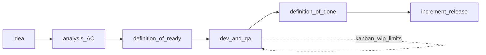

## Введение

Закрывая junior-блок СА, на собесе проверяют процессное мышление: где аналитик в SDLC, как оценивать работу и чем Scrum отличается от Kanban. Выпуск T6.1.1–6.1.14 — про практику поставки, а не про заучивание манифеста.

## Раздел: SDLC, роль аналитика, работа с QA, оценка

**Этапы SDLC (типовая лента):** инициация и цели → анализ требований → проектирование → реализация → тестирование → внедрение/релиз → эксплуатация и развитие. В Agile этапы перекрываются итерациями, но смыслы те же.

**Роль системного аналитика:** выявить и зафиксировать потребности, согласовать scope, смоделировать процессы и данные, описать постановки/контракты, провести требования через разработку и приёмку, управлять изменениями. СА — «переводчик» между бизнесом и инженерией.

**Когда аналитик особенно ключевой:** новый продукт/домен, много стейкхолдеров и конфликтов целей, сложные интеграции, регуляторика, миграции, высокий cost of defect в требованиях. Когда «уже всё ясно и команда зрелая», роль смещается к уточнению edges и NFR.

**Работа с QA:** совместный разбор AC, тест-идеи на этапе требований, трассировка требование→тест, уточнение спорных кейсов до кодирования, участие в приёмке. Хороший тон: баг «неясных требований» чинят уточнением постановки, а не спором «это не баг».

**Декомпозиция и оценка:** крупную цель режут на ценности (epic → stories → tasks), отдельно выделяют spikes на неизвестность. Оценка нужна для прогноза, не для «отчётности ради отчётности».

**Часы vs story points:** часы — абсолютная длительность, удобны для внешних контрактов, но плохо живут с разной скоростью людей. Story points — относительная сложность/объём; скорость (velocity) измеряют post-factum. На собесе: points не равны часам напрямую; это шкала команды.

## Раздел: DoR, DoD, AC и методологии

**DoR (Definition of Ready)** — критерии «можно брать в спринт/работу»: понятная цель, AC, зависимости ясны, дизайн/макеты достаточны, оценили, нет блокеров доступа. Без DoR команда берёт «сырое» и срывает итерацию.

**DoD (Definition of Done)** — критерии «готово»: код смержен, ревью пройдено, тесты зелёные, документация/контракт обновлены, задеплоено на стенд, AC выполнены. DoD общий для команды; не путать с AC конкретной story.

**AC (Acceptance Criteria)** — проверяемые условия приёмки *этой* истории. AC ⊂ готовности по DoD, но DoD шире (инженерное качество поставки).

**Методологии (обзор):** Waterfall — последовательные фазы; Agile — итеративная поставка ценности; Scrum — фреймворк Agile с ролями/событиями/артефактами; Kanban — визуальный поток и лимиты WIP; иногда гибриды (Scrumban).

## Раздел: Scrum events, правила Kanban, Scrum vs Kanban

**События Scrum:** Sprint Planning, Daily Scrum, Sprint Review (демо стейкхолдерам), Sprint Retrospective; сам Sprint — контейнер времени. Артефакты: Product Backlog, Sprint Backlog, Increment. Роли: PO, SM, Developers (аналитик часто внутри Developers или рядом с PO — зависит от компании).

**Правила Kanban (практический минимум):** визуализировать поток; ограничить WIP; управлять временем цикла; делать политики явными; улучшать эволюционно. Нет обязательных спринтов и фиксированных ролей Scrum — изменения входят в поток по приоритету.

**Scrum vs Kanban:**
- ритм: итерации фиксированной длины vs непрерывный поток;
- обязательства: sprint goal vs лимиты и пропускная способность;
- изменения mid-sprint: ограничены vs обычны (с учётом WIP);
- роли и церемонии: предписаны vs гибкие;
- когда Scrum: нужна каденция, фокус, обучение команды; когда Kanban: поток поддержки/операционка, нестабильный вход задач, нужна прозрачность узких мест.

Аналитик в Scrum готовит ready- backlog к planning и уточняет AC; в Kanban следит, чтобы анализ не стал вечным WIP-бутылочным горлышком — лимит на колонку «Analysis».

## Лаба

**Цель.** Сформулировать DoR/DoD для команды и сравнить один поток в Scrum и Kanban.

**Шаги.**
1. Напишите 6 пунктов DoR и 6 пунктов DoD для фичи «REST-ресурс заказов».
2. Разложите epic на 5 stories, оцените относительно (1/2/3/5), отметьте spike.
3. Опишите, как пройдёт planning → daily → review → retro для двухнедельного спринта.
4. Нарисуйте Kanban-доску Analysis/Dev/QA/Done с WIP-лимитами и объясните, что делать при заторе в QA.

**В группу:** один настаивает на часах, другой на points — найдите, для какого стейкхолдера какой язык.

**Готово, если…**
- [ ] Объясняете роль СА в SDLC и связку с QA
- [ ] Не путаете DoR, DoD и AC
- [ ] Сравниваете Scrum и Kanban на своём примере потока

## Схема: Ready → Sprint/Flow → Done

## Тест

### Чем DoR отличается от DoD?

**Ответ:** DoR — готовность взять задачу в работу; DoD — готовность считать результат поставленным

**Пояснение:** DoR про качество входа (AC, зависимости); DoD про качество выхода (тесты, ревью, деплой, выполнение AC).

### Почему story points не переводят «официально» в часы?

**Ответ:** points относительны и зависят от команды; скорость проявляется по факту

**Пояснение:** прямой перевод создаёт ложную точность и давление; для внешних оценок иногда калибруют отдельно, но это уже договорённость, не свойство SP.

### В чём главное отличие Kanban от Scrum?

**Ответ:** Kanban управляет непрерывным потоком через WIP; Scrum — фиксированными итерациями и ролями/событиями

**Пояснение:** у Kanban нет обязательного спринта; у Scrum есть каденция планирования и обзора инкремента.

## Шпаргалка

<h3>Суть</h3>
<ul>
<li>SDLC: от цели и требований до эксплуатации</li>
<li>СА переводит потребности в проверяемые постановки и ведёт изменения</li>
<li>DoR = вход; AC = приёмка story; DoD = стандарт готовности поставки</li>
<li>Points — относительный объём; часы — абсолютное время</li>
<li>Scrum — каденция; Kanban — поток и WIP</li>
</ul>
<h3>События Scrum</h3>
<pre><code>Planning → Daily → Review → Retro
внутри Sprint; артефакты: backlogs + increment
</code></pre>

## Anki

### Front: Что такое Definition of Ready?

Back: Набор критериев, при выполнении которых задача достаточно ясна для взятия в разработку/спринт

### Front: Назовите основные события Scrum

Back: Sprint Planning, Daily Scrum, Sprint Review, Sprint Retrospective (и сам Sprint)

### Front: Зачем WIP-лимит в Kanban?

Back: Ограничивает незавершённую работу, снижает многозадачность и делает узкие места видимыми

## Итоги

- Аналитик ценен там, где неопределённость и цена ошибки требований высоки
- DoR/DoD/AC — три разных слоя дисциплины поставки
- Оценка служит прогнозу; язык часов и points выбирают осознанно
- Scrum и Kanban решают разные проблемы потока — умейте обосновать выбор

## Ссылки

- [Топ-150 вопросов СА на Хабре](https://habr.com/ru/articles/963708/)
- Learn | /game/learn
