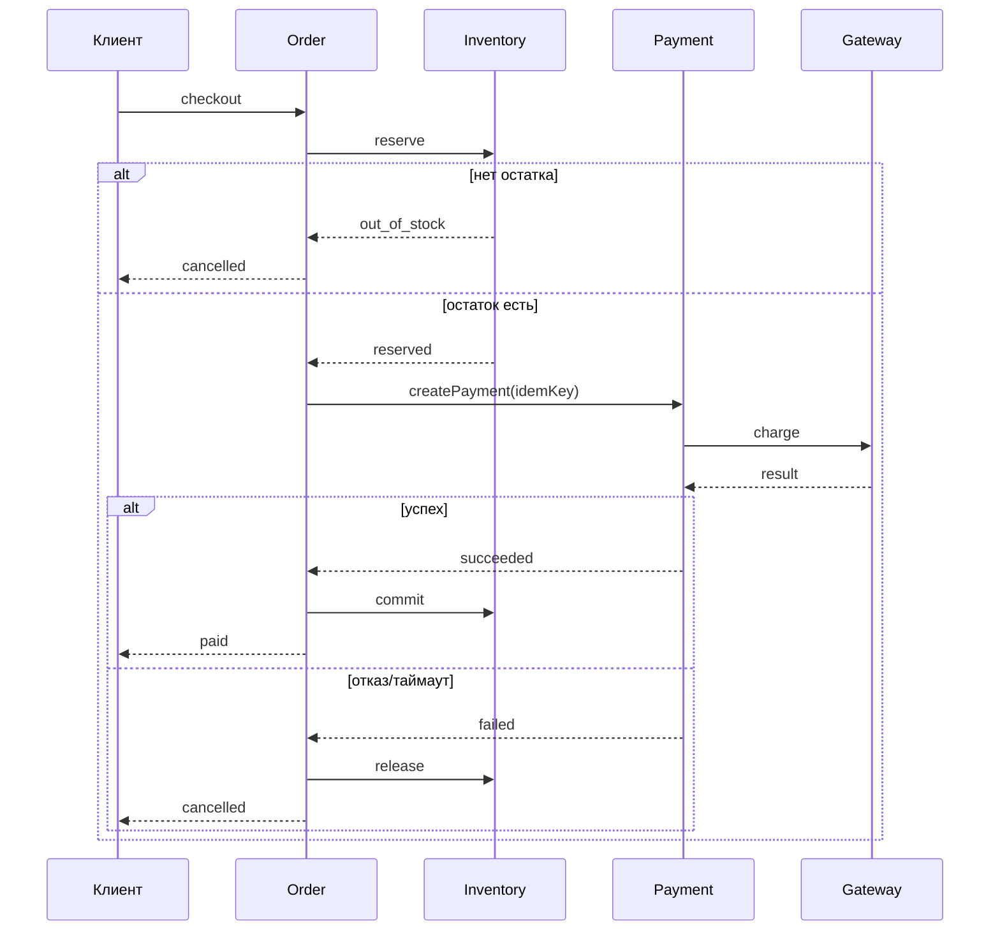

## Введение

Теорию нотаций вы закрыли в junior (T2) и БД в T3. Senior на собесе часто просят: «нарисуйте процесс заказа с оплатой». Здесь один учебный кейс — три модели рядом: BPMN (бизнес-поток), Sequence (взаимодействие систем), ER (данные). Цель — показать согласованность, а не красоту фигур.

## Раздел: Кейс и BPMN процесса заказа

**Кейс.** Клиент оформляет заказ в интернет-магазине, резервирует товар, инициирует оплату; при успехе заказ подтверждается, при отказе/таймауте — резерв снимается. Участники: Клиент, Storefront, Order Service, Inventory, Payment Gateway.

**BPMN — что показать на собесе:**

1. **Пулы/дорожки:** Клиент | Магазин (можно объединить сервисы в один пул «Backend» с lane'ами).
2. **Старт:** «Клиент подтвердил корзину».
3. **Задачи:** создать заказ, зарезервировать остаток, создать платёж, дождаться результата, подтвердить/отменить.
4. **Шлюзы:** exclusive после ответа банка (успех / отказ); возможно timer boundary на ожидании оплаты.
5. **События:** сообщение от платёжного шлюза; ошибка нехватки остатка → конец с отменой.
6. **Не рисовать** реализацию (циклы SQL) — только бизнес-смысл и точки ожидания.

Текстовый скелет потока (его проговорите, даже без Ideального Visio):

1. Создать заказ в статусе `draft`/`awaiting_payment`.
2. Резерв inventory; если нет остатка — `cancelled`, конец.
3. Инициация оплаты (внешний gateway).
4. Ожидание callback/redirect result.
5. Успех → `paid` + подтверждение резерва; отказ/таймаут → `cancelled` + release резерва.

## Раздел: Sequence и ER — один кейс, разные срезы

**Sequence (UML)** отвечает на «кто кого в каком порядке вызывает». Для того же кейса:

- Client → Storefront: POST /checkout
- Storefront → Order: createOrder
- Order → Inventory: reserve(items)
- Inventory → Order: reserved / out_of_stock
- Order → Payment: createPayment(orderId, amount, idempotencyKey)
- Payment → Gateway: charge
- Gateway --> Payment: async result (или sync, если так решили)
- Payment → Order: payment.succeeded / failed
- Order → Inventory: commit / release
- Order --> Storefront → Client: итоговый статус

На диаграмме обязательны: **синхронные** вызовы (сплошная стрелка туда-обратно) и **асинхронный** результат оплаты, если он webhook/очередь. Покажите **идемпотентный ключ** на создании платежа — senior-деталь.

**ER (сущности):**

- `Customer` (1) — (N) `Order`
- `Order` (1) — (N) `OrderItem`
- `OrderItem` (N) — (1) `Product` (или SKU)
- `Order` (1) — (0..1 или 1..N) `Payment` (повторные попытки)
- `Payment`: id, order_id, amount, currency, status, external_id, idempotency_key UNIQUE
- `Reservation` / поля резерва на `OrderItem` (qty_reserved) — как решите, но согласуйте с BPMN

Правило воркшопа: **статусы в BPMN = статусы в атрибутах Order/Payment**. Если в процессе есть `awaiting_payment`, в ER/enum он тоже есть. Расхождение моделей — красный флаг на собесе.

## Раздел: Согласование трёх моделей и типичные ошибки

Перед сдачей лабы сверьте:

| Вопрос | BPMN | Sequence | ER |
|--------|------|----------|-----|
| Кто инициирует оплату? | задача | вызов | — |
| Где ждём банк? | waiting/event | async return | Payment.status |
| Нет остатка? | gateway cancel | ответ inventory | нет Order paid |
| Повтор оплаты? | loop/новый платёж | новый createPayment | новая строка Payment |

Частые ошибки:

- На BPMN «рисовали микросервисы», забыв клиента и бизнес-ветки.
- Sequence без ошибок и таймаутов.
- ER без связи Payment↔Order или без уникальности идемпотентности.
- Три модели про «разные миры» (в BPMN отмена есть, в ER статуса нет).

На собесе лучше одна согласованная тройка на доске, чем три красивых несвязанных картинки.

## Лаба

**Цель.** За 45–60 минут собрать согласованный пакет моделей для заказа с оплатой.

**Шаги.**
1. Выпишите актёров и статусы `Order` / `Payment` (5–7 значений суммарно).
2. Нарисуйте BPMN: от корзины до paid/cancelled, с веткой out_of_stock и таймером оплаты.
3. Нарисуйте Sequence: минимум 8 сообщений, включая неуспех оплаты и release резерва.
4. Нарисуйте ER: Customer, Order, OrderItem, Product, Payment + ключи и кардинальности.
5. Заполните таблицу согласования (3 строки: успех, отказ банка, нет остатка).
6. Добавьте в заметку: где идемпотентность и где фиксируется `external_id` платежа.

**В группу:** обменяйтесь Sequence; найдите у партнёра место, где статус в ER не следует из диаграммы.

**Готово, если…**
- [ ] Три модели описывают один и тот же кейс без противоречий статусов
- [ ] Есть ветки успеха, отказа оплаты и нехватки товара
- [ ] Payment связан с Order, idempotency_key уникален

## Схема: Сквозной поток заказа и оплаты

## Тест

### Чем BPMN отличается от Sequence на одном кейсе оплаты?

**Ответ:** BPMN показывает бизнес-процесс и решения; Sequence — порядок вызовов между системами

**Пояснение:** обе нужны: процесс для стейкхолдеров и QA, sequence — для интеграций и разработки.

### Что обязательно согласовать между BPMN и ER?

**Ответ:** статусы сущностей и исходы веток процесса (paid, cancelled, awaiting_payment и т.д.)

**Пояснение:** если в процессе есть состояние, которого нет в модели данных — реализации и тестам не на что опереться.

### Зачем на Sequence показывать idempotency key при createPayment?

**Ответ:** чтобы повтор запроса не создал второй платёж при ретраях клиента или сети

**Пояснение:** senior-деталь интеграций; в ER ключ должен быть уникальным ограничением.

## Шпаргалка

<h3>Суть</h3>
<ul>
<li>Один кейс → BPMN + Sequence + ER</li>
<li>BPMN: дорожки, шлюзы, ожидание оплаты, отмены</li>
<li>Sequence: вызовы, async результат, ошибки</li>
<li>ER: Order–Payment–Items, статусы, unique idempotency</li>
<li>Сверка статусов между моделями обязательна</li>
</ul>
<h3>Статусы-памятка</h3>
<pre><code>Order: draft → awaiting_payment → paid | cancelled
Payment: created → pending → succeeded | failed</code></pre>

## Anki

### Front: Какие три модели собрать на кейсе заказа/оплаты?

Back: BPMN (процесс), Sequence (вызовы), ER (данные и статусы)

### Front: Что проверить при согласовании моделей?

Back: одни и те же исходы и статусы; кто инициирует оплату; отмена резерва при неуспехе

### Front: Где живёт идемпотентность оплаты в моделях?

Back: в Sequence на createPayment и в ER как UNIQUE idempotency_key у Payment

## Итоги

- Senior моделирует один сценарий тремя нотациями без противоречий
- BPMN — бизнес и ожидания; Sequence — интеграции; ER — факты и ограничения
- Оплата заказа — идеальный тренировочный кейс для T2+T3 на собесе
- Идемпотентность и статусы — то, за что цепляют на senior-уровне

## Ссылки

- [Топ-150 вопросов СА (Хабр)](https://habr.com/ru/articles/963708/)
- Learn | /game/learn
- Далее: [Проектирование интеграций](/game/learn/sa-integration-design)
