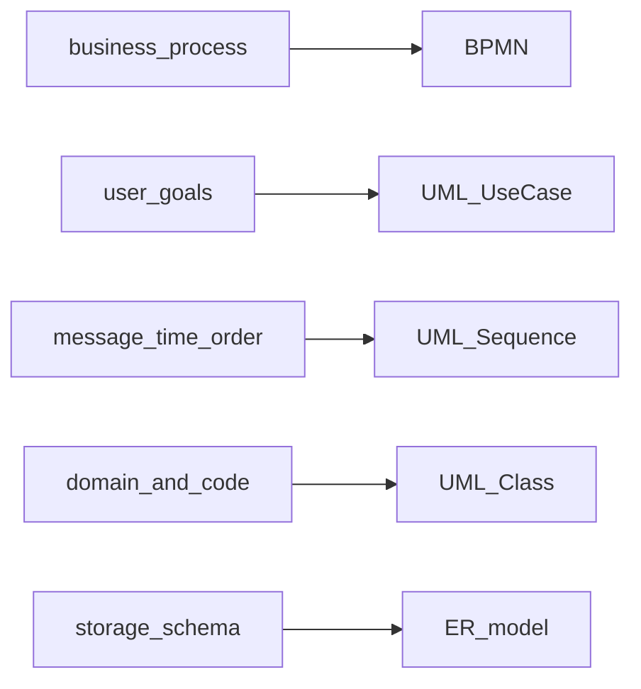

## Введение

Умение выбрать нотацию и объяснить диаграмму — базовый навык СА на собесе. Выпуск T2.1–2.8 закрывает BPMN и UML: какие элементы знать наизусть, чем шлюзы отличаются от событий и когда class diagram не заменяет ER.

## Раздел: Нотации, BPMN: элементы, шлюзы, события

**Нотации моделирования** — согласованный язык картинок и символов: BPMN (бизнес-процессы), UML (структура и поведение ПО), ER (данные), иногда ArchiMate/C4 на обзор архитектуры. Выбор зависит от аудитории: бизнес читает BPMN, разработка — sequence/class, DBA — ER.

**BPMN — ключевые элементы:**
- **Пулы и дорожки (pools/lanes)** — границы участников и ответственности.
- **Задачи / подпроцессы** — работа, которую выполняют.
- **События** — start, intermediate, end (сообщение, таймер, ошибка и др.).
- **Шлюзы (gateways)** — развилки и слияния потока.
- **Потоки** — sequence flow внутри процесса, message flow между пулами.
- **Артефакты** — data object, annotation, group.

**Шлюзы (минимум для junior):**
- **Exclusive (XOR)** — один из путей (или/или);
- **Parallel (AND)** — все пути параллельно, потом синхронизация;
- **Inclusive (OR)** — один или несколько путей по условиям;
- **Event-based** — развилка по тому, какое событие придёт первым.

**События:** стартовые запускают процесс; промежуточные случаются «по дороге» (ждать оплату 15 минут — timer); конечные завершают ветку/процесс. Сообщение (message) связано с обменом между участниками; ошибка (error) — с обработкой сбоев. На собесе подчеркните: шлюз маршрутизирует поток по условиям; событие отражает факт во времени/окружении.

## Раздел: UML: типы диаграмм, Sequence frames, Use Case

**Частые UML-диаграммы для СА:**
- **Use Case** — акторы и цели относительно системы;
- **Activity** — поток действий (близко к процессу, но в UML-семантике);
- **Sequence** — обмен сообщениями во времени между объектами/сервисами;
- **Class** — классы, атрибуты, операции, связи;
- **State** — жизненный цикл сущности (заказ: created → paid → shipped);
- **Component / Deployment** — реже на junior, но полезны для обзора.

**Sequence: фреймы (combined fragments)** — блоки на диаграмме:
- **alt** — альтернативы (if/else);
- **opt** — опциональный фрагмент;
- **loop** — цикл;
- **par** — параллельно;
- **ref** — ссылка на другую диаграмму.

Умение читать фреймы часто важнее, чем рисовать «красивые стрелки».

**Use Case diagram:** система (граница), акторы (люди/внешние системы), овалы use case, связи associate, include (обязательное включение общего поведения), extend (опциональное расширение), generalization акторов. Диаграмма показывает состав целей, но не заменяет текстовые сценарии с ветками.

## Раздел: Class diagram vs ER

**Class diagram (UML)** моделирует объектную структуру ПО: классы, поля, методы, наследование, ассоциации, агрегация/композиция, видимость. Она ближе к коду и доменной модели приложения.

**ER (Entity-Relationship)** моделирует данные для хранения: сущности, атрибуты, ключи, связи 1:1 / 1:N / M:N, иногда атрибуты связей. Ближе к схеме БД и нормализации.

Отличия для ответа на собесе:
- class может содержать поведение (операции); ER — нет;
- наследование в class естественно; в ER обычно через приёмы моделирования таблиц;
- M:N в ER часто раскладывают в связующую сущность сразу; в class могут оставить ассоциацию;
- цель class — понимание/проектирование кода; цель ER — структура данных и ограничения целостности.

На практике аналитик часто ведёт оба взгляда: доменные понятия → class/glossary; физическое хранение → ER.

## Лаба

**Цель.** За 30 минут набросать BPMN и sequence для одного сценария и объяснить выбор нотаций.

**Шаги.**
1. Процесс «оплата заказа»: нарисуйте BPMN с XOR (успех/отказ оплаты) и timer-событием ожидания колбэка.
2. Для того же сценария нарисуйте sequence: UI → Order Service → Payment Gateway, с фреймом alt.
3. Добавьте use case diagram: покупатель, платёжная система, use case «Оплатить заказ» + include «Проверить наличие».
4. Для сущностей Order и Payment сравните набросок class vs ER (2–3 поля и связь).

**В группу:** коллега задаёт вопросы «почему XOR, а не OR?» и «зачем sequence, если уже есть BPMN?».

**Готово, если…**
- [ ] Называете основные элементы BPMN и 3 типа шлюзов
- [ ] Объясняете alt/opt/loop на sequence
- [ ] Чётко отличаете class diagram от ER

## Схема: Когда какую нотацию выбрать

## Тест

### Чем exclusive gateway отличается от parallel?

**Ответ:** XOR выбирает один путь; AND запускает/синхронизирует все параллельные пути

**Пояснение:** оплата картой или счётом — XOR; «списать склад и создать накладную одновременно» — часто AND.

### Для чего фрейм alt на sequence-диаграмме?

**Ответ:** показать взаимоисключающие ветки сценария

**Пояснение:** например, успех и отказ авторизации в одном фрагменте с условиями.

### Почему ER не равен class diagram?

**Ответ:** ER про данные и ключи для хранения; class — про структуру и поведение в ПО

**Пояснение:** у классов есть операции и наследование как у кода; ER фокусируется на сущностях, атрибутах и целостности данных.

## Шпаргалка

<h3>Суть</h3>
<ul>
<li>BPMN — процессы: tasks, events, gateways, pools/lanes</li>
<li>XOR / AND / OR — разные правила ветвления</li>
<li>UML для СА: use case, activity, sequence, class, state</li>
<li>Sequence frames: alt, opt, loop, par, ref</li>
<li>Class ≠ ER: поведение/код vs схема данных</li>
</ul>
<h3>Памятка шлюзов</h3>
<pre><code>XOR — один путь
AND — все пути
OR  — один или несколько
</code></pre>

## Anki

### Front: Какие три типа шлюзов BPMN назвать в первую очередь?

Back: Exclusive (XOR), Parallel (AND), Inclusive (OR); плюс event-based

### Front: Что показывает UML Sequence diagram?

Back: Обмен сообщениями между участниками во времени, включая альтернативы через фреймы

### Front: Class vs ER — главный акцент?

Back: Class — объектная модель ПО (данные+поведение); ER — модель хранения данных и связей

## Итоги

- Нотацию выбирают под аудиторию и вопрос (процесс, взаимодействие, данные)
- В BPMN важно не путать шлюзы и события
- Sequence с фреймами закрывает ветвления интеграций
- Class и ER отвечают на разные проектные вопросы

## Ссылки

- [Топ-150 вопросов СА на Хабре](https://habr.com/ru/articles/963708/)
- Learn | /game/learn
