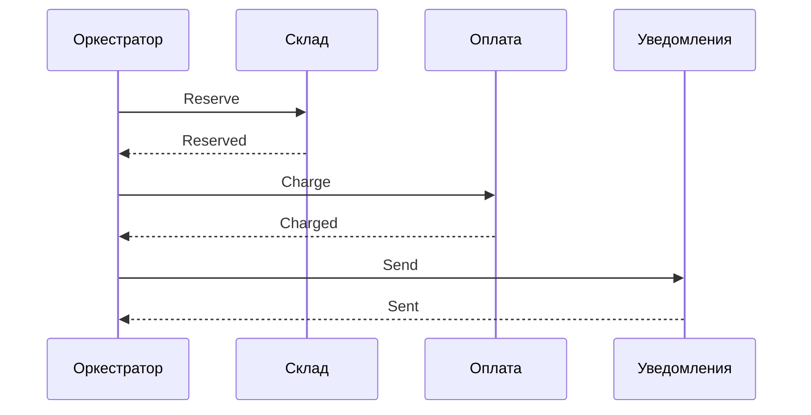

## Введение

Продолжение архитектурного блока: как сервисы договариваются о длинном бизнес-процессе (хореография vs оркестрация), что такое AJAX, почему нельзя одновременно иметь идеальные C, A и P в распределёнке, зачем API Gateway и балансировщик, и что хранит Event Sourcing. Вопросы T5.7–5.15.

## Раздел: Хореография и оркестрация

**Хореография** — участники процесса реагируют на **события** друг друга без центрального дирижёра: `OrderCreated` → склад резервирует → `StockReserved` → биллинг списывает. **Зачем:** слабая связанность, нет единой точки оркестратора. **Плюсы:** гибкость, параллелизм команд. **Минусы:** сложнее увидеть сквозной процесс, труднее отладить «где застряло», риск циклических событий; нужен мониторинг саги и компенсирующие действия.

**Оркестрация** — есть **координатор** (процессный движок, workflow-сервис), который вызывает шаги по сценарию: «сначала склад, потом оплата, потом нотификация». **Зачем:** явный BPMN/state machine длинного процесса. **Плюсы:** прозрачный статус, проще менять порядок шагов в одном месте. **Минусы:** оркестратор — критический компонент; риск чрезмерной централизации логики; нагрузка на координатор.

На собесе: для регулируемых процессов с auditable статусом чаще оркестрация; для слабосвязанного event-driven контура — хореография или гибрид.

## Раздел: AJAX и CAP-теорема

**AJAX (Asynchronous JavaScript and XML)** — подход, при котором страница в браузере обменивается данными с сервером **без полной перезагрузки**: XHR/fetch (сегодня чаще JSON, не XML). **Зачем:** отзывчивый UI, частичное обновление блоков, SPA-паттерны. Для СА: фиксировать API под асинхронные виджеты и состояния загрузки/ошибок.

**CAP-теорема:** в распределённой системе при **сетевом разделении (Partition)** нельзя одновременно гарантировать полную **Consistency** (все узлы видят одни данные) и полную **Availability** (каждый запрос получает ответ). Выбирают CP или AP на время партиции; **P** в сети почти неизбежен, поэтому «CA без оговорок» — упрощение для одной ноды.

**«Консистентна, доступна и устойчива на части»** — маркетинговый идеал; на практике: репликация + кворумы, деградация (read-only), conflict resolution, явное SLA eventual consistency. Аналитик фиксирует: что важнее для домена — не принять заказ при сомнении (C) или принять и свернуть позже (A).

## Раздел: API Gateway и балансировщик

**API Gateway** — единая точка входа для клиентов к множеству backend-сервисов: маршрутизация, TLS termination, authN, rate limit, агрегирование BFF-сценариев, версия API, логирование. Клиент не ходит на 15 микросервисов напрямую.

**Балансировщик нагрузки (load balancer)** — распределяет трафик между **однотипными** инстансами сервиса (round-robin, least connections, health checks). Цель: масштабирование и отказоустойчивость горизонтали. Gateway *может* включать балансировку, но роли разные: gateway — *какой* сервис/политика; balancer — *какой инстанс* внутри пула.

## Раздел: Event Sourcing

**Event Sourcing** — состояние сущности восстанавливается из **журнала событий** (`OrderCreated`, `ItemAdded`, `OrderPaid`), а не только из мутабельной «текущей строки». Текущий снимок (snapshot) — оптимизация. **Зачем:** аудит, временные запросы «как было», сложные саги, интеграция через тот же поток событий. **Цена:** сложнее читать «текущее», нужны проекции/read-модели, эволюция схем событий, идемпотентность обработчиков.

Не путать с «просто писать логи» или с CQRS (часто рядом, но не синоним): CQRS — разделение read/write моделей; Event Sourcing — способ хранения write-модели как событий.

## Лаба

**Цель.** Спроектировать сагу «заказ → резерв → оплата» в двух стилях и выбрать CAP-приоритет для каталога и платежей.

**Шаги.**
1. Нарисуйте оркестратор со статусами WaitingStock / WaitingPayment / Done / Compensating.
2. Нарисуйте хореографию теми же событиями без центра.
3. Для платежей выберите CP или AP при партиции и аргументируйте.
4. Перечислите 5 функций API Gateway для мобильного приложения маркетплейса.
5. Опишите 3 события Event Sourcing для сущности `Order` и одну read-модель «заказ для UI».

**В группу:** где гибрид лучше чистой хореографии (намек: компенсации и дедлайны оплаты).

**Готово, если…**
- [ ] Сравниваете плюсы/минусы orchestration vs choreography
- [ ] Объясняете CAP без мифа «выберем все три»
- [ ] Отличаете Gateway от load balancer и суть Event Sourcing

## Схема: Оркестрация заказа

## Тест

### Плюс оркестрации относительно хореографии?

**Ответ:** сквозной процесс и статусы видны в одном координаторе, проще менять сценарий централизованно

**Пояснение:** цена — зависимость от оркестратора и риск свалить всю логику в него.

### Что утверждает CAP-теорема?

**Ответ:** при сетевом разделении нельзя одновременно сохранить полную согласованность и полную доступность

**Пояснение:** выбирают приоритет CP или AP; «сделать CA+P идеально» в распределёнке нельзя.

### Зачем API Gateway?

**Ответ:** единая точка входа: маршрутизация к сервисам, безопасность, лимиты, агрегация клиентских API

**Пояснение:** упрощает клиентов и политики; не заменяет балансировщик инстансов внутри сервиса.

## Шпаргалка

<h3>Суть</h3>
<ul>
<li>Хореография — события без дирижёра; оркестрация — центральный сценарий</li>
<li>AJAX — обновление UI без полной перезагрузки страницы</li>
<li>CAP: при P выбираем C или A</li>
<li>Gateway — вход и политики; LB — распределение по инстансам</li>
<li>Event Sourcing — журнал событий как источник состояния</li>
</ul>
<h3>Памятка CAP для домена</h3>
<pre><code>Платежи / остатки → чаще строже к C
Лента лайков / рекомендации → чаще A + eventual
Всегда: что делаем при партиции?</code></pre>

## Anki

### Front: Хореография vs оркестрация

Back: хореография — реакция на события без центра; оркестрация — координатор вызывает шаги процесса

### Front: CAP в одном предложении

Back: в распределённой системе при partition нельзя одновременно гарантировать полные Consistency и Availability

### Front: Что такое Event Sourcing?

Back: состояние сущности восстанавливается из последовательности событий, а не только из мутабельного снимка строки

## Итоги

- Саги бывают «с дирижёром» и «по событиям» — у каждого свой operational cost
- CAP заставляет явно выбрать поведение при сбое сети
- Gateway, LB и Event Sourcing — разные рычаги масштаба, безопасности и аудита

## Ссылки

- [Топ-150 вопросов СА (Хабр)](https://habr.com/ru/articles/963708/)
- Learn | /game/learn
- Далее: [HTTP, HTTPS и основы безопасности](/game/learn/sa-http-security-basics)
