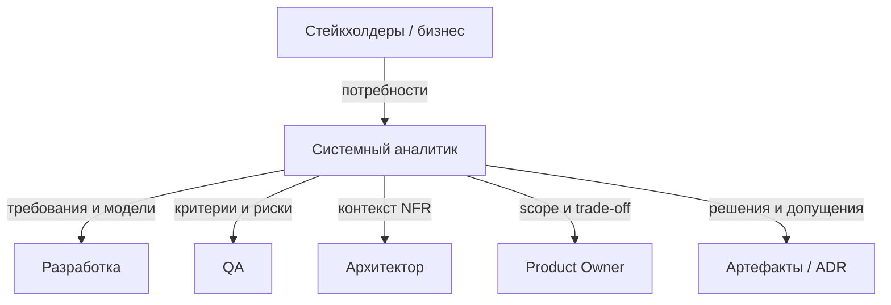

## Введение

Блок T6.2 на собесе звучит мягко («какой аналитик хороший?»), но по ответу отличают человека с опытом от выучившего определения. Ниже — оригинальные ориентиры T6.2.1–6.2.4: эталон, разница уровней, антипаттерны и граница роли СА.

## Раздел: Хороший аналитик и зона ответственности

**Хороший системный аналитик** (T6.2.1) — не тот, кто больше всех пишет документы, а тот, кто:

- переводит неопределённость бизнеса в **проверяемые** требования и модели;
- выявляет противоречия **до** разработки, а не после релиза;
- говорит на языке стейкхолдеров и на языке инженеров без подмены одного другим;
- фиксирует решения и допущения (протоколы, ADR, open questions);
- считает качество постановки частью своей репутации: если QA/Dev «не поняли» — это сигнал доработать вход;
- видит систему целиком: данные, процесс, интеграции, NFR, приёмка;
- умеет сказать «нет/не сейчас» с альтернативой (trade-off), а не только «сделаем».

**Что должен делать СА** (T6.2.4) — ядро роли:

1. Выявлять и приоритизировать потребности стейкхолдеров.
2. Формировать и согласовывать требования (FR/NFR), scope.
3. Моделировать процессы и данные, описывать интеграции.
4. Готовить постановки/user stories/UC и критерии приёмки.
5. Сопровождать реализацию: уточнения, влияние изменений, трассировка.
6. Участвовать в приёмке и разборе дефектов «из требований».
7. Помогать оценке и планированию через декомпозицию и риски.
8. Не подменять собой PO (приоритет ценности), архитектора (финальный tech-choice) и QA (тест-дизайн) — но стыковаться со всеми.

Граница: СА **владеет ясностью задачи**; не обязан писать прод-код и не обязан быть единственным «виновником сроков», если решения принимал бизнес вопреки рискам — но обязан риски озвучить письменно.

## Раздел: Junior vs Senior

**Junior** (ориентир):

- собирает требования по шаблону, уточняет у наставника;
- пишет stories/простые UC, базовые диаграммы с проверкой;
- знает FR/NFR на уровне списка, путается в сложных интеграциях;
- работает в узком куске системы; слабо видит побочные эффекты;
- оценку и конфликт приоритетов эскалирует;
- сильная сторона роста — скорость обучения и аккуратность артефактов.

**Senior** (ориентир):

- сам ведёт неопределённые темы end-to-end до согласованного решения;
- выбирает нотацию и глубину под аудиторию; согласует модели между собой;
- проектирует интеграции и формулирует измеримые NFR;
- влияет на архитектуру через контекст и ADR, не через «я так чувствую»;
- mentorit junior, ставит DoR, режет scope с бизнесом;
- отвечает за качество входа команды и прозрачность рисков поставки;
- на собесе приводит **кейсы**: конфликт стейкхолдеров, ломающий контракт, компромисс CAP/SLA.

Middle — мост: самостоятельные фичи внутри известного контура, ещё без владения «плавающей» архитектурой и жёсткими политическими компромиссами.

Вопрос «чем junior отличается от senior?» лучше закрывать **примерами поведения**, не годами стажа: senior уменьшает энтропию системы решений; junior аккуратно исполняет известный процесс.

## Раздел: Плохой аналитик — антипаттерны

**Плохой СА** (T6.2.3) узнаётся по следствиям:

- **Письмоводитель** — пересказывает встречу без решений и открытых вопросов.
- **Прокси-разработчик без компетенций** — диктует стек и таблицы, игнорируя архитектора и NFR.
- **Человек-соглашатель** — принимает любой scope «завтра», риски не фиксирует.
- **Хранитель тайны** — знания только в голове, артефакты пустые или устаревшие.
- **Враг QA** — «тестируйте как хотите», без критериев приёмки.
- **Водонапорная башня** — все коммуникации только через него, команда слепнет.
- **Шаблонный фанатик** — ГОСТ/BPMN ради галочки, не ради ясности.
- **Тихий саботаж изменений** — Sabotages через бесконечные уточнения без критерия остановки analysis.

Контраст для собеса: хороший аналитик оставляет после себя **воспроизводимую ясность** (документы, модели, решения); плохой — либо хаос, либо иллюзию порядка.

## Лаба

**Цель.** Собрать самооценку уровня и «истории» для T6.2 на собесе.

**Шаги.**
1. Отметьте по чеклисту хорошего СА 8 пунктов: ✅ / ⚠️ / ❌.
2. Напишите 1 кейс junior-поведения и 1 кейс senior-поведения из своего опыта (или учебного проекта).
3. Выберите 2 антипаттерна, которым вы рискуете чаще всего, и контрмеры на 30 дней.
4. Сформулируйте 60-секундный ответ: «чем senior СА отличается от junior».
5. Разделите таблицу: делаю я / делает PO / архитектор / QA — на примере последней фичи.
6. Подготовьте фразу эскалации риска, которую вы реально готовы сказать бизнесу.

**В группу:** партнёр играет плохого «соглашателя» — остановите расползание scope за 2 минуты.

**Готово, если…**
- [ ] Есть честный gap-list по T6.2
- [ ] Pitch junior vs senior звучит на примерах, не на стаже
- [ ] Границы роли с PO/QA/архитектором названы без размытия

## Схема: Зона ясности СА

## Тест

### Что характеризует хорошего системного аналитика?

**Ответ:** превращает неопределённость в проверяемые требования и согласованные решения, видит систему целиком и фиксирует риски и компромиссы

**Пояснение:** объём документов сам по себе не показатель; показатель — ясность для Dev/QA и управляемый scope.

### Чем senior СА отличается от junior?

**Ответ:** senior самостоятельно ведёт неопределённые темы end-to-end, стыкует интеграции/NFR/архитектурный контекст и управляет trade-off; junior работает по шаблону в узком контуре с эскалацией

**Пояснение:** разница в снижении энтропии и зоне ответственности, а не только в годах.

### Назовите признак плохого аналитика.

**Ответ:** например, соглашается на любой срок без фиксации рисков или оставляет знания только в голове без артефактов

**Пояснение:** антипаттерны проявляются в хаосе поставки, войне с QA и вечных «уточнениях» без решения.

## Шпаргалка

<h3>Суть</h3>
<ul>
<li>Хороший СА = ясность + трассировка + смелость trade-off</li>
<li>Junior исполняет процесс; senior снимает неопределённость</li>
<li>Плохой: письмоводитель, соглашатель, хранитель тайн</li>
<li>СА владеет ясностью задачи, не приоритетом продукта и не тест-дизайном</li>
<li>На собесе — кейсы поведения, не лозунги</li>
</ul>
<h3>Границы</h3>
<pre><code>PO — ценность/приоритет
Архитектор — финальный tech-choice
QA — тест-дизайн
СА — требования, модели, ясность, влияние изменений</code></pre>

## Anki

### Front: T6.2.1 — хороший аналитик?

Back: делает требования проверяемыми, снимает противоречия рано, фиксирует решения и риски, говорит и с бизнесом, и с инженерами

### Front: Ключевое отличие junior vs senior СА?

Back: зона неопределённости: junior — узкий кусок с эскалацией; senior — end-to-end решение и trade-off

### Front: Что должен делать СА vs не должен?

Back: должен — требования, модели, постановка, сопровождение ясности; не должен подменять PO/архитектора/QA

## Итоги

- T6.2 проверяет зрелость роли, не зубрёжку терминов
- Senior измеряется поведением в неопределённости и качеством входа команды
- Антипаттерны полезно знать для самоконтроля и для «разбора чужих провалов» на собесе
- Чёткие границы с PO, архитектором и QA усиливают, а не ослабляют позицию СА

## Ссылки

- [Топ-150 вопросов СА (Хабр)](https://habr.com/ru/articles/963708/)
- Learn | /game/learn
- Далее: [Interview drill T1–T7](/game/learn/sa-interview-drill)
