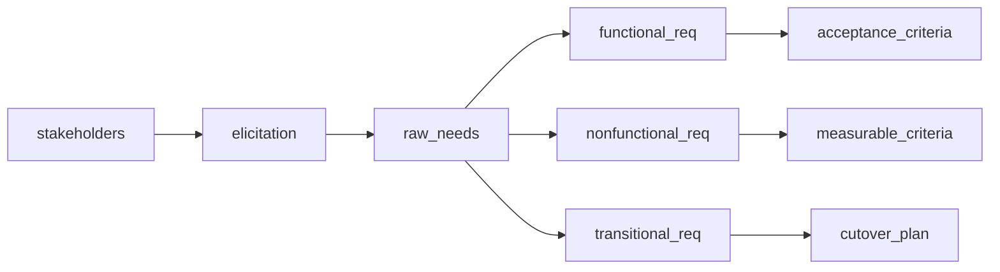

## Введение

На junior-собесе системного аналитика почти всегда спрашивают, как вы собираете требования и чем функциональные отличаются от нефункциональных. Этот выпуск закрывает T1.1–1.6 своими формулировками — без копипаста платных курсов.

## Раздел: Elicitation и стейкхолдеры

**Elicitation** — выявление требований: активный сбор потребностей, ограничений и ожиданий, а не «ждать, пока заказчик пришлёт ТЗ». Аналитик выбирает методы под контекст и фиксирует результат так, чтобы его можно было проверить и согласовать.

Частые методы elicitation:
- **Интервью** — глубина по ролям и сценариям; хорошо для скрытых ожиданий.
- **Воркшопы / фасилитация** — согласование между ролями в одной комнате.
- **Наблюдение / job shadowing** — как люди реально работают, а не как «по регламенту».
- **Анализ документов** — договоры, регламенты, логи, тикеты поддержки, legacy-ТЗ.
- **Прототипы и мокапы** — быстро проверить UI-ожидания.
- **Опросы и анкеты** — широкий охват при однотипных вопросах.
- **Brainwriting / CJM / user journey** — путь пользователя и точки боли.

**Стейкхолдер** — любой, кто влияет на продукт или на кого продукт влияет: спонсор, владелец продукта, пользователи, смежные системы, служба безопасности, поддержка, юристы, регулятор. На собесе полезно сказать: стейкхолдеров ищут по влиянию и интересу, а не только по оргструктуре; карту интересов обновляют, когда меняется scope или появляются новые интеграции.

Практика: для каждой крупной фичи фиксируйте «кто решает», «кто использует», «кого затронет сбой» и «кто даёт ограничение» (безопасность, compliance, инфраструктура).

## Раздел: Типы FR, классификация NFR, FR vs NFR

**Функциональное требование (FR)** описывает *что* система должна уметь делать: поведение, данные, бизнес-правила, реакции на события. Примеры: «пользователь может создать заказ», «система отклоняет платёж при недостатке средств», «админ выгружает отчёт в CSV».

Типы FR (удобная сетка для ответа):
- **Бизнес-функции** — операции предметной области (создание, изменение, расчёт).
- **Интерфейсные** — обмен с пользователем или внешней системой (экран, API, файл, сообщение).
- **Правила и ограничения поведения** — валидации, статусы, права доступа на уровне «кто может что».
- **Отчётность и уведомления** — что система сообщает и когда.
- **Обработка ошибок и исключений** — ожидаемое поведение при сбоях данных/интеграций.

**Нефункциональное требование (NFR)** описывает *как* система должна работать: качество, ограничения среды, эксплуатационные свойства. Классификация NFR (часто на собесе ждут именно группы):
- **Производительность** — latency, throughput, время отклика под нагрузкой.
- **Надёжность / доступность** — SLA, RTO/RPO, устойчивость к сбоям.
- **Безопасность** — аутентификация, авторизация, шифрование, аудит.
- **Масштабируемость и ёмкость** — рост пользователей/данных.
- **Удобство использования (usability)** — обучаемость, доступность, ошибки пользователя.
- **Сопровождаемость и наблюдаемость** — логи, метрики, простота изменений.
- **Совместимость и переносимость** — браузеры, ОС, стандарты обмена.
- **Юридические / compliance** — хранение ПДн, сроки, отраслевые нормы.

**FR vs NFR:** FR отвечает на «какая функция нужна», NFR — на «с какими характеристиками качества и в каких границах». Тест на собесе: если требование можно проверить сценарием «сделал действие → получил результат», это скорее FR; если нужна метрика, порог или политика качества («p95 &lt; 300 мс», «доступность 99.9%»), это NFR. Одно и то же слово («быстро», «удобно») без числа — ещё не требование, а пожелание; аналитик уточняет измеримый критерий.

## Раздел: Переходные (transitional) требования

**Переходные требования** описывают условия *миграции и внедрения*, а не целевое поведение системы в стационарном режиме. Они нужны, чтобы «дойти» от текущего состояния к новому: перенос данных, параллельная работа со старой системой, обучение, cutover, откат.

Примеры:
- одноразовая миграция клиентов и историй заказов с маппингом полей;
- период dual-run: старая и новая система работают параллельно с сверкой;
- требования к обучению и runbook для поддержки на go-live;
- окна простоя, план отката, критерии «миграция успешна».

После завершения перехода такие требования обычно закрываются: они не входят в постоянный backlog целевой системы, но критичны для проекта. На собесе подчеркните: без transitional-требований можно «правильно» спроектировать продукт и провалить внедрение.

## Лаба

**Цель.** Устно за 2 минуты объяснить elicitation, стейкхолдеров, FR/NFR и привести пример переходного требования.

**Шаги.**
1. Выберите домен (например, запись к врачу или интернет-магазин) и перечислите 6 стейкхолдеров с ролью «решает / использует / ограничивает».
2. Запишите 4 FR разных типов и 4 NFR из разных классов с измеримым критерием.
3. Добавьте 2 transitional-требования для запуска (миграция + dual-run или обучение).
4. Для одного «размытого» пожелания («система должна быть быстрой») переформулируйте в NFR с метрикой.

**В группу:** коллега играет спонсора и пользователя с конфликтующими интересами; вы фиксируете вопросы elicitation и предлагаете, как согласовать.

**Готово, если…**
- [ ] Называете ≥4 метода elicitation и зачем каждый
- [ ] Чётко отличаете FR от NFR на своих примерах
- [ ] Объясняете transitional requirements и когда они «умирают»

## Схема: От стейкхолдера к FR/NFR

## Тест

### Чем elicitation отличается от «прочитать ТЗ»?

**Ответ:** это активное выявление потребностей разными методами, а не только разбор готового документа

**Пояснение:** ТЗ часто неполное или устаревшее; аналитик уточняет у людей, в процессах и данных, затем фиксирует проверяемые требования.

### Как быстро отличить FR от NFR?

**Ответ:** FR — поведение/функция; NFR — качество и ограничения с метрикой

**Пояснение:** «создать заказ» — FR; «создание заказа p95 &lt; 500 мс при 200 RPS» — NFR.

### Что такое переходное требование?

**Ответ:** требование к миграции и внедрению, нужное только на переходном этапе

**Пояснение:** примеры — перенос данных, dual-run, обучение, cutover; после go-live обычно закрывается.

## Шпаргалка

<h3>Суть</h3>
<ul>
<li>Elicitation = интервью, воркшопы, наблюдение, документы, прототипы</li>
<li>Стейкхолдер = влияние + интерес, не только должность</li>
<li>FR = что система делает; NFR = как хорошо / в каких рамках</li>
<li>NFR без числа — часто ещё не требование</li>
<li>Transitional = миграция, cutover, dual-run, обучение</li>
</ul>
<h3>Фразы на собесе</h3>
<pre><code>FR → сценарий и результат
NFR → метрика, порог, условие измерения
Сначала стейкхолдеры и цели, потом backlog функций
</code></pre>

## Anki

### Front: Назовите 4 метода elicitation

Back: интервью, воркшоп, наблюдение, анализ документов (также прототипы, опросы)

### Front: Чем FR отличается от NFR?

Back: FR описывает функцию/поведение; NFR — характеристики качества и ограничения, обычно измеримые

### Front: Пример transitional requirement?

Back: одноразовая миграция данных или период параллельной работы со старой системой до cutover

## Итоги

- Сбор требований — активный процесс с выбором методов под контекст
- Стейкхолдеров ищут шире оргструктуры: влияние, интерес, ограничения
- FR и NFR дополняют друг друга; NFR нужно делать измеримыми
- Переходные требования спасают внедрение, но не живут вечно в целевой системе

## Ссылки

- [Топ-150 вопросов СА на Хабре](https://habr.com/ru/articles/963708/)
- Learn | /game/learn
