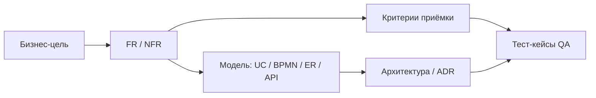

## Введение

На junior достаточно отличить FR от NFR и написать user story. На senior ждут другое: постановка, по которой разработка и QA не спорят «что имелось в виду», явная трассировка требования → сценарий → API/таблицы → тест, и NFR, которые можно измерить и принять. Это углубление темы T1 плюс стык с QA (T6.1.4).

## Раздел: Качество постановки и критерии «готово к разработке»

**Плохая постановка** описывает «что хотим в целом». **Хорошая** снимает неоднозначность до уровня контракта: актёры, предусловия, основной и альтернативные потоки, правила данных, ошибки, границы системы, ссылки на интеграции.

Senior-чеклист перед передачей в спринт:

1. **Цель и ценность** — зачем бизнесу (метрика/риск), не только «сделать экран».
2. **Область** — in/out of scope явным списком.
3. **Данные** — сущности, обязательность, валидации, уникальность, жизненный цикл статусов.
4. **Поведение** — happy path + минимум 3 альтернативы (отказ, таймаут, повтор).
5. **Интерфейсы** — кто вызывает кого, синхронно/асинхронно, коды ответов.
6. **NFR** — числа: RPS, p95 latency, RPO/RTO, уровни доступа, аудит.
7. **Приёмка** — проверяемые критерии (Given/When/Then или чеклист QA).
8. **Открытые вопросы** — отдельно, с владельцем и сроком; не прятать в тексте.

«Готово к разработке» ≠ «много текста». Готово — когда разработчик может оценить, QA — написать кейсы, архитектор — увидеть влияние на контур, а бизнес подписывает scope без «ну вы поняли».

Типичные дефекты постановки на собесе: смешение желания и решения («сделать на Kafka»), отсутствие негативов, NFR вида «быстро и надёжно», нет владельца данных, нет DoD приёмки.

## Раздел: Traceability к архитектуре и работа с QA

**Трассировка (traceability)** — связь артефактов: бизнес-цель → требование/эпик → use case/story → элементы модели (BPMN/ER/API) → тест-кейсы → релиз. Senior не держит это «в голове»: матрица или ссылки в Confluence/Jira/ADR.

Минимальная матрица для фичи «оплата заказа»:

| ID | Требование | Артефакт | Компонент | Тест |
|----|------------|----------|-----------|------|
| FR-41 | Создать платёж | UC-Pay, Seq-Pay | payments-api | TC-Pay-01..05 |
| NFR-12 | p95 &lt; 300 ms | ADR-cache | gateway+payments | Perf-Pay-smoke |
| FR-42 | Идемпотентность | API POST /payments | payments-api | TC-Pay-idem |

Зачем это на собесе: показать, что вы не «пишете ТЗ в вакууме», а контролируете полноту и влияние изменений. Меняется поле в API — видно, какие FR и тесты затронуты.

**Работа с QA (T6.1.4).** Аналитик — поставщик ясности для тестирования, не замена тест-дизайнеру:

- До разработки: согласовать критерии приёмки и границы (что *не* тестируем в релизе).
- В спринте: уточнять неоднозначности до бага «по документации».
- На регрессе: подсветить зоны риска по изменениям (diff требований).
- Не писать за QA сотни кейсов; давать сценарии и данные-примеры, риск-карту, контракты ошибок.
- Совместно чинить формулировки: если QA не может автоматизировать проверку — требование, скорее всего, размыто.

Правило: **баг «непонятно из постановки» — дефект аналитики**, даже если код «в целом работает».

## Раздел: Сложные NFR — измеримость и компромиссы

Простые NFR («HTTPS», «логин») вы уже закрыли в middle. Senior формулирует **измеримые** и **конфликтующие** ограничения:

- **Производительность:** целевой RPS, p50/p95/p99, объём данных, сценарий нагрузки (не «сайт не тормозит»).
- **Доступность:** SLA/SLO (%), окно обслуживания, поведение деградации (что отключаем первым).
- **Согласованность:** eventual vs strong; допустимый лаг реплики для отчётов.
- **Безопасность:** классы данных (PII), маскирование, срок хранения логов, требования к authN/authZ.
- **Наблюдаемость:** обязательные метрики, correlation-id, аудит кто изменил статус.
- **Сопровождаемость:** время наката миграции, обратная совместимость API N релизов.
- **Масштаб:** рост пользователей/заказов на горизонте 12–24 мес — закладывать в ADR, не «потом».

Сложность NFR в том, что они **торгуются**: сильная консистентность vs latency; полный аудит vs стоимость хранения. Senior фиксирует решение и владельца компромисса (бизнес/архитектор), а не прячет конфликт.

Шаблон строки NFR: *«Система должна … при условии …; измеряем …; принимаем, если …; иначе … (деградация/эскалация)»*.

## Лаба

**Цель.** Собрать senior-постановку на фичу «возврат оплаты заказа» с трассировкой и NFR.

**Шаги.**
1. Запишите цель бизнеса и 5 пунктов in/out of scope.
2. Опишите основной поток + 3 альтернативы (банк отклонил, таймаут, повторный запрос).
3. Составьте матрицу traceability на 4 строки (FR/NFR → артефакт → компонент → тест).
4. Сформулируйте 3 NFR по шаблону (latency платежа, идемпотентность, аудит).
5. Напишите 5 критериев приёмки в Given/When/Then для передачи QA.
6. Выделите 2 открытых вопроса с владельцем (например, кто инициирует refund — клиент или оператор).

**В группу:** партнёр пишет NFR «система должна быть надёжной» — перепишите в измеримый вид за 2 минуты.

**Готово, если…**
- [ ] Постановка без «ну вы поняли» и с явным out of scope
- [ ] Есть матрица трассировки хотя бы на 4 связи
- [ ] QA может начать кейсы по вашим критериям приёмки без доп. встречи

## Схема: От требования до теста

## Тест

### Чем senior-постановка отличается от «длинного ТЗ»?

**Ответ:** снимает неоднозначность до проверяемого контракта: scope, негативы, данные, интерфейсы, измеримые NFR и приёмка

**Пояснение:** объём текста не равен качеству; важны проверяемость, границы и трассировка до реализации и тестов.

### Зачем системному аналитику traceability?

**Ответ:** чтобы видеть полноту и влияние изменений: требование ↔ модель ↔ компонент ↔ тест

**Пояснение:** без связей правка API «тихо» ломает приёмку и регресс; матрица делает последствия явными.

### Как senior формулирует сложный NFR?

**Ответ:** с метрикой, условиями нагрузки, критерием приёмки и описанием деградации при нарушении

**Пояснение:** «быстро и надёжно» не принимается; нужны числа, сценарий измерения и владелец компромисса.

## Шпаргалка

<h3>Суть</h3>
<ul>
<li>Постановка = контракт для Dev + QA + архитектуры</li>
<li>Готово к разработке: scope, данные, негативы, API, NFR, приёмка, открытые вопросы</li>
<li>Traceability: цель → требование → модель → тест</li>
<li>QA: ясность и риски, не замена тест-дизайна</li>
<li>NFR: число + условие + приёмка + деградация</li>
</ul>
<h3>Шаблон NFR</h3>
<pre><code>Должна … при …; измеряем …; OK если …; иначе …</code></pre>

## Anki

### Front: 8 пунктов senior-чеклиста постановки?

Back: цель, scope, данные, поведение (+негативы), интерфейсы, NFR, приёмка, открытые вопросы

### Front: Что такое traceability у СА?

Back: явные связи бизнес-цель → требование → модель/API → тест/релиз

### Front: Как писать сложный NFR?

Back: измеримо: метрика, нагрузка, критерий приёмки, поведение при нарушении

## Итоги

- Senior-постановка — про однозначность и приёмку, не про объём документа
- Трассировка защищает от «потерянных» требований и сюрпризов регресса
- Сложные NFR всегда содержат числа и компромисс с владельцем
- Стык с QA — ранняя ясность критериев и зон риска (T6.1.4)

## Ссылки

- [Топ-150 вопросов СА (Хабр)](https://habr.com/ru/articles/963708/)
- Learn | /game/learn
- Далее: [Моделирующий воркшоп](/game/learn/sa-modeling-workshop)
