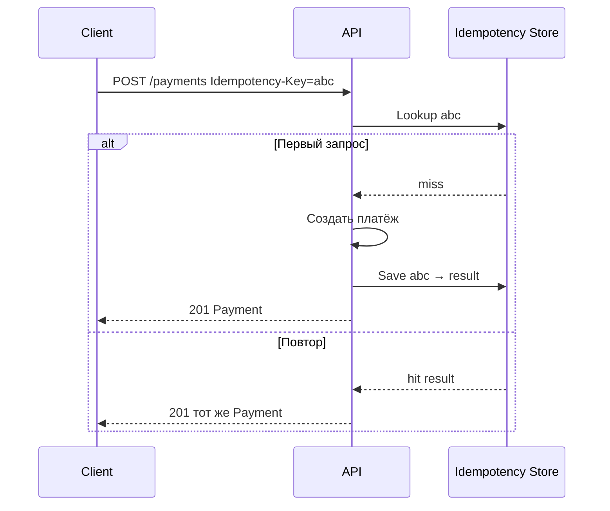

## Введение

Базовые методы HTTP на junior уже «сданы». На middle спрашивают кэш, идемпотентность (в том числе как «починить» POST), допустимость POST для чтения, стратегию обратной совместимости и JSON Schema. Выпуск закрывает T4.2.5–4.2.6 и T4.2.15–4.2.20.

## Раздел: Кэширование — зачем и где

**Кэширование** — хранение результата дорогого чтения, чтобы отдать его повторно без полной пересчётки/похода в БД. Зачем: снизить латентность, разгрузить БД и бэкенд, сгладить пики публичных GET.

**Где реализуется — клиент или сервер?** Оба уровня, и это нормальный ответ:
- **клиент / браузер** — Cache-Control, ETag/If-None-Match, локальный кэш SPA;
- **промежуточные** — CDN, reverse proxy (nginx), API Gateway;
- **сервер** — application cache (Redis), query cache, HTTP-кэш ответов.

В постановке СА указывает: какие ресурсы кэшируемы, TTL, ключ кэша, что инвалидирует (смена статуса заказа), и что **нельзя** кэшировать (персональные балансы без ключа пользователя, чувствительные данные).

## Раздел: Идемпотентность методов

**Идемпотентный** запрос — многократное выполнение с теми же параметрами даёт тот же **эффект на ресурс** (не обязательно идентичное тело ответа). Важно при ретраях сети: клиент не должен создать 5 заказов из-за таймаута.

Классика HTTP:
- **GET, PUT, DELETE, HEAD, OPTIONS** — идемпотентны по семантике;
- **POST** — не идемпотентен (каждый вызов может создать новый ресурс);
- **PATCH** — зависит от семантики патча.

**DELETE идемпотентен?** Да: первый DELETE удаляет ресурс (200/204); повторный — ресурс уже отсутствует (часто 404 или снова 204 — политика API). Состояние «ресурса нет» стабильно, повтор не удаляет «ещё раз» другой объект.

**Как сделать POST идемпотентным:**
1. **Idempotency-Key** в заголовке: сервер сохраняет ключ → результат первого успеха и при повторе возвращает тот же ответ.
2. Клиентский **бизнес-ключ** (`external_order_id`) с UNIQUE в БД.
3. Перевести создание на **PUT** по известному URL `/orders/{id}`, если id задаёт клиент.

**Можно ли POST для получения данных?** Технически да (тело запроса с сложным фильтром, превышение лимита URL, RPC-стиль). Но это ломает кэшируемость GET и ожидания REST. На собесе: «можно, но лучше GET + query/body sparingly; если POST-search — явно задокументировать и не считать ресурс „созданием“».

## Раздел: Обратная совместимость и версии API

**Обратная совместимость** — старые клиенты продолжают работать после изменений сервера. Совместимые изменения: добавить опциональное поле в ответ, новый endpoint, новый опциональный query. Ломающие: удалить/переименовать поле, сменить тип, сделать поле обязательным во входе, изменить семантику кода ответа.

**Когда новая версия API:** накоплены breaking changes, смена модели безопасности, несовместимый редизайн ресурсов. Способы: `/v2/...`, заголовок `Accept-Version`, отдельный хост. Параллельно — deprecation policy (срок жизни v1).

Роль СА: в changelog интеграции помечать breaking/non-breaking; не «тихо» менять контракт шины/мобильного клиента.

## Раздел: JSON Schema

**JSON Schema** — формальное описание JSON-документа: типы, required, enum, format, вложенность, `$ref`. Зачем: валидация запросов/ответов, контракт для моков и тестов, генерация документации, единый язык фронта и бэка.

На практике аналитик пишет или ревьюит schema для тела `POST /orders`, ошибок `ErrorResponse`, событий. Даже если «сам не писал файлы» — важно читать schema и сверять с постановкой (обязательность, nullable, диапазоны).

## Лаба

**Цель.** Спроектировать идемпотентное создание платежа и политику версионирования каталога.

**Шаги.**
1. Опишите `POST /payments` с заголовком `Idempotency-Key` и таблицей поведения при повторе.
2. Перечислите 3 изменения контракта каталога: два совместимых, одно ломающее → нужна v2.
3. Решите: поиск товаров с фильтром на 30 полей — GET или POST, аргументы.
4. Набросайте JSON Schema объекта `Payment` (id, amount, currency, status enum) в 10–15 строках YAML/JSON.
5. Укажите Cache-Control для `GET /public/products/{id}` и почему `GET /me/balance` не кэшировать на CDN.

**В группу:** партнёр дважды шлёт один Idempotency-Key с разным телом — что должен ответить сервер (конфликт ключа).

**Готово, если…**
- [ ] Объясняете идемпотентность без путаницы с «одинаковым JSON ответа»
- [ ] Знаете, как сделать POST безопасным к ретраям
- [ ] Отличаете breaking change от добавления optional-поля

## Схема: Идемпотентный POST

## Тест

### Является ли DELETE идемпотентным?

**Ответ:** да — повторный DELETE не меняет итог «ресурса нет»

**Пояснение:** первый вызов удаляет; последующие остаются в том же финальном состоянии ресурса (код ответа может отличаться — 404 vs 204).

### Как обеспечить обратную совместимость API?

**Ответ:** не ломать контракт старых клиентов: только аддитивные изменения; breaking — через новую версию и политику deprecation

**Пояснение:** удаление полей, смена типов и обязательности во входе — поводы для vN+1, а не «тихого» релиза.

### Зачем JSON Schema?

**Ответ:** формально описать и валидировать структуру JSON-контракта

**Пояснение:** единый контракт для разработки, тестов и документации; снижает рассинхрон «в Swagger одно, в коде другое».

## Шпаргалка

<h3>Суть</h3>
<ul>
<li>Кэш — на клиенте, CDN и сервере; в ТЗ — TTL и инвалидация</li>
<li>Идемпотентность = безопасные ретраи</li>
<li>DELETE идемпотентен; POST — через Idempotency-Key / business key / PUT</li>
<li>Breaking change → версия API</li>
<li>JSON Schema — контракт структуры JSON</li>
</ul>
<h3>Совместимость</h3>
<pre><code>+ optional field в ответе — OK
+ новый endpoint — OK
- rename / remove / change type — breaking
- required во входе там, где было optional — breaking</code></pre>

## Anki

### Front: Как сделать POST идемпотентным?

Back: Idempotency-Key, уникальный бизнес-ключ создания или PUT по клиентскому id

### Front: Где бывает HTTP-кэш?

Back: браузер/клиент, CDN/прокси, сервер приложения — часто комбинируют

### Front: Когда плодить v2 API?

Back: когда нужны несовместимые изменения контракта или радикальный редизайн ресурсов

## Итоги

- Кэш и идемпотентность — про устойчивость интеграций, не «красоту REST»
- POST для чтения возможен, но осознанно; ретраи POST без ключа опасны
- Версии и JSON Schema — инструменты управляемой эволюции контракта

## Ссылки

- [Топ-150 вопросов СА (Хабр)](https://habr.com/ru/articles/963708/)
- Learn | /game/learn
- Далее: [SOAP и XML](/game/learn/sa-soap-xml)
