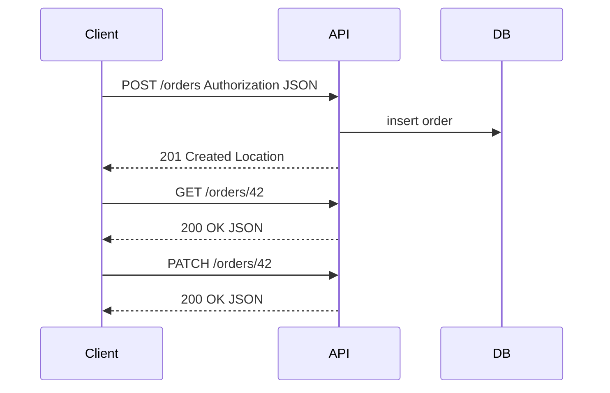

## Введение

Интеграции — хлеб системного аналитика: на junior-собесе ждут уверенный рассказ про API и REST без путаницы методов и кодов. Выпуск T4.2.1–4.2.14 собирает базу, на которой потом строят версии, контракты и идемпотентность уровня middle.

## Раздел: API, REST, RESTful, Stateless и кэш

**API** — контракт взаимодействия: как одна система просит другую выполнить операцию или отдать данные (методы, URL, форматы, ошибки, авторизация).

**REST** — стиль архитектуры для распределённых систем (Dissertation Fielding): ресурсы, единообразный интерфейс, представление ресурса (JSON и др.), взаимодействие через HTTP в вебе. **RESTful** на практике называют API, которые *примерно* следуют этим идеям: ресурсные URL, правильные глаголы, коды ответов. Идеально «чистый REST» редок; на собесе честно разделите теорию и «как принято в индустрии».

**Stateless:** сервер не хранит клиентскую сессию между запросами как обязательное условие обработки. Каждый запрос содержит всё нужное (токен, параметры). Состояние ресурса лежит в хранилище, а не в «памяти сервера о прошлом запросе этого клиента». Это упрощает масштабирование.

**Кэширование (вводно):** ответы можно помечать как кэшируемые (Cache-Control, ETag, Last-Modified), чтобы клиент или промежуточный кэш не ходил в origin повторно. Для СА: кэш ускоряет чтение, но усложняет актуальность; для изменяющих операций кэш обычно bypass.

## Раздел: Методы, параметры, URL, заголовки, коды

**Методы HTTP (базовый набор):**
- **GET** — читать ресурс(ы), без побочных эффектов в идеале;
- **POST** — создать ресурс / запустить процесс / неидемпотентная операция;
- **PUT** — создать или полностью заменить ресурс по известному URI;
- **PATCH** — частичное обновление;
- **DELETE** — удалить;
- **HEAD/OPTIONS** — метаданные и возможности (реже спрашивают junior).

**Параметры:** path (`/orders/{id}`), query (`?status=paid&page=2`), body (JSON для POST/PUT/PATCH), иногда headers для сквозных корреляционных id.

**URL:** существительные-ресурсы во множественном числе (`/users/42/orders`), избегают глаголов в пути (`/getOrders` — запах RPC). Действия-процессы иногда моделируют отдельно (`/payments`), если это отдельный ресурс.

**Заголовки:** `Authorization`, `Content-Type`, `Accept`, `Idempotency-Key`, корреляция (`X-Request-Id`), кэш-заголовки. Аналитик фиксирует обязательные заголовки в контракте интеграции.

**200 vs 201:** **200 OK** — успешный ответ общего вида (часто на GET, иногда на PUT/PATCH/DELETE). **201 Created** — ресурс успешно создан; желательно `Location` с URI нового ресурса. На POST создания заказа уместный ответ — 201.

## Раздел: GET vs POST, PUT vs PATCH, POST vs PUT, идемпотентность

**GET vs POST:** GET для безопасного чтения и возможности кэша/закладок; POST когда меняем состояние или нельзя светить данные в URL. «GET с телом» — плохая практика.

**PUT vs PATCH:** PUT передаёт полное представление ресурса (или согласованную полную замену); PATCH — только изменённые поля. Если клиент не знает всех полей, PATCH безопаснее от затирания.

**POST vs PUT (создание):** POST на коллекцию (`POST /orders`) — сервер назначает id, типичный 201. PUT на конкретный URI (`PUT /orders/42`) — клиент знает id, операция идемпотентна: повторный PUT с тем же телом не создаёт «ещё один» ресурс.

**Идемпотентность (вводно):** повтор запроса даёт тот же эффект на ресурсах, что и один успешный (не обязательно тот же байтовый ответ). GET, PUT, DELETE — идемпотентны по семантике HTTP; POST — обычно нет. Для оплаты на POST ставят ключ идемпотентности, чтобы ретрай не списал дважды — детали будут в middle-серии.

## Лаба

**Цель.** Описать REST-контракт ресурса Order на одну страницу.

**Шаги.**
1. Перечислите endpoints: список, получение, создание, полное и частичное обновление, удаление.
2. Для каждого укажите метод, код успеха, пример JSON и 1–2 ошибки (404, 409, 422).
3. Отметьте, какие операции идемпотентны и где нужен Idempotency-Key.
4. Добавьте 2 заголовка обязательных для всех запросов и политику кэша для GET списка.

**В группу:** сосед пытается сломать ваш контракт неоднозначным PATCH и повторным POST.

**Готово, если…**
- [ ] Объясняете REST/stateless без воды
- [ ] Не путаете 200/201 и GET/POST/PUT/PATCH
- [ ] Даёте определение идемпотентности и пример с ретраями

## Схема: Запрос к ресурсу заказа

## Тест

### Что означает stateless в REST?

**Ответ:** сервер не опирается на сохранённую сессию клиента между запросами; каждый запрос самодостаточен

**Пояснение:** авторизация и контекст передаются с запросом; состояние ресурсов — в хранилище.

### Когда отвечать 201, а не 200?

**Ответ:** когда успешно создан новый ресурс

**Пояснение:** типично для POST создания; полезно вернуть Location и тело созданного объекта.

### Чем PATCH отличается от PUT?

**Ответ:** PATCH меняет часть полей; PUT заменяет ресурс целиком по контракту полной замены

**Пояснение:** повторный PUT с полным телом идемпотентен; неосторожный PUT без всех полей может обнулить данные.

## Шпаргалка

<h3>Суть</h3>
<ul>
<li>API = контракт; REST = стиль ресурсного взаимодействия</li>
<li>Stateless упрощает горизонтальное масштабирование</li>
<li>GET читать; POST создавать/действие; PUT заменить; PATCH частично; DELETE удалить</li>
<li>201 — создано; 200 — общий успех</li>
<li>Идемпотентность критична при ретраях сетей</li>
</ul>
<h3>Памятка методов</h3>
<pre><code>GET    read          idempotent safe
POST   create/action not idempotent
PUT    replace       idempotent
PATCH  partial       обычно осторожно
DELETE remove        idempotent
</code></pre>

## Anki

### Front: RESTful API — что обычно имеют в виду на практике?

Back: HTTP API с ресурсными URL, осмысленными методами и кодами, близкое к принципам REST

### Front: Почему POST обычно не идемпотентен?

Back: Повтор может создать второй ресурс или повторно запустить действие; без ключа идемпотентности ретрай опасен

### Front: Path vs query параметры?

Back: Path идентифицирует ресурс/иерархию; query — фильтры, сортировка, пагинация и опции выборки

## Итоги

- Аналитик описывает API как контракт: ресурсы, методы, коды, ошибки, заголовки
- Stateless и кэш — часть поведения системы, не «детали разработки»
- Путаница PUT/PATCH/POST — частый фильтр на собесе
- Идемпотентность стоит упоминать сразу, когда речь о платежах и ретраях

## Ссылки

- [Топ-150 вопросов СА на Хабре](https://habr.com/ru/articles/963708/)
- Learn | /game/learn
