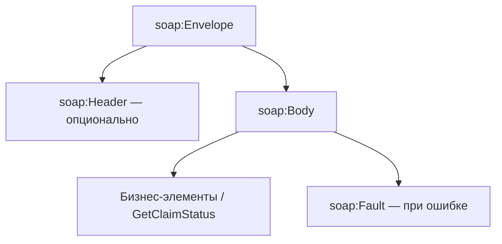

## Введение

В энтерпрайзе и банках SOAP/XML всё ещё встречаются в легаси и B2B. Middle СА должен отличить HTML от XML, объяснить XSD и namespaces, разобрать конверт SOAP и роль WSDL, а также честно сравнить с REST. Тема T4.3.1–4.3.9.

## Раздел: HTML vs XML и что внутри XML

**HTML** — язык разметки **страниц** для браузера: фиксированный набор тегов (`div`, `p`, `a`), толерантен к ошибкам, про представление.

**XML** — универсальный формат **данных и документов**: теги вы задаёте сами под домен (`<Order>`, `<Amount>`), строже к синтаксису (хорошо сформированный документ), про обмен и хранение структурированных данных.

**Что содержится в XML:**
- пролог (`<?xml version="1.0" encoding="UTF-8"?>`);
- элементы (теги) с вложенностью;
- атрибуты у элементов;
- текстовые узлы;
- опционально — namespaces, CDATA, комментарии, processing instructions;
- часто рядом — ссылка на XSD/DTD для валидации.

XML не «исполняется» как HTML в браузере; его парсят системы.

## Раздел: XSD, пространства имён, инструменты

**XSD (XML Schema Definition)** — схема, описывающая допустимую структуру XML: элементы, типы (`xs:string`, `xs:decimal`), обязательность, cardinality (`minOccurs`/`maxOccurs`), ограничения. Аналитик встречается с XSD как с контрактом интеграции (аналог JSON Schema для XML). «Писал ли» — если нет, скажите, что читаете/согласовываете XSD с вендором и сверяете примеры сообщений.

**Пространство имён (namespace)** — способ избежать конфликта одинаковых имён тегов из разных словарей (`<id>` в заказе и в пользователе). Объявляется через URI (`xmlns:ord="http://example.com/order"`) и префиксы. На собесе: «namespace = уникальный контекст имён элементов».

**Инструменты работы с XML:** редакторы и IDE (VS Code, IDEA), `xmllint`, Oxygen XML, SoapUI / Postman (SOAP), XMLSpy, библиотеки языков (Java JAXB, Python `lxml`), XSLT-процессоры для преобразований, браузер для просмотра сырого XML.

## Раздел: SOAP, сообщение, WSDL

**SOAP (Simple Object Access Protocol)** — протокол обмена структурированными сообщениями, обычно XML поверх HTTP(S). В энтерпрайсе: строгий контракт, WS-* (безопасность, транзакции) в зрелых стеках.

**Из чего состоит SOAP-сообщение (envelope):**
- **Envelope** — корневой контейнер;
- **Header** (опционально) — метаданные: безопасность, трассировка, маршрутизация;
- **Body** — полезный бизнес-payload;
- **Fault** — стандартный способ ошибки внутри Body при сбое.

**WSDL (Web Services Description Language)** — машинно-читаемое описание сервиса: операции, сообщения, типы (часто через XSD), привязка к протоколу (SOAP/HTTP), endpoint. По WSDL генерируют клиенты и stub'ы. Для СА WSDL = «паспорт» SOAP-API.

## Раздел: SOAP vs REST

| | SOAP | REST |
|--|------|------|
| Контракт | WSDL + XSD, операции | ресурсы + HTTP-методы, OpenAPI/JSON Schema |
| Формат | XML (типично) | JSON чаще; бывает XML |
| Стиль | RPC-операции (`GetOrder`) | ресурсно-ориентированный |
| Транспорт | чаще HTTP, возможны другие | HTTP(S) |
| Плюсы SOAP | строгая схема, зрелые WS-Security, формальные операции | простота, кэш GET, широкая экосистема веба |
| Плюсы REST | скорость разработки, читаемость, мобильные/SPA | — |

Выбор: SOAP — легаси и корпоративные шины с жёстким контрактом; REST/JSON — новые публичные и продуктовые API. Аналитик не «воюет за моду», а стыкует то, что есть у контрагента.

## Лаба

**Цель.** Разобрать учебный SOAP-вызов «получить статус заявки» и сопоставить с REST-аналогом.

**Шаги.**
1. Напишите дерево XML: `Envelope / Header / Body / GetClaimStatus` с полем `claimId`.
2. Опишите 3 ограничения XSD для `claimId` (тип, длина, pattern).
3. Объясните, зачем двум системам разные `xmlns` на тег `Status`.
4. Составьте таблицу маппинга: SOAP-операция → `GET /claims/{id}/status`.
5. Перечислите 2 причины оставить SOAP на контуре банка и 2 — не тащить SOAP в новый мобильный BFF.

**В группу:** обменяйтесь «сломанным» XML (незакрытый тег) — что скажет парсер vs HTML-браузер.

**Готово, если…**
- [ ] Отличаете HTML от XML по назначению
- [ ] Называете части SOAP Envelope
- [ ] Объясняете роль WSDL и XSD в контракте

## Схема: SOAP Envelope

## Тест

### В чём разница HTML и XML?

**Ответ:** HTML — разметка страниц с фиксированными тегами; XML — расширяемый формат данных со своими тегами и строгим синтаксисом

**Пояснение:** HTML про отображение в браузере; XML про структурированный обмен между системами.

### Что такое WSDL?

**Ответ:** описание SOAP-веб-сервиса: операции, сообщения, типы, endpoint

**Пояснение:** по WSDL строят клиенты и понимают контракт без чтения чужого кода.

### Чем SOAP отличается от REST?

**Ответ:** SOAP — протокол операций с XML/WSDL; REST — стиль доступа к ресурсам через HTTP и произвольный контракт (часто JSON)

**Пояснение:** разный уровень стандартизации контракта и модель мышления (RPC-операции vs ресурсы).

## Шпаргалка

<h3>Суть</h3>
<ul>
<li>XML — данные; HTML — страница</li>
<li>XSD — схема XML; namespace — словарь имён</li>
<li>SOAP: Envelope = Header + Body (+ Fault)</li>
<li>WSDL — контракт сервиса</li>
<li>SOAP vs REST — операции/XML vs ресурсы/HTTP</li>
</ul>
<h3>Каркас сообщения</h3>
<pre><code>&lt;soap:Envelope&gt;
  &lt;soap:Header/&gt;
  &lt;soap:Body&gt;...&lt;/soap:Body&gt;
&lt;/soap:Envelope&gt;</code></pre>

## Anki

### Front: Из чего состоит SOAP-сообщение?

Back: Envelope, опциональный Header, Body; при ошибке — Fault

### Front: Зачем namespace в XML?

Back: развести одинаковые имена элементов из разных словарей через URI/префиксы

### Front: Что описывает XSD?

Back: допустимую структуру и типы XML-документа: элементы, обязательность, ограничения

## Итоги

- XML/XSD/namespace — язык корпоративных контрактов
- SOAP строится вокруг Envelope и WSDL, не «просто XML по HTTP»
- Сравнение с REST — про модель и экосистему, не про «кто лучше абсолютен»

## Ссылки

- [Топ-150 вопросов СА (Хабр)](https://habr.com/ru/articles/963708/)
- Learn | /game/learn
- Далее: [ESB и современные интеграции](/game/learn/sa-esb-integrations)
