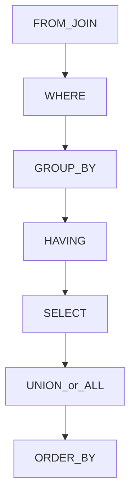

## Введение

На собесе СА часто просят «чуть-чуть SQL»: не оптимизировать планы, а уверенно читать и писать выборки. Выпуск T3.2.1–3.2.7 закрывает команды, JOIN, фильтры агрегатов и типичные ловушки TRUNCATE/UNION.

## Раздел: Команды SQL и JOIN

**Группы команд SQL (классика):**
- **DDL** — структура: CREATE, ALTER, DROP, TRUNCATE (часто относят к DDL);
- **DML** — данные: SELECT, INSERT, UPDATE, DELETE;
- **DCL** — права: GRANT, REVOKE;
- **TCL** — транзакции: BEGIN/COMMIT/ROLLBACK (в конкретных диалектах синтаксис свой).

Для аналитика в повседневности важнее DML-выборки и понимание, что DDL меняет схему.

**JOIN** объединяет строки связанных таблиц:
- **INNER JOIN** — только совпавшие пары по условию;
- **LEFT JOIN** — все слева + совпадения справа (иначе NULL справа);
- **RIGHT JOIN** — зеркало LEFT (на практике чаще переписывают в LEFT);
- **FULL OUTER JOIN** — все из обеих сторон;
- **CROSS JOIN** — декартово произведение.

Аналитику: LEFT JOIN нужен, когда важны «заказы без оплаты» или «клиенты без заказов» (дальше фильтр по NULL — anti-join). Ошибка новичка — фильтровать правую таблицу в WHERE так, что LEFT превращается по смыслу в INNER.

## Раздел: TRUNCATE vs DELETE, HAVING и WHERE

**DELETE** удаляет строки (можно с WHERE), обычно логируется построчно, может срабатывать с триггерами, откатывается в транзакции (зависит от СУБД/режима). **TRUNCATE** быстро очищает таблицу целиком, сбрасывает идентичность в многих СУБД, обычно не допускает WHERE, ограничения по FK могут мешать; семантика транзакций/триггеров зависит от СУБД — на собесе скажите принцип: TRUNCATE — массовая очистка структуры хранения, DELETE — удаление набора строк.

**HAVING** фильтрует результат **после группировки** (условия на агрегаты: COUNT, SUM, AVG…). **WHERE** фильтрует строки **до** GROUP BY.

Пример смысла: «клиенты с числом заказов &gt; 5» → GROUP BY customer_id HAVING COUNT(*) &gt; 5. Писать COUNT в WHERE нельзя (ещё нет групп).

**HAVING vs WHERE:** WHERE — про сырые строки и индексируемые предикаты на столбцы; HAVING — про агрегаты групп. Часто часть условий можно вынести в WHERE, чтобы раньше отсечь строки и не тащить их в группировку.

## Раздел: Anti-join и UNION

**Anti-join** — найти строки одной таблицы без пар в другой. Способы:
1. `LEFT JOIN ... WHERE right.id IS NULL`
2. `NOT EXISTS (подзапрос)`
3. `NOT IN (подзапрос)` — осторожно с NULL внутри списка
4. Иногда `EXCEPT` (если диалект поддерживает)

Предпочтительно для ответа: NOT EXISTS или LEFT JOIN + IS NULL; про NULL в NOT IN упомянуть как ловушку.

**UNION** объединяет результаты выборок и **убирает дубликаты**. **UNION ALL** склеивает всё **с дубликатами**, обычно быстрее. Число и типы столбцов должны совпадать. На собесе: «нужна уникальность — UNION; нужна скорость/полная картина повторов — UNION ALL».

## Лаба

**Цель.** Написать 4 запроса «на бумаге» и объяснить план фильтрации.

**Шаги.**
1. INNER JOIN заказов и клиентов по customer_id с фильтром по дате в WHERE.
2. LEFT JOIN + IS NULL: клиенты без заказов.
3. GROUP BY товара с HAVING SUM(qty) &gt; 100.
4. Два SELECT статусов через UNION ALL и тот же через UNION — опишите разницу результата.

**В группу:** разберите ошибку «LEFT JOIN, но в WHERE right.col = 'X'» — что произошло с семантикой.

**Готово, если…**
- [ ] Перечисляете DDL/DML и типы JOIN своими словами
- [ ] Объясняете TRUNCATE vs DELETE и WHERE vs HAVING
- [ ] Знаете ≥2 способа anti-join и отличие UNION/UNION ALL

## Схема: Порядок логической обработки запроса

## Тест

### Почему условие на COUNT пишут в HAVING, а не в WHERE?

**Ответ:** COUNT появляется после группировки; WHERE работает до GROUP BY

**Пояснение:** WHERE не видит агрегаты групп; HAVING как раз фильтрует группы.

### Чем TRUNCATE принципиально отличается от DELETE без WHERE?

**Ответ:** TRUNCATE — быстрая очистка всей таблицы с иной семантикой; DELETE удаляет строки и может быть выборочным

**Пояснение:** у TRUNCATE обычно нет WHERE, другое поведение по идентичности/триггерам в зависимости от СУБД.

### Когда выбрать UNION ALL вместо UNION?

**Ответ:** когда дубликаты допустимы или их и так нет, и нужна экономия на дедупликации

**Пояснение:** UNION делает DISTINCT по результату — дороже; ALL просто склеивает наборы.

## Шпаргалка

<h3>Суть</h3>
<ul>
<li>DDL структура, DML данные, DCL права, TCL транзакции</li>
<li>INNER — пересечение; LEFT — все слева</li>
<li>WHERE до групп; HAVING после агрегатов</li>
<li>Anti-join: NOT EXISTS или LEFT + IS NULL</li>
<li>UNION уникализирует; UNION ALL сохраняет дубли</li>
</ul>
<h3>Шаблоны</h3>
<pre><code>LEFT JOIN b ON ... WHERE b.id IS NULL
SELECT ... GROUP BY x HAVING COUNT(*) &gt; n
SELECT ... UNION ALL SELECT ...
</code></pre>

## Anki

### Front: INNER JOIN vs LEFT JOIN?

Back: INNER возвращает только совпадения; LEFT — все строки левой таблицы и совпадения правой (или NULL)

### Front: WHERE vs HAVING?

Back: WHERE фильтрует строки до группировки; HAVING — группы после агрегации

### Front: UNION vs UNION ALL?

Back: UNION удаляет дубликаты между выборками; UNION ALL оставляет все строки

## Итоги

- СА читает SQL как язык проверки гипотез о данных и требований
- JOIN и anti-join закрывают типичные аналитические вопросы «есть/нет связи»
- HAVING и WHERE путают часто — держите порядок обработки запроса в голове
- UNION ALL по умолчанию практичнее, если уникальность не нужна

## Ссылки

- [Топ-150 вопросов СА на Хабре](https://habr.com/ru/articles/963708/)
- Learn | /game/learn
