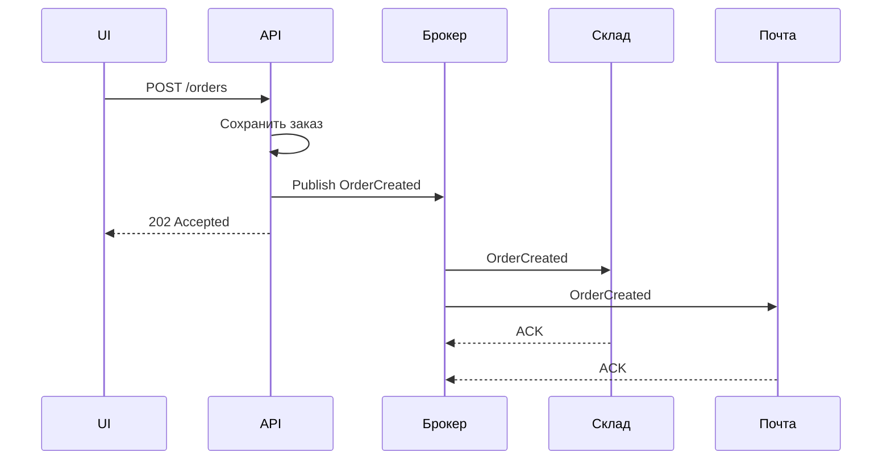

## Введение

Интеграции на собеседовании почти всегда сводят к вопросу: «синхронно или через очередь?». Middle СА должен объяснить разницу sync/async, когда ответ обязателен, зачем брокер, чем Kafka отличается от RabbitMQ, и что значат гарантии доставки и offset. Ниже — ответы на T4.1.1–4.1.5 и T4.4.1–4.4.5.

## Раздел: Синхронное и асинхронное взаимодействие

**Синхронное** — вызывающая сторона ждёт завершения обработки (или таймаута): отправил запрос → блокируется/ждёт → получил ответ. Пример: HTTP REST `POST /orders` с телом результата или ошибкой.

**Асинхронное** — отправили работу и не держим клиента на всём цикле обработки: приняли, ответили «принято» (или вообще fire-and-forget в шину), результат придёт позже (callback, polling, событие, письмо).

**Всегда ли должен быть ответ?**
- В **синхронном** контракте ответ (успех/ошибка/таймаут) — часть взаимодействия: без него клиент не знает исход.
- В **асинхронном** «ответ» может быть: (а) техническое подтверждение приёма (ACK брокера, 202 Accepted); (б) бизнес-результат отдельным сообщением; (в) в чистом pub/sub издатель может не ждать бизнес-ответа. На собесе лучше сказать: «технический ACK часто есть; бизнес-ответ — по контракту».

**Пример только sync:** экран логина → `POST /auth/login` → JWT в ответе. Пользователь не может идти дальше без синхронного результата. То же: платёжный authorize в момент checkout, если UI обязан показать успех/отказ сразу.

**Зачем очереди в async:** сгладить пики, развязать сервисы по времени жизни, повторить обработку при падении consumer, маршрутизировать нескольким обработчикам, гарантировать буфер при недоступности получателя.

**Вызов БД / хранимой процедуры:** для приложения это обычно **синхронный** вызов: поток/корутина ждёт результат SQL. «Асинхронность» драйвера (asyncpg) не делает взаимодействие с БД бизнес-async: вы всё равно ждёте ответ СУБД в рамках запроса. Настоящий async-паттерн — отложить тяжёлую работу в очередь и сразу вернуть клиенту 202.

## Раздел: Когда нужны очереди сообщений

Очереди уместны, когда:
- производитель быстрее или нестабильнее потребителя;
- нужна повторная доставка и изоляция сбоев;
- несколько независимых обработчиков одного события (заказ создан → склад, почта, аналитика);
- длинные процессы (генерация отчёта, видео) нельзя держать в HTTP-таймауте;
- важна пиковая устойчивость витрины/акций.

С какими брокерами «работали» на собесе: честно назовите стек проекта; если учебного опыта нет — разберите Kafka и RabbitMQ концептуально (этого часто достаточно middle).

## Раздел: Kafka vs RabbitMQ, гарантии, offset, queue vs topic

**Kafka vs RabbitMQ (рабочая схема ответа):**
| | RabbitMQ | Kafka |
|--|----------|-------|
| Модель | брокер очередей, маршрутизация (exchange → queue) | распределённый лог, топики и партиции |
| Потребление | сообщение обычно забирается из очереди consumer'ом | читают offset в логе, можно перечитывать |
| Фокус | гибкая маршрутизация задач, низкая задержка команд | высокий throughput событий, replay, stream |
| Типично | команды, RPC-like задачи, сложный routing | event streaming, аудит, CDC, fan-out читателей |

**Гарантии доставки (общая терминология):**
- **at most once** — не более одного раза (можно потерять);
- **at least once** — хотя бы раз (возможны дубли → нужна идемпотентность);
- **exactly once** — ровно раз (дорого/ограничено; в Kafka — с транзакциями и идемпотентным producer в определённых сценариях).

Брокер «гарантирует» в рамках выбранного режима: persist на диск, ACK consumer, репликация партиций/очередей. Аналитик в постановке пишет требуемую семантику и идемпотентность обработчика.

**Перечитать два последних сообщения в Kafka:** consumer group хранит **offset**. Чтобы прочитать снова те же записи — сдвинуть (reset) offset назад на нужную позицию (например, `end-2` или конкретный timestamp/offset) и продолжить poll. Важно: это управление курсором читателя, а не «вернуть сообщения в очередь».

**Очередь vs топик:**
- **Очередь (queue)** — точка-точка: конкурирующие consumer'ы делят сообщения (одно сообщение — одному обработчику из группы).
- **Топик (pub/sub)** — публикация многим подписчикам; каждый подписчик (или каждая group в Kafka) видит свой поток. В Kafka «топик» — именованный лог; семантика competing consumers достигается consumer group.

## Лаба

**Цель.** Для сценария «создали заказ → уведомить склад и отправить письмо» выбрать sync/async и описать контракт с брокером.

**Шаги.**
1. Нарисуйте два варианта: всё в одном HTTP-запросе vs `202` + событие `OrderCreated`.
2. Решите: RabbitMQ или Kafka для уведомлений склада и почты — аргумент в 3 предложениях.
3. Зафиксируйте гарантию: at least once + идемпотентный ключ `order_id` у consumer.
4. Опишите, как QA/разработка «перечитает» событие в Kafka после бага в consumer (offset).
5. Ответьте письменно: «вызов stored procedure из API — sync или async?» и почему.

**В группу:** партнёр ломает consumer (медленный) — обсудите рост лага и влияние на SLA витрины.

**Готово, если…**
- [ ] Чётко отличаете sync HTTP от async через брокер
- [ ] Объясняете at least once и зачем идемпотентность
- [ ] Знаете, как в Kafka сдвинуть offset для повторного чтения

## Схема: Заказ через очередь

## Тест

### Вызов хранимой процедуры из сервиса — sync или async?

**Ответ:** обычно синхронный: вызывающий код ждёт результат СУБД

**Пояснение:** async-драйвер не меняет бизнес-смысл «запрос–ответ к БД»; отложенная обработка — это уже очередь вне транзакции ответа клиенту.

### Как в Kafka снова прочитать два последних сообщения?

**Ответ:** сдвинуть offset consumer group назад на две записи (или к нужному offset) и продолжить чтение

**Пояснение:** Kafka хранит лог; повторное чтение — управление курсором, а не возврат message в конец очереди как в классическом MQ.

### В чём отличие очереди от топика?

**Ответ:** очередь — конкурирующие потребители делят сообщения; топик — публикация нескольким подписчикам

**Пояснение:** в Kafka топик + consumer group даёт и log, и конкурирующее потребление внутри группы.

## Шпаргалка

<h3>Суть</h3>
<ul>
<li>Sync — ждём бизнес/транспортный ответ; async — развязка по времени</li>
<li>Очередь сглаживает пики и сбои потребителя</li>
<li>RabbitMQ — маршрутизация задач; Kafka — лог событий и replay</li>
<li>at least once ⇒ дубли ⇒ идемпотентность</li>
<li>Queue vs topic: point-to-point vs pub/sub</li>
</ul>
<h3>Формулировка в ТЗ</h3>
<pre><code>Канал: Kafka topic orders.events
Ключ: order_id
Семантика: at least once
Consumer: идемпотентен по order_id
Ответ клиенту: 202 + id операции</code></pre>

## Anki

### Front: Зачем очереди в асинхронных интеграциях?

Back: буфер при пиках и простоях consumer, развязка сервисов, ретраи, fan-out обработчиков

### Front: Kafka vs RabbitMQ — главное отличие модели

Back: Kafka — распределённый лог с offset и replay; RabbitMQ — брокер очередей с гибкой маршрутизацией сообщений

### Front: at most / at least / exactly once

Back: не больше одного (можно потерять) / хотя бы раз (возможны дубли) / ровно раз (сложнее и дороже)

## Итоги

- Sync и async — про ожидание результата, не только про «есть ли HTTP»
- Очереди — инструмент развязки и надёжности; гарантии требуют идемпотентности
- Kafka и RabbitMQ отвечают на разные классы задач; queue и topic — разные семантики доставки

## Ссылки

- [Топ-150 вопросов СА (Хабр)](https://habr.com/ru/articles/963708/)
- Learn | /game/learn
- Далее: [REST advanced: кэш, идемпотентность, версии](/game/learn/sa-rest-advanced)
