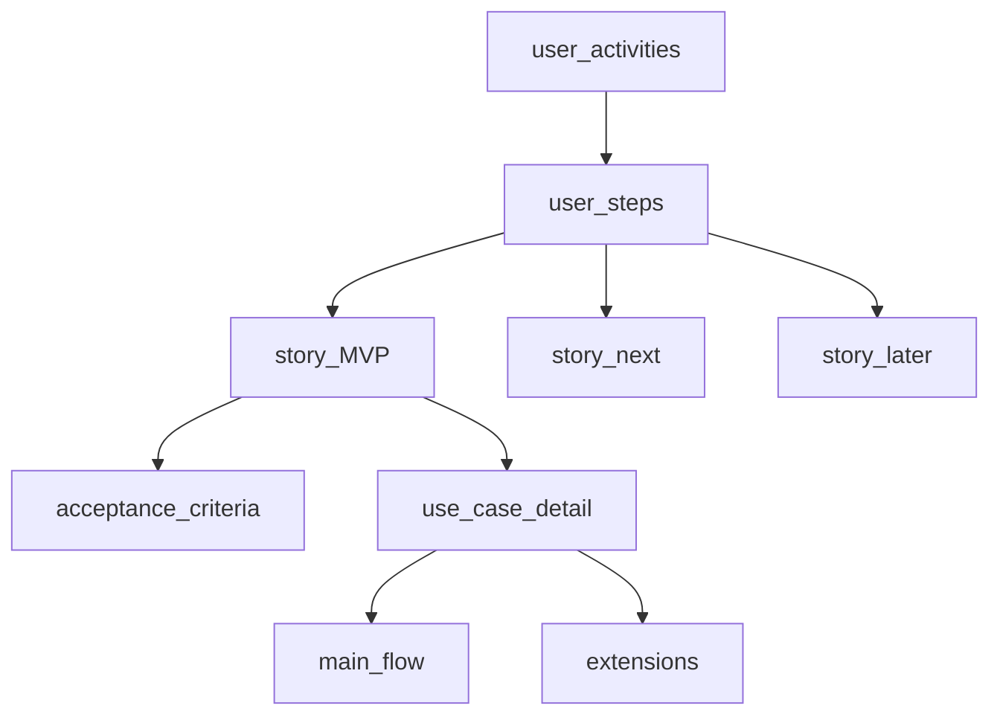

## Введение

После базы про FR/NFR на junior-собесе СА часто переходят к форматам описания ценности: user story, карта историй и use case. Этот выпуск закрывает T1.7–1.12 практичными ответами, которые можно сказать за 60–90 секунд.

## Раздел: User story, USM и преимущества

**User story** — короткое описание потребности с точки зрения роли, обычно в формате: «Как &lt;роль&gt;, я хочу &lt;действие&gt;, чтобы &lt;ценность&gt;». История сама по себе не заменяет анализ: к ней добавляют **acceptance criteria (AC)**, ограничения, наброски UI и ссылки на правила. Story — «обещание разговора», а не полное ТЗ в одной строке.

Пример: «Как покупатель, я хочу сохранить адрес доставки, чтобы не вводить его при каждом заказе». AC могут включать: поля адреса, валидацию индекса, возможность редактировать/удалять, кто видит адрес.

**User Story Mapping (USM)** — визуальная карта продукта: по горизонтали — путь пользователя (activities → steps), по вертикали — приоритет деталей (backbone сверху, затем walking skeleton и релизы вниз). USM помогает:
- увидеть целостность продукта, а не россыпь тикетов;
- договориться о MVP (горизонтальный «срез» ценности);
- выявить пробелы в сценарии («оплатили, но письмо не уходит»);
- планировать релизы слоями, а не случайным набором stories.

**Преимущества user stories** (что говорить на собесе):
- фокус на ценности для роли, а не на «кнопке»;
- лёгкость приоритизации и декомпозиции;
- живой диалог с командой вместо толстого документа «на полку»;
- удобная связка с AC и демо;
- хорошо стыкуются с backlog и итеративной поставкой.

Ограничения: без AC и контекста истории размыты; сложные интеграции и NFR плохо живут «только в story» — их нужно явно дополнять.

## Раздел: INVEST, хорошая история, use case

**INVEST** — чеклист качества story:
- **I**ndependent — по возможности независима от других (иначе явные зависимости);
- **N**egotiable — детали обсуждаемы до реализации;
- **V**aluable — даёт ценность пользователю/бизнесу;
- **E**stimable — команда может оценить;
- **S**mall — умещается в итерацию;
- **T**estable — есть способ проверить (обычно через AC).

Признаки **хорошей истории**: ясная роль и ценность, проверяемые AC, понятный scope «in/out», учтены ошибки и права, согласована с владельцем продукта. Плохая история: «сделать админку», «улучшить UX», «как система, я хочу…» без ценности.

**Use case** — описание взаимодействия актора с системой для достижения цели: название, актор(ы), предусловия, основной поток, альтернативы/исключения, постусловия. Use case сильнее в детализации ветвлений и системных реакций; часто рисуют диаграмму вариантов использования и текстовые сценарии.

Структура текстового use case (минимум для ответа):
1. Цель и уровень (user-goal / subfunction).
2. Основной успешный сценарий по шагам.
3. Расширения: ошибки оплаты, отказ прав, таймаут внешней системы.
4. Бизнес-правила и данные на входе/выходе.

## Раздел: User story vs use case

| | User story | Use case |
|---|---|---|
| Фокус | ценность и разговор | полное взаимодействие и ветки |
| Объём | коротко + AC | сценарии детально |
| Когда удобно | Agile backlog, MVP, частые поставки | сложные процессы, много альтернатив, контракты |
| Риск | недосказать детали | избыточная бюрократия |

На практике их комбинируют: story как единица планирования, use case / сценарий — когда нужно разобрать ветвления; для интеграций часто добавляют sequence/BPMN. Хороший ответ: «story не против use case — разные уровни детализации и разные цели артефакта».

## Лаба

**Цель.** Собрать мини-USM и сравнить одну потребность в форматах story и use case.

**Шаги.**
1. Возьмите сценарий «оформить возврат товара» и постройте backbone из 5–7 шагов пользователя.
2. Напишите 3 user stories с INVEST-проверкой и AC (не менее 3 критериев на story).
3. Для одной story напишите use case: основной поток + 2 альтернативы.
4. Отметьте, что лучше оставить в story, а что вынести в use case/правила.

**В группу:** один защищает «только stories», другой — «только use cases»; договоритесь о гибриде для вашего домена.

**Готово, если…**
- [ ] Объясняете формат story и смысл USM
- [ ] Прогоняете историю по INVEST без шпаргалки
- [ ] Называете 3 отличия story от use case на примере

## Схема: USM и связь с use case

## Тест

### Что обязательно добавить к user story, кроме шаблона «как… хочу…»?

**Ответ:** acceptance criteria и контекст границ

**Пояснение:** одна строка без AC непроверяема; команде нужны условия приёмки, ошибки и scope.

### Что означает буква V в INVEST?

**Ответ:** Valuable — история должна давать ценность

**Пояснение:** технический рефакторинг без объяснённой ценности для пользователя/бизнеса обычно формулируют иначе или связывают с риском/скоростью поставки.

### Когда use case предпочтительнее короткой story?

**Ответ:** при сложных ветвлениях и множестве альтернативных потоков

**Пояснение:** use case явно раскладывает основной и альтернативные сценарии; story остаётся удобной единицей backlog.

## Шпаргалка

<h3>Суть</h3>
<ul>
<li>Story = роль + действие + ценность + AC</li>
<li>USM = путь пользователя × приоритет деталей / релизов</li>
<li>INVEST = Independent, Negotiable, Valuable, Estimable, Small, Testable</li>
<li>Use case = актор, потоки, предусловия/постусловия, расширения</li>
<li>Story для планирования ценности; use case для детальных ветвлений</li>
</ul>
<h3>Шаблон</h3>
<pre><code>Как &lt;роль&gt;, хочу &lt;действие&gt;, чтобы &lt;ценность&gt;.
AC: given / when / then или маркированный список.
</code></pre>

## Anki

### Front: Классический шаблон user story?

Back: Как &lt;роль&gt;, я хочу &lt;действие&gt;, чтобы &lt;ценность&gt; (+ AC)

### Front: Что такое User Story Mapping?

Back: Карта пути пользователя по оси X и приоритета деталей/релизов по оси Y для планирования MVP

### Front: Чем use case отличается от user story?

Back: Use case детализирует взаимодействие и ветки; story короче фокусируется на ценности и планировании

## Итоги

- User story работает только вместе с критериями приёмки и диалогом
- USM помогает собрать целостность продукта и MVP-срез
- INVEST — быстрый фильтр «можно ли брать в спринт»
- Story и use case дополняют друг друга, а не конкурируют

## Ссылки

- [Топ-150 вопросов СА на Хабре](https://habr.com/ru/articles/963708/)
- Learn | /game/learn
