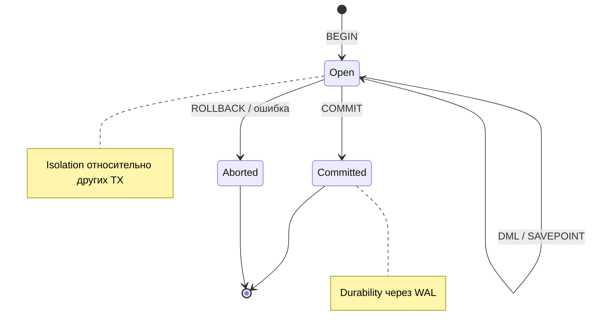

## Введение

ACID — каркас ответа про надёжность транзакций в СУБД. На middle-собесе мало расшифровать буквы: нужны примеры, что ломается без каждого свойства, и понимание, что Isolation — спектр уровней, а не магический «всегда полная изоляция». Опора — PostgreSQL; отличия MySQL/SQL Server — точечно.

## Раздел: Atomicity и Consistency

**Транзакция** — логическая единица работы: набор операций, который фиксируется целиком (`COMMIT`) или отменяется целиком (`ROLLBACK`).

**Atomicity (атомарность)** — «всё или ничего». Пример перевода денег:

```sql
BEGIN;
UPDATE accounts SET balance = balance - 100 WHERE id = 1; -- списание
UPDATE accounts SET balance = balance + 100 WHERE id = 2; -- зачисление
-- если второй UPDATE упал или приложение решило отменить:
ROLLBACK;  -- оба изменения откатываются
-- либо
COMMIT;    -- оба изменения видны другим как совершённые вместе
```

Без атомарности возможна потеря денег на одном счёте без появления на другом.

В PostgreSQL DDL тоже часто участвует в транзакции: можно создать таблицу и откатиться (в отличие от типичного MySQL, где DDL часто неявно коммитит текущую транзакцию — важная оговорка).

**Consistency (согласованность)** — транзакция переводит БД из одного **валидного** состояния в другое относительно ограничений: PK/FK/CHECK, уникальности, триггеров, инвариантов, которые СУБД умеет enforced.

Пример: нельзя закоммитить заказ с `user_id`, которого нет — FK остановит. Бизнес-инвариант «баланс не отрицательный» можно выразить `CHECK (balance >= 0)` или проверкой в приложении + правильном уровне изоляции.

Важно: Consistency в ACID — про правила БД; это не CAP-consistency распределённых систем. На собесе иногда путают — разведите явно.

## Раздел: Isolation и Durability

**Isolation (изоляция)** — параллельные транзакции не должны «ломать» друг друга неконтролируемым образом. Полная сериализация дорога, поэтому стандарты дают уровни:

| Уровень | Типичные феномены, которые ещё возможны |
|---------|------------------------------------------|
| Read Uncommitted | «грязное» чтение (в PG фактически не ослабляет ниже Read Committed) |
| Read Committed | неиповторяемое чтение, фантомы (дефолт PostgreSQL) |
| Repeatable Read | в PG защищает от фантомов сильнее классического определения; детали реализации MVCC |
| Serializable | максимальная изоляция, возможны ошибки сериализации и ретраи |

Примеры феноменов простым языком:
- **dirty read** — увидели чужой незакоммиченный UPDATE;
- **non-repeatable read** — тот же SELECT дважды, строка изменилась чужим COMMIT;
- **phantom** — появилась новая строка, попадающая под тот же предикат.

```sql
BEGIN ISOLATION LEVEL REPEATABLE READ;
SELECT balance FROM accounts WHERE id = 1;
-- ... другая транзакция меняет и коммитит ...
SELECT balance FROM accounts WHERE id = 1;  -- в RR снимок тот же в PG
COMMIT;
```

Для перевода денег часто комбинируют транзакцию + блокировки/`SELECT … FOR UPDATE`, чтобы не уйти в минус при гонке.

**Durability (долговечность)** — после успешного COMMIT данные переживают сбой процесса/питания (в рамках заявленных гарантий fsync/WAL). В PostgreSQL механизм — WAL (write-ahead log): сначала журнал, потом страницы данных; `commit` считается устойчивым после сброса журнала (настройки синхронизации влияют на компромисс скорость/надёжность).

Кратко по диалектам:
- **SQL Server** — уровни изоляции + опционально snapshot isolation; `GETDATE()` vs `CURRENT_DATE`/`now()` — про функции, не про ACID, но часто рядом в блоке «диалекты».
- **MySQL InnoDB** — транзакции и уровни есть; MyISAM исторически без полноценных транзакций — полезно упомянуть, если спросят «всегда ли MySQL = ACID».

## Раздел: Транзакции на практике заказа

Сценарий: создать заказ, списать позицию со склада, записать платёж.

```sql
BEGIN;
INSERT INTO orders (user_id, status) VALUES (42, 'new') RETURNING id;
-- id = 1001
UPDATE inventory SET qty = qty - 1 WHERE product_id = 7 AND qty >= 1;
-- если rowcount = 0 → ROLLBACK
INSERT INTO payments (order_id, amount) VALUES (1001, 499.00);
UPDATE orders SET status = 'paid' WHERE id = 1001;
COMMIT;
```

Что проверить голосом на собесе:
1. Atomicity — не останется paid-заказа без платежа при ошибке посередине.
2. Consistency — `qty >= 0`, FK на user/product.
3. Isolation — два заказа на последний товар не уйдут в −1 без блокировок/ограничений.
4. Durability — после COMMIT рестарт СУБД не «забывает» оплату.

`SAVEPOINT` — частичный откат внутри большой транзакции; `SET CONSTRAINTS DEFERRED` в PG — отложенная проверка FK до конца транзакции (осторожный инструмент).

## Лаба

**Цель.** Воспроизвести гонку двух транзакций на балансе/остатке и сравнить поведение с `FOR UPDATE` и без.

**Шаги.**
1. Создайте `sql08_accounts(id int PRIMARY KEY, balance int CHECK (balance >= 0))` с двумя счетами.
2. В двух сессиях откройте транзакции Read Committed и одновременно спишите 70 с баланса 100 без блокировок — поймайте аномалию или конфликт CHECK.
3. Повторите со `SELECT … FOR UPDATE` перед списанием — зафиксируйте разницу.
4. Сделайте перевод с `ROLLBACK` после первого UPDATE и убедитесь в атомарности.
5. Кратко опишите каждый столбец ACID одним предложением и одним примером из этой лабы.

**В группу:** один ломает изоляцию (два клиента), второй предлагает уровень изоляции и блокировки.

**Готово, если…**
- [ ] Расшифровываете ACID с примерами, а не только словами
- [ ] Называете дефолт изоляции PostgreSQL (Read Committed) и зачем RR/Serializable
- [ ] Отличаете Consistency ACID от «consistency» в CAP

## Схема: Жизненный цикл транзакции



## Тест

### Что гарантирует Atomicity?

**Ответ:** либо применяются все изменения транзакции, либо ни одного (COMMIT vs ROLLBACK)

**Пояснение:** частичный успех внутри транзакции наружу не «протекает» после отката.

### Какой уровень изоляции по умолчанию в PostgreSQL?

**Ответ:** Read Committed

**Пояснение:** каждый оператор видит только закоммиченные на его начало данные; повторы SELECT могут видеть новые committed-изменения.

### Чем Consistency в ACID отличается от consistency в CAP?

**Ответ:** ACID Consistency — соблюдение ограничений и инвариантов БД; CAP — про одинаковое видение данных узлами распределённой системы

**Пояснение:** разные контексты; путать на собесе — частая ловушка.

## Шпаргалка

<h3>ACID</h3>
<ul>
<li><b>A</b> — всё или ничего</li>
<li><b>C</b> — ограничения схемы/инварианты соблюдены после COMMIT</li>
<li><b>I</b> — контроль аномалий параллелизма (уровни изоляции)</li>
<li><b>D</b> — COMMIT пережил сбой (WAL/fsync)</li>
</ul>
<h3>Команды</h3>
<pre><code>BEGIN;
-- ...
COMMIT;
-- или
ROLLBACK;

SELECT ... FOR UPDATE;  -- пессимистическая блокировка строки
</code></pre>
<h3>Диалекты</h3>
<ul>
<li>PG: мощный MVCC, DDL в транзакции, дефолт Read Committed</li>
<li>MySQL: InnoDB транзакционен; DDL часто неявный commit</li>
<li>SQL Server: свои уровни + snapshot; даты — GETDATE() и аналоги</li>
</ul>

## Anki

### Front: Расшифруйте ACID одной строкой каждое свойство

Back: Atomicity — всё/ничего; Consistency — валидные ограничения; Isolation — изоляция параллельных TX; Durability — COMMIT устойчив к сбою

### Front: Зачем SELECT FOR UPDATE при списании остатка?

Back: Заблокировать строку до конца транзакции, чтобы параллельная TX не изменила остаток между проверкой и записью

### Front: Что такое dirty read?

Back: Чтение незакоммиченных изменений чужой транзакции; при её ROLLBACK вы опирались на «призрак»

## Итоги

- ACID объясняется примерами денег/заказа/склада, не только акронимом
- Isolation — настраиваемый компромисс; знайте дефолт PostgreSQL и феномены
- Практические инструменты: транзакции, CHECK/FK, FOR UPDATE, ретраи при serialization failure

## Ссылки

- [OTUS / Хабр — топ вопросов по SQL, часть I](https://habr.com/ru/companies/otus/articles/461067/)
- [PostgreSQL: Transaction Isolation](https://www.postgresql.org/docs/current/transaction-iso.html)
- Learn | /game/learn
- Далее по серии: SQL09 — триггеры и операторы (см. SERIES.md)
