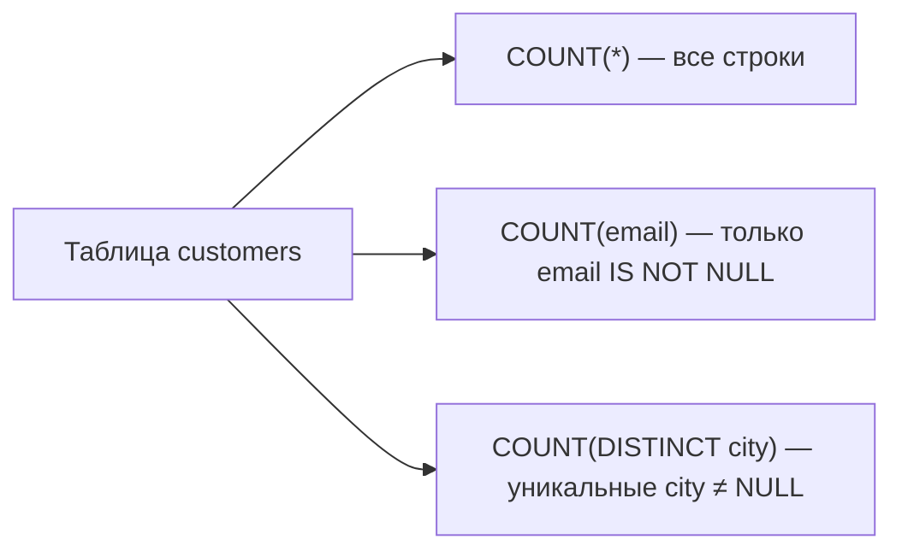

## Введение

Два коротких, но коварных вопроса: «как получить текущую дату?» (Q14) и «как посчитать количество записей?» (Q30). Кажется trivial, пока не всплывут диалекты, `COUNT(col)` с NULL и «зачем вообще полный COUNT на огромной таблице».

## Раздел: Текущая дата и время (Q14)

В **PostgreSQL** основные варианты:

| Выражение | Тип / смысл |
|-----------|-------------|
| `CURRENT_DATE` | дата без времени (`date`) |
| `CURRENT_TIME` | время с таймзоной |
| `CURRENT_TIMESTAMP` / `now()` | timestamptz «сейчас» |
| `LOCALTIMESTAMP` | timestamp без таймзоны |
| `clock_timestamp()` | «стенные часы» даже внутри транзакции (редко нужно) |

Нюанс транзакции: `now()` / `CURRENT_TIMESTAMP` в PostgreSQL стабильны **внутри одной транзакции** (время старта). Если нужен реальный тик на каждом вызове — `clock_timestamp()`.

В **MSSQL** классика — `GETDATE()` (datetime), также `SYSDATETIME()`, `CURRENT_TIMESTAMP`. В **MySQL** — `CURDATE()`, `NOW()`, `CURRENT_TIMESTAMP`.

На собесе ответьте так: «В PostgreSQL — `CURRENT_DATE` для даты и `now()`/`CURRENT_TIMESTAMP` для момента; в SQL Server — `GETDATE()`; синтаксис стандарта пересекается, но типы и таймзоны различаются».

Практика фильтра «за сегодня»:

```sql
SELECT *
FROM orders
WHERE created_at::date = CURRENT_DATE;
-- или диапазоном (дружелюбнее к индексу):
WHERE created_at >= CURRENT_DATE
  AND created_at < CURRENT_DATE + INTERVAL '1 day';
```

## Раздел: Способы посчитать строки (Q30)

**1. `COUNT(*)`** — число строк в группе/выборке. Не игнорирует NULL в отдельных столбцах: считает строки как сущности.

**2. `COUNT(column)`** — число строк, где `column IS NOT NULL`. Поэтому `COUNT(*)` и `COUNT(email)` могут различаться.

**3. `COUNT(DISTINCT column)`** — число уникальных не-NULL значений.

```sql
SELECT
  count(*) AS all_rows,
  count(email) AS with_email,
  count(DISTINCT city) AS distinct_cities
FROM customers;
```

**4. Условный подсчёт:** `count(*) FILTER (WHERE status = 'paid')` в PostgreSQL или `sum(CASE WHEN … THEN 1 ELSE 0 END)` — портативнее между диалектами.

**5. Приближённая оценка (когда полный COUNT дорог):**

```sql
SELECT reltuples::bigint AS estimate
FROM pg_class
WHERE oid = 'orders'::regclass;
```

Или смотреть оценку в `EXPLAIN` без `ANALYZE`. Это **не** аудитовая цифра: после массовых DML статистика устаревает, пока не сделают `ANALYZE`. На собесе: «для UI „примерно N миллионов“ — estimate; для биллинга — точный `COUNT` или поддерживаемый счётчик».

Другие ответы, которые засчитывают: отдельная таблица счётчиков + триггер/приложение; `pg_stat_user_tables`; в некоторых СУБД — sample/`TABLESAMPLE`. Главное — различать **точный** и **приближённый** подсчёт и цену блокировок/I/O.

## Лаба

**Цель.** Сравнить функции даты и три формы COUNT на учебных данных с NULL.

**Шаги.**
1. Создайте `customers(id, email text, city text)` и вставьте строки, у части `email` = NULL.
2. Выведите `CURRENT_DATE`, `now()`, `CURRENT_TIMESTAMP` и типы через `pg_typeof(...)`.
3. Посчитайте `count(*)`, `count(email)`, `count(DISTINCT city)` — зафиксируйте разницу.
4. Добавьте `orders(created_at timestamptz)` и отфильтруйте «за сегодня» диапазоном без `::date` на столбце.
5. Снимите `EXPLAIN` для `SELECT count(*) FROM orders` и отдельно посмотрите `reltuples` в `pg_class`.

**В группу:** один считает «сегодня» через `created_at::date = CURRENT_DATE`, другой — диапазоном; сравните, чей план может использовать индекс по `created_at`.

**Готово, если…**
- [ ] Называете PG- и MSSQL-функции «текущего момента»
- [ ] Объясняете, почему COUNT(*) ≠ COUNT(col) при NULL
- [ ] Знаете, когда уместна приближённая оценка

## Схема: COUNT(*) vs COUNT(col)



## Тест

### Как в PostgreSQL получить текущую дату без времени?

**Ответ:** `CURRENT_DATE`

**Пояснение:** для момента со временем — `now()` или `CURRENT_TIMESTAMP`; в MSSQL часто отвечают `GETDATE()`.

### Чем `COUNT(*)` отличается от `COUNT(email)`?

**Ответ:** `COUNT(*)` считает строки; `COUNT(email)` — только строки с не-NULL email

**Пояснение:** это прямой ответ на Q30 и частая причина расхождений в отчётах.

### Когда на собесе уместно говорить про estimate вместо COUNT(*)?

**Ответ:** когда нужна порядок-величины оценка на большой таблице, а точность не критична

**Пояснение:** упомяните `pg_class.reltuples` / `EXPLAIN` и необходимость `ANALYZE`; для денег и аудита — только точный подсчёт.

## Шпаргалка

<h3>Дата/время</h3>
<ul>
<li>PG: CURRENT_DATE, now(), CURRENT_TIMESTAMP</li>
<li>MSSQL: GETDATE(), SYSDATETIME()</li>
<li>Фильтр «сегодня»: полуоткрытый диапазон по timestamptz</li>
</ul>
<h3>COUNT</h3>
<pre><code>COUNT(*)              -- строки
COUNT(col)            -- col IS NOT NULL
COUNT(DISTINCT col)   -- уникальные не-NULL
count(*) FILTER (WHERE ...)</code></pre>
<ul>
<li>Оценка: pg_class.reltuples / EXPLAIN</li>
</ul>

## Anki

### Front: Q14 — текущая дата в PostgreSQL и MSSQL?

Back: PG: CURRENT_DATE / now(); MSSQL: GETDATE() (и аналоги)

### Front: COUNT(*) vs COUNT(column)?

Back: * — все строки; column — без NULL в этом столбце

### Front: Быстрая оценка числа строк в PG?

Back: reltuples в pg_class или оценка узлов в EXPLAIN; не для аудита

## Итоги

- Дата/время — стандартные имена плюс диалект (`GETDATE` vs `now`)
- Три точных COUNT и условный FILTER/CASE — must-have middle
- Огромные таблицы: сознательно разделяйте точный COUNT и estimate

## Ссылки

- [OTUS / Хабр — топ SQL, часть I (Q14, Q30)](https://habr.com/ru/companies/otus/articles/461067/)
- [PostgreSQL: Date/Time Functions](https://www.postgresql.org/docs/current/functions-datetime.html)
- [PostgreSQL: Aggregate Functions](https://www.postgresql.org/docs/current/functions-aggregate.html)
- Learn | /game/learn/sql-subqueries
