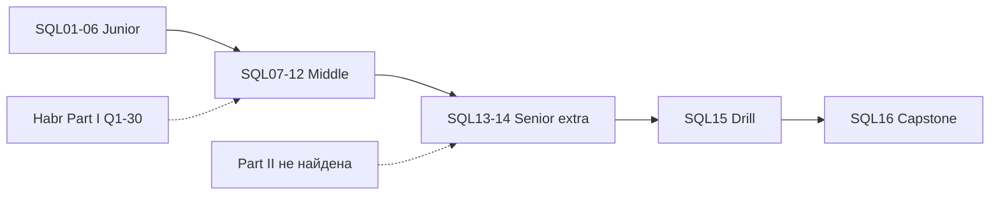

## Введение

Финальный выпуск серии SQL Learn: собрать траекторию Junior → Middle → Senior, пройти self-check и быстро найти выпуск по номеру вопроса Qi. Полные формулировки Q1–Q30 — в [Части I на Хабре](https://habr.com/ru/companies/otus/articles/461067/); здесь — **ориентиры компетенций** и навигация. Часть II исходного «топ-65» на Хабре **не найдена**; темы вроде CTE, окон и EXPLAIN закрыты выпусками SQL13–SQL14.

## Раздел: Чеклисты Junior → Middle → Senior

**Как пользоваться серией.**

1. Идите по `order` 601→616 или точечно по индексу Q→slug ниже.
2. Выпуск: теория → лаба → тест → Anki; SQL12 не пропускайте.
3. Держите открытой [Часть I OTUS/Хабр](https://habr.com/ru/companies/otus/articles/461067/) для формулировок; ответы готовьте свои (PostgreSQL-first).
4. После Middle-лабы обязательны SQL13–14, даже если их не было в Q1–Q30.
5. SQL15 — таймер; SQL16 — чеклист перед собесом.

**Чеклист Junior (SQL01–SQL06).**

- [ ] DDL / DML / DCL и «SQL ≠ СУБД»
- [ ] PK / UK / FK, constraints, целостность
- [ ] DELETE vs TRUNCATE vs DROP
- [ ] INNER/LEFT/RIGHT/FULL/CROSS; идея NATURAL
- [ ] CHAR/VARCHAR/text, трёхзначная логика NULL
- [ ] Зачем индекс; clustered vs secondary с оговоркой диалекта

**Чеклист Middle (SQL07–SQL12).**

- [ ] 1–3НФ, сущность, когда денормализуют
- [ ] ACID и границы транзакции
- [ ] Триггеры BEFORE/AFTER, NEW/OLD; операторы и NULL
- [ ] Подзапросы; correlated vs not; NOT EXISTS
- [ ] CURRENT_DATE/now vs GETDATE; COUNT(*) vs COUNT(col) vs estimate
- [ ] Сводная лаба: JOIN, anti-join, агрегаты, удаление на одной схеме

**Чеклист Senior (SQL13–SQL15 + практика).**

- [ ] CTE (WITH), при необходимости рекурсия; отличие от TEMP
- [ ] ROW_NUMBER / RANK / SUM OVER; «последняя строка в группе»
- [ ] EXPLAIN vs EXPLAIN ANALYZE; Seq vs Index Scan
- [ ] Когда индекс помогает/вредит; идея covering; N+1
- [ ] Drill Q1–Q30 за ≤90 с с примером
- [ ] Честно разделяете PostgreSQL / MSSQL / MySQL в ответах

## Раздел: Индекс Q1–Q30 → slug

| Q | Тема (кратко) | slug |
|---|----------------|------|
| Q1 | DELETE vs TRUNCATE | `sql-delete-truncate-drop` |
| Q2 | DDL/DML/DCL | `sql-ddl-dml-dcl` |
| Q3 | SQL vs MySQL | `sql-ddl-dml-dcl` |
| Q4 | Таблица / поле | `sql-tables-keys-constraints` |
| Q5 | JOIN | `sql-joins` |
| Q6 | CHAR vs VARCHAR | `sql-types-null` |
| Q7 | Primary key | `sql-tables-keys-constraints` |
| Q8 | Constraints / связанные | `sql-tables-keys-constraints` |
| Q9 | Зачем СУБД | `sql-ddl-dml-dcl` |
| Q10 | Constraints | `sql-tables-keys-constraints` |
| Q11 | Unique vs PK | `sql-tables-keys-constraints` |
| Q12 | Целостность | `sql-tables-keys-constraints` |
| Q13 | Индекс | `sql-indexes-basics` |
| Q14 | Текущая дата | `sql-agg-dates-count` |
| Q15 | Виды JOIN | `sql-joins` |
| Q16 | Нормализация | `sql-normalization` |
| Q17 | 1–3 НФ | `sql-normalization` |
| Q18 | Clustered index | `sql-indexes-basics` |
| Q19 | Nonclustered | `sql-indexes-basics` |
| Q20 | Денормализация | `sql-normalization` |
| Q21 | DROP | `sql-delete-truncate-drop` |
| Q22 | Сущность | `sql-normalization` |
| Q23 | ACID | `sql-acid-transactions` |
| Q24 | Триггер | `sql-triggers-operators` |
| Q25 | Операторы | `sql-triggers-operators` |
| Q26 | NULL | `sql-types-null` |
| Q27 | CROSS vs NATURAL | `sql-joins` |
| Q28 | Подзапрос | `sql-subqueries` |
| Q29 | Correlated | `sql-subqueries` |
| Q30 | COUNT | `sql-agg-dates-count` |

**Расширения сверх Части I (вместо отсутствующей Части II).**

| Тема | slug |
|------|------|
| Практика сводная | `sql-practice-lab` |
| CTE + window | `sql-cte-window` |
| EXPLAIN, индексы на практике, N+1 | `sql-performance-explain` |
| Устный drill | `sql-interview-drill` |
| Capstone / этот индекс | `sql-capstone-checklist` |

**Обзор серии SQL Learn.**

| Ep | slug | Фокус |
|----|------|--------|
| SQL01 | sql-ddl-dml-dcl | Подмножества, СУБД |
| SQL02 | sql-tables-keys-constraints | Ключи, constraints |
| SQL03 | sql-delete-truncate-drop | DELETE/TRUNCATE/DROP |
| SQL04 | sql-joins | JOIN |
| SQL05 | sql-types-null | Типы, NULL |
| SQL06 | sql-indexes-basics | Индексы |
| SQL07 | sql-normalization | НФ |
| SQL08 | sql-acid-transactions | ACID |
| SQL09 | sql-triggers-operators | Триггеры, операторы |
| SQL10 | sql-subqueries | Подзапросы |
| SQL11 | sql-agg-dates-count | Дата, COUNT |
| SQL12 | sql-practice-lab | Сводная лаба |
| SQL13 | sql-cte-window | CTE, окна |
| SQL14 | sql-performance-explain | Планы, perf |
| SQL15 | sql-interview-drill | Drill Q1–30 |
| SQL16 | sql-capstone-checklist | Capstone |

## Раздел: План на 2 недели до собеса

**Неделя 1.** Закрыть ❌ в Junior+Middle чеклистах; один раз полностью прогнать SQL12 на чистой БД; Anki по слабым Qi.  
**Неделя 2.** SQL13–14 с `EXPLAIN ANALYZE` на своих данных; ежедневный drill SQL15 (по 10 случайных Qi); пробный live-coding: «клиенты без заказов», «последний заказ», «сумма paid за сегодня».

Артефакт «папка доказательств»: скрипт схемы магазина, 10 SQL-решений, 2 скрина/текста планов до/после индекса, список ловушек NULL/диалектов своими словами.

## Лаба

**Цель.** Заполнить чеклисты и собрать персональный индекс пробелов Qi → действия.

**Шаги.**
1. Пройдите три чеклиста выше маркерами ✅/❌.
2. Для каждого ❌ выпишите slug и одну лабу/Anki на повторение.
3. Сверьте, что Q24–Q25, Q28–Q29, Q14/Q30 реально закрыты SQL09–11 (не только «читал Хабр»).
4. Отметьте отдельно статус SQL13–14 — даже если в Части I их не было.
5. Назначьте дату повторного drill SQL15.

**В группу:** обменяйтесь списками ❌ и проведите взаимный мини-собес на 15 минут.

**Готово, если…**
- [ ] Junior и Middle чеклисты ≥80% ✅
- [ ] SQL13–14 осознанно пройдены или запланированы
- [ ] Есть персональная таблица Qi → slug → статус

## Схема: Траектория серии

## Тест

### Куда смотреть ответ на Q24 и Q29 в серии Learn?

**Ответ:** Q24 → `sql-triggers-operators`; Q29 → `sql-subqueries`

**Пояснение:** индекс выше — основной навигатор перед собесом.

### Почему SQL13–14 входят в capstone, хотя их нет в Q1–Q30?

**Ответ:** Часть II исходного топ-65 на Хабре не найдена; CTE/окна/EXPLAIN — стандарт modern-собеса

**Пояснение:** серия сознательно дополняет пробел, а не ограничивается копией Части I.

### Что считать критерием «готов к middle SQL-собесу»?

**Ответ:** чеклист Junior+Middle закрыт, лаба SQL12 сделана руками, drill ≥24/30 устойчивых ответов

**Пояснение:** senior-планка дополнительно требует окна и чтение планов.

## Шпаргалка

<h3>Уровни</h3>
<ul>
<li>Junior: DDL/DML, ключи, JOIN, NULL, индекс, DELETE/TRUNCATE</li>
<li>Middle: НФ, ACID, триггеры, подзапросы, COUNT/даты, сводная лаба</li>
<li>Senior: CTE, window, EXPLAIN, N+1, темп drill</li>
</ul>
<h3>Источник</h3>
<ul>
<li>Формулировки Q1–30: Хабр OTUS Часть I</li>
<li>Часть II: не найдена → SQL13–14</li>
</ul>
<pre><code>Qi → таблица индекса → slug выпуска</code></pre>

## Anki

### Front: Где в серии триггеры и операторы?

Back: sql-triggers-operators (SQL09, Q24–Q25)

### Front: Что делать с отсутствующей Частью II топ-65?

Back: Опираться на SQL13–14 (CTE/window/EXPLAIN) как на обязательное расширение

### Front: Минимум перед SQL middle-собесом?

Back: SQL01–12 чеклист + руки на схеме customers/orders + drill слабых Qi

## Итоги

- Capstone = чеклисты + индекс Q→slug + честный план повторения
- Хабр Часть I — формулировки; Learn — ваши разборы под PostgreSQL
- Часть II не найдена: senior-темы закрыты SQL13–14, не оставляйте их «на потом»

## Ссылки

- [OTUS / Хабр — топ SQL, часть I (Q1–Q30)](https://habr.com/ru/companies/otus/articles/461067/)
- Learn | /game/learn/sql-interview-drill
- Learn | /game/learn/sql-cte-window
- Learn | /game/learn/sql-performance-explain
