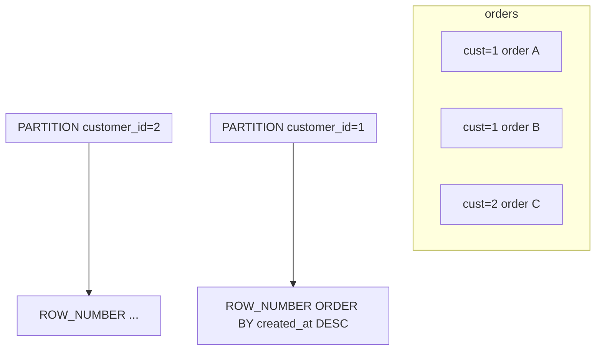

## Введение

В исходной Части I (Q1–Q30) CTE и оконные функции почти не разобраны, но на реальных собесах 2020-х это **обязательная** полка. Выпуск — мост от middle-лабы к senior: читаемый `WITH`, ранжирование и бегущие агрегаты без самоджойна кошмара.

## Раздел: CTE — WITH и рекурсия

**CTE (Common Table Expression)** — именованный подзапрос в предложении `WITH`, видимый основному запросу (и следующим CTE в том же `WITH`).

```sql
WITH paid AS (
  SELECT customer_id, sum(total) AS paid_sum
  FROM orders
  WHERE status = 'paid'
  GROUP BY customer_id
),
top_clients AS (
  SELECT customer_id, paid_sum
  FROM paid
  WHERE paid_sum > 10000
)
SELECT c.email, t.paid_sum
FROM top_clients t
JOIN customers c ON c.id = t.customer_id
ORDER BY t.paid_sum DESC;
```

Зачем на собесе: читаемость, декомпозиция, меньше вложенности; в PostgreSQL CTE по умолчанию могут оптимизироваться по-разному в разных версиях (инлайн vs materialize) — если спрашивают про perf, скажите «смотрю `EXPLAIN`, при необходимости `MATERIALIZED` / `NOT MATERIALIZED` (PG12+)».

**Рекурсивный CTE** — иерархии (оргструктура, категории): якорная часть `UNION ALL` рекурсивная. Кратко уметь нарисовать обход дерева; детали оптимизации — бонус.

CTE ≠ временная таблица: живёт в одном запросе; `CREATE TEMP TABLE` — отдельный объект сессии.

## Раздел: Оконные функции

Окно считает выражение по **набору связанных строк**, не схлопывая результат (в отличие от `GROUP BY`).

Каркас:

```sql
<func>() OVER (
  [PARTITION BY ...]
  [ORDER BY ...]
  [ROWS/RANGE BETWEEN ...]
)
```

Must-have функции:

| Функция | Смысл |
|---------|--------|
| `ROW_NUMBER()` | уникальный номер в разделе (1…n) |
| `RANK()` | ранг с дырками при ничьих |
| `DENSE_RANK()` | ранг без дырок |
| `SUM() OVER (...)` | накопительная/раздельная сумма |
| `LAG` / `LEAD` | соседние строки |

Типичная задача: «последний заказ каждого клиента»:

```sql
WITH ranked AS (
  SELECT o.*,
         row_number() OVER (
           PARTITION BY customer_id
           ORDER BY created_at DESC, id DESC
         ) AS rn
  FROM orders o
)
SELECT *
FROM ranked
WHERE rn = 1;
```

Накопительная сумма по клиенту во времени:

```sql
SELECT id, customer_id, total, created_at,
       sum(total) OVER (
         PARTITION BY customer_id
         ORDER BY created_at, id
         ROWS BETWEEN UNBOUNDED PRECEDING AND CURRENT ROW
       ) AS running_total
FROM orders
WHERE status = 'paid';
```

`RANK` vs `ROW_NUMBER`: при одинаковых ключах сортировки `ROW_NUMBER` всё равно уникален (порядок ничьих недетерминирован без tie-breaker); `RANK` даёт одинаковый ранг и пропускает номера.

Связь с подзапросами (SQL10): многие коррелированные скаляры переписываются в окна — часто яснее и быстрее.

## Лаба

**Цель.** На схеме SQL12 написать CTE-отчёт и выборку «топ-1 заказ на клиента» через `ROW_NUMBER`.

**Шаги.**
1. Возьмите `customers` / `orders` из sql-practice-lab (или пересоздайте кратко).
2. Через `WITH` посчитайте сумму `paid` по клиентам и отфильтруйте порог.
3. Выберите последний заказ каждого клиента (`ROW_NUMBER` + фильтр `rn = 1`).
4. Добавьте `SUM(total) OVER (PARTITION BY customer_id ORDER BY created_at)` и сверьте руками на 2–3 строках.
5. Сравните `RANK` и `DENSE_RANK` на искусственных одинаковых `total`.

**В группу:** один решает «последний заказ» через коррелированный подзапрос, другой — через окно; сравните читаемость и `EXPLAIN`.

**Готово, если…**
- [ ] Пишете цепочку из 2 CTE без подглядывания
- [ ] Объясняете PARTITION BY vs GROUP BY
- [ ] Отличаете ROW_NUMBER / RANK / DENSE_RANK

## Схема: Окно PARTITION BY customer



## Тест

### Чем CTE отличается от подзапроса в FROM?

**Ответ:** CTE именован в WITH и улучшает читаемость/переиспользование в одном запросе; семантика близка derived table

**Пояснение:** senior добавляет про оптимизацию (inline/materialize) и отличие от TEMP TABLE.

### Зачем ROW_NUMBER, если уже есть RANK?

**Ответ:** ROW_NUMBER всегда уникален в разделе — удобно для «ровно одна строка на группу»

**Пояснение:** RANK/DENSE_RANK отражают соревновательную семантику ничьих; для de-dup обычно ROW_NUMBER.

### Чем оконный SUM отличается от SUM + GROUP BY?

**Ответ:** окно возвращает значение на каждой исходной строке; GROUP BY схлопывает строки группы в одну

**Пояснение:** поэтому running total и «доля от группы» делают через OVER, а не только GROUP BY.

## Шпаргалка

<h3>CTE</h3>
<pre><code>WITH a AS (...), b AS (SELECT ... FROM a)
SELECT ... FROM b;</code></pre>
<ul>
<li>Рекурсия: WITH RECURSIVE … UNION ALL …</li>
<li>PG12+: MATERIALIZED / NOT MATERIALIZED</li>
</ul>
<h3>Окна</h3>
<pre><code>row_number() OVER (PARTITION BY cust ORDER BY created_at DESC)
sum(total) OVER (PARTITION BY cust ORDER BY created_at
                 ROWS UNBOUNDED PRECEDING)</code></pre>
<ul>
<li>ROW_NUMBER — уникальный номер; RANK — с дырками; DENSE_RANK — без</li>
</ul>

## Anki

### Front: Что такое CTE?

Back: Именованный подзапрос в WITH для читаемой декомпозиции одного SQL

### Front: Шаблон «последняя строка в группе»?

Back: ROW_NUMBER() OVER (PARTITION BY ключ ORDER BY время DESC) → WHERE rn = 1

### Front: PARTITION BY vs GROUP BY?

Back: PARTITION сохраняет строки и считает окно; GROUP BY агрегирует и схлопывает

## Итоги

- CTE делают сложный SQL сопровождаемым; рекурсия — для иерархий
- Окна — must-have senior/middle+: ранги, running sum, de-dup
- Часть I Хабра этого не закрывает — держите SQL13 в обязательном маршруте

## Ссылки

- [OTUS / Хабр — топ SQL, часть I](https://habr.com/ru/companies/otus/articles/461067/)
- [PostgreSQL: WITH Queries (CTEs)](https://www.postgresql.org/docs/current/queries-with.html)
- [PostgreSQL: Window Functions](https://www.postgresql.org/docs/current/tutorial-window.html)
- Learn | /game/learn/sql-practice-lab
