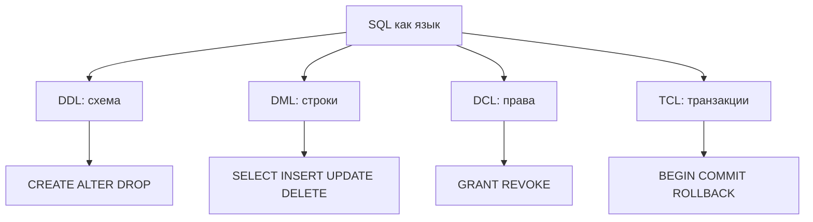

## Введение

Первый выпуск серии SQL для собеседования. Здесь разбираем, как устроен язык SQL по группам команд, чем реляционная СУБД отличается от NoSQL и почему «SQL» и «MySQL» — не одно и то же. Примеры ориентированы на PostgreSQL; различия с MySQL и MS SQL Server отмечены коротко.

## Раздел: DDL, DML, DCL и TCL

SQL удобно мысленно делить на семейства команд — так отвечают на вопрос «что такое DDL/DML/DCL».

**DDL (Data Definition Language)** — описание структуры: объекты схемы создаём, меняем и удаляем.
- Типичные команды: `CREATE`, `ALTER`, `DROP`, `TRUNCATE` (в части классификаций `TRUNCATE` относят к DDL, потому что это операция над таблицей как объектом, а не построчное изменение данных).
- Пример (PostgreSQL):

```sql
CREATE TABLE accounts (
  id         bigint GENERATED ALWAYS AS IDENTITY PRIMARY KEY,
  email      text NOT NULL,
  created_at timestamptz NOT NULL DEFAULT now()
);

ALTER TABLE accounts ADD COLUMN is_active boolean NOT NULL DEFAULT true;
```

**DML (Data Manipulation Language)** — работа со строками данных.
- Команды: `SELECT`, `INSERT`, `UPDATE`, `DELETE`, иногда отдельно выделяют `MERGE` / `UPSERT` (`INSERT … ON CONFLICT` в PostgreSQL).
- Пример:

```sql
INSERT INTO accounts (email) VALUES ('dev@example.com');
UPDATE accounts SET is_active = false WHERE email = 'dev@example.com';
SELECT id, email FROM accounts WHERE is_active;
```

**DCL (Data Control Language)** — права доступа.
- Команды: `GRANT`, `REVOKE` (в некоторых СУБД ещё `DENY`).
- Пример:

```sql
GRANT SELECT, INSERT ON accounts TO app_writer;
REVOKE INSERT ON accounts FROM app_writer;
```

**TCL (Transaction Control Language)** — границы транзакций (часто спрашивают вместе с тройкой выше).
- Команды: `BEGIN` / `START TRANSACTION`, `COMMIT`, `ROLLBACK`, `SAVEPOINT`.
- В PostgreSQL DML обычно идёт внутри транзакции; DDL тоже может быть транзакционным (в отличие от многих сценариев MySQL с InnoDB, где DDL часто неявно коммитит).

На собесе достаточно чётко разделить: **схема** (DDL), **данные** (DML), **права** (DCL), **атомарность изменений** (TCL).

## Раздел: RDBMS и NoSQL

**RDBMS (реляционная СУБД)** хранит данные в таблицах со схемой, связями через ключи и декларативным SQL. Примеры: PostgreSQL, MySQL/MariaDB, SQL Server, SQLite, Oracle.

Сильные стороны для бизнес-систем:
- предсказуемая схема и ограничения целостности;
- мощные JOIN и аналитические запросы;
- транзакции и зрелая модель конкурентного доступа.

**NoSQL** — зонтичный термин для моделей без жёсткой «таблицы + SQL» как единственного интерфейса:
- **документные** (MongoDB) — JSON/BSON-документы;
- **ключ–значение** (Redis) — быстрый доступ по ключу, кэш, сессии;
- **колоночные / широкие таблицы** (Cassandra) — высокие объёмы записи и горизонтальное масштабирование;
- **графовые** (Neo4j) — связи как первоклассные сущности;
- **поисковые** (Elasticsearch) — полнотекст и фасеты.

На практике часто гибрид: PostgreSQL как система записи + Redis/Elasticsearch рядом. Важно сказать интервьюеру: выбор модели зависит от запросов, согласованности и операционной сложности, а не от моды.

## Раздел: Язык SQL и продукт MySQL

**SQL** — язык запросов (стандарт ISO/ANSI с диалектными расширениями). Одна и та же идея (`SELECT … FROM … WHERE`) живёт в разных СУБД, но синтаксис и поведение отличаются: типы, функции дат, `LIMIT`/`OFFSET` vs `TOP`/`FETCH`, автоинкремент, изоляции.

**MySQL** — конкретная СУБД (продукт), которая *реализует* диалект SQL. Аналогично PostgreSQL и SQL Server — тоже продукты со своими диалектами.

Короткий ответ на Q9: «SQL — язык; MySQL — СУБД, которая понимает свой диалект SQL». Не путать также MySQL (СУБД) и «mysql» (клиентская утилита/протокол).

## Лаба

**Цель.** В учебной БД PostgreSQL (или SQLite) создать схему, данные, выдать права (если есть роли) и откатить транзакцию — чтобы наглядно разделить DDL/DML/DCL/TCL.

**Шаги.**
1. Создайте таблицу `sql01_items (id, name, qty)` через `CREATE TABLE` (DDL).
2. Вставьте 3 строки, обновите `qty` у одной, сделайте `SELECT` (DML).
3. Откройте транзакцию, удалите одну строку, выполните `ROLLBACK` и убедитесь, что строка на месте (TCL).
4. Если работаете в PostgreSQL с ролями: создайте роль `sql01_reader`, сделайте `GRANT SELECT` и проверьте отказ на `INSERT` (DCL). В SQLite этот шаг замените письменным объяснением, почему DCL там почти отсутствует.
5. Запишите в заметку одну фразу-ответ: чем DDL отличается от DML на примере вашей таблицы.

**В группу:** партнёр называет случайную команду (`ALTER`, `REVOKE`, `COMMIT`, `UPDATE`) — вы относите её к семейству и объясняете зачем.

**Готово, если…**
- [ ] Называете по 2–3 команды для DDL, DML, DCL и TCL без подсказки
- [ ] Объясняете RDBMS vs документное/ключ–значение хранилище одним примером из продукта
- [ ] Чётко отличаете язык SQL от СУБД MySQL

## Схема: Семейства команд SQL



## Тест

### К какому семейству относится ALTER TABLE ADD COLUMN?

**Ответ:** DDL

**Пояснение:** меняется структура объекта схемы, а не содержимое строк как цель операции.

### Чем RDBMS принципиально отличается от key-value хранилища?

**Ответ:** таблицы, схема, связи и декларативный SQL против доступа преимущественно по ключу

**Пояснение:** key-value отлично для кэша и простых lookup; сложные связи и отчёты обычно проще в RDBMS.

### SQL и MySQL — это одно и то же?

**Ответ:** нет; SQL — язык, MySQL — СУБД со своим диалектом

**Пояснение:** тот же язык в разных продуктах (PostgreSQL, SQL Server) реализуется с отличиями.

## Шпаргалка

<h3>Семейства</h3>
<ul>
<li><b>DDL</b> — CREATE / ALTER / DROP (схема)</li>
<li><b>DML</b> — SELECT / INSERT / UPDATE / DELETE (данные)</li>
<li><b>DCL</b> — GRANT / REVOKE (права)</li>
<li><b>TCL</b> — BEGIN / COMMIT / ROLLBACK (транзакции)</li>
</ul>
<h3>СУБД</h3>
<ul>
<li>RDBMS: PostgreSQL, MySQL, SQL Server, SQLite</li>
<li>NoSQL: документ, KV, колонки, граф, поиск</li>
<li>SQL ≠ MySQL (язык ≠ продукт)</li>
</ul>
<h3>Мини-пример</h3>
<pre><code>BEGIN;
UPDATE accounts SET is_active = false WHERE id = 1;
ROLLBACK;  -- изменение не сохранилось
</code></pre>

## Anki

### Front: Что такое DDL?

Back: команды определения схемы — CREATE, ALTER, DROP (и часто TRUNCATE как операция над объектом)

### Front: Зачем выделяют TCL отдельно от DML?

Back: TCL управляет границами транзакции (COMMIT/ROLLBACK), а DML меняет или читает строки внутри этих границ

### Front: Чем SQL отличается от MySQL?

Back: SQL — стандартизированный язык запросов; MySQL — конкретная СУБД, реализующая диалект SQL

## Итоги

- Четыре семейства команд — быстрый каркас ответа на junior-собесе
- RDBMS и NoSQL решают разные классы задач; гибриды нормальны
- «SQL vs MySQL» проверяет, понимаете ли вы слой языка и слой продукта

## Ссылки

- [OTUS / Хабр — топ вопросов по SQL, часть I](https://habr.com/ru/companies/otus/articles/461067/)
- [PostgreSQL: SQL Commands](https://www.postgresql.org/docs/current/sql-commands.html)
- Learn | /game/learn
- Далее: [Таблицы, ключи и ограничения](/game/learn/sql-tables-keys-constraints)
