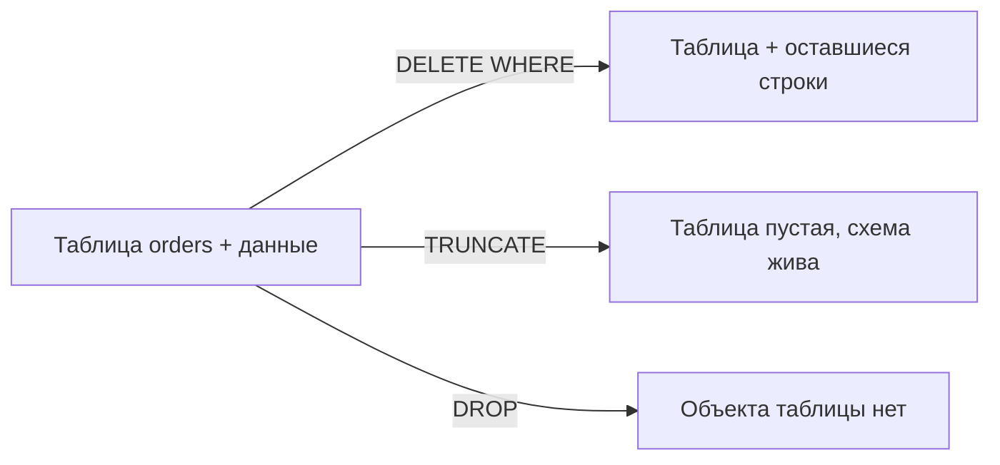

## Введение

Классика собеседования: «чем DELETE отличается от TRUNCATE» и следом «а DROP тогда зачем». Вопрос звучит просто, но ловит на деталях: WHERE, скорость, триггеры, идентичность/sequence, права и особенно **откат**. Ниже — практичный разбор с упором на PostgreSQL и явными оговорками по диалектам.

## Раздел: DELETE против TRUNCATE

**DELETE** — DML: удаляет строки, можно с условием.

```sql
DELETE FROM orders WHERE status = 'canceled';
DELETE FROM orders;  -- все строки, но таблица остаётся
```

Свойства DELETE:
- допускается `WHERE`;
- в PostgreSQL срабатывают триггеры `BEFORE/AFTER DELETE` (построчно или statement-level);
- можно вернуть удалённые строки (`RETURNING` в PG);
- в транзакции полностью откатывается через `ROLLBACK`;
- для больших таблиц без условия может быть медленнее TRUNCATE из‑за построчного/WAL-накладного характера и последующего обслуживания мёртвых строк (VACUUM).

**TRUNCATE** — быстрая очистка таблицы (в классификации часто ближе к DDL-операции над объектом).

```sql
TRUNCATE TABLE orders;
TRUNCATE TABLE order_items, orders RESTART IDENTITY CASCADE;  -- PostgreSQL
```

Свойства TRUNCATE (типично):
- нельзя указать `WHERE` — очищается вся таблица (или список таблиц);
- обычно не вызывает построчные DELETE-триггеры (в PG для TRUNCATE есть отдельные trigger events);
- сбрасывает/перезапускает identity/sequence при `RESTART IDENTITY` (PG);
- требует прав, отличных от обычного DELETE (в PG — право `TRUNCATE`);
- быстрее на больших объёмах за счёт освобождения страниц целиком.

**Откат — критичное отличие диалектов:**
- **PostgreSQL:** `TRUNCATE` можно выполнить внутри транзакции и **откатить** `ROLLBACK` (пока транзакция не закоммичена).
- **Microsoft SQL Server:** `TRUNCATE` тоже логируется минимально, но в типичном учебном ответе его часто противопоставляют DELETE; в актуальных версиях truncate table откатывается в явной транзакции — проверяйте версию, не зубрите миф «truncate никогда не откатывается».
- **MySQL (InnoDB):** DDL-подобные операции часто делают неявный commit; `TRUNCATE` обычно **нельзя откатить** как обычный DML — это частый правильный акцент на собесе про MySQL.

Короткий ответ: DELETE — выборочно и как DML; TRUNCATE — полная быстрая очистка таблицы без WHERE; про rollback всегда уточняйте СУБД.

## Раздел: DROP против TRUNCATE

**DROP** удаляет сам объект схемы.

```sql
DROP TABLE orders;
DROP TABLE IF EXISTS orders CASCADE;  -- PG: зависимые объекты тоже
```

Сравнение с TRUNCATE:
- **TRUNCATE** — таблица остаётся (имя, столбцы, ограничения, привилегии), данные исчезают;
- **DROP** — исчезает определение таблицы; все данные, индексы, триггеры на ней пропадают вместе с объектом; FK, которые ссылались на таблицу, нужно учесть (`CASCADE` / сначала снять зависимости);
- после DROP нужно заново `CREATE TABLE`, чтобы пользоваться объектом;
- **DROP** vs **DELETE/TRUNCATE** — это «убить сущность схемы» vs «очистить содержимое».

Связанные команды: `DROP INDEX`, `DROP SCHEMA`, `DELETE` из строк — не путать уровни.

Практическое правило:
1. убрать часть строк → `DELETE … WHERE`;
2. очистить таблицу, сохранив схему → `TRUNCATE`;
3. убрать таблицу из модели → `DROP TABLE`.

## Лаба

**Цель.** На учебной таблице сравнить DELETE, TRUNCATE и DROP и проверить откат в вашей СУБД.

**Шаги.**
1. Создайте `sql03_demo(id serial/identity, note text)`, вставьте 5 строк.
2. В транзакции удалите 2 строки через `DELETE … WHERE`, сделайте `ROLLBACK` — строки должны вернуться.
3. В новой транзакции выполните `TRUNCATE` (в PG) и `ROLLBACK` — зафиксируйте, восстановились ли данные. Если MySQL — опишите, что truncate, скорее всего, уже зафиксирован.
4. Снова заполните таблицу и выполните `DROP TABLE`; попробуйте `SELECT` — ожидайте ошибку «relation does not exist».
5. Запишите таблицу сравнения из трёх строк: команда / WHERE / объект схемы / rollback в PG.

**В группу:** один говорит «нужно обнулить огромный лог за сегодня ночью, схема важна» — второй выбирает команду и обосновывает.

**Готово, если…**
- [ ] Называете минимум 3 отличия DELETE и TRUNCATE
- [ ] Объясняете, почему DROP опаснее TRUNCATE для приложения
- [ ] Умеете сказать про rollback в PostgreSQL vs типичный MySQL

## Схема: Что остаётся после команды



## Тест

### Можно ли сделать TRUNCATE только для строк status = 'new'?

**Ответ:** нет, у TRUNCATE нет WHERE; нужен DELETE или промежуточная таблица

**Пояснение:** TRUNCATE очищает таблицу целиком (или перечисленные таблицы целиком).

### Откатывается ли TRUNCATE в PostgreSQL?

**Ответ:** да, внутри незакоммиченной транзакции ROLLBACK вернёт данные

**Пояснение:** это важное отличие от распространённого поведения MySQL, где truncate обычно не откатывают как DML.

### Чем DROP TABLE отличается от TRUNCATE TABLE?

**Ответ:** DROP удаляет объект схемы; TRUNCATE только данные, определение таблицы сохраняется

**Пояснение:** после DROP нужны CREATE и восстановление зависимостей/прав.

## Шпаргалка

<h3>Сравнение</h3>
<ul>
<li><b>DELETE</b> — строки, WHERE, триггеры DELETE, DML, rollback</li>
<li><b>TRUNCATE</b> — все строки, быстро, без WHERE; rollback зависит от СУБД</li>
<li><b>DROP</b> — удаляет таблицу как объект</li>
</ul>
<h3>Диалекты</h3>
<ul>
<li>PostgreSQL: TRUNCATE транзакционен; RESTART IDENTITY, CASCADE</li>
<li>MySQL: TRUNCATE часто с неявным commit</li>
<li>SQL Server: уточняйте версию и мифы про «нельзя откатить»</li>
</ul>
<pre><code>BEGIN;
TRUNCATE TABLE sql03_demo;
ROLLBACK;  -- в PostgreSQL данные вернутся
</code></pre>

## Anki

### Front: Когда выбрать DELETE, а не TRUNCATE?

Back: Когда нужно условие WHERE, построчные DELETE-триггеры или удаление части строк

### Front: Что делает DROP TABLE?

Back: Удаляет определение таблицы и всё её содержимое из схемы; объект нужно создавать заново

### Front: TRUNCATE в PostgreSQL и откат?

Back: Можно выполнить в транзакции и откатить ROLLBACK до COMMIT

## Итоги

- DELETE — точечная работа со строками; TRUNCATE — полная очистка; DROP — конец объекта
- Скорость и триггеры — частые критерии выбора
- Про rollback всегда уточняйте СУБД: PostgreSQL дружелюбнее к транзакционному TRUNCATE, чем типичный MySQL

## Ссылки

- [OTUS / Хабр — топ вопросов по SQL, часть I](https://habr.com/ru/companies/otus/articles/461067/)
- [PostgreSQL: TRUNCATE](https://www.postgresql.org/docs/current/sql-truncate.html)
- Learn | /game/learn
- Далее: [JOIN в SQL](/game/learn/sql-joins)
