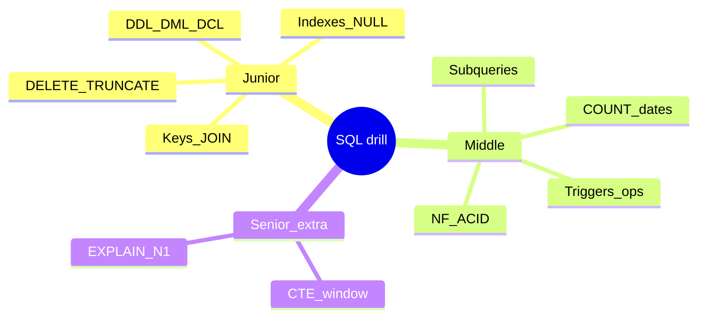

## Введение

Не новая теория, а **темп**. Формулировки вопросов близки к [Части I на Хабре](https://habr.com/ru/companies/otus/articles/461067/); ответы ниже — сжатые оригинальные модели под PostgreSQL. Режим: 45–90 секунд на пункт, определение → пример → ловушка.

## Раздел: Drill Q1–Q15

**Q1 · DELETE vs TRUNCATE.** DELETE — DML, можно WHERE, row-триггеры; TRUNCATE быстро чистит всю таблицу, без WHERE, иные права/WAL/identity.  
**Q2 · DDL/DML/DCL.** DDL — структура (`CREATE`); DML — данные (`SELECT/INSERT…`); DCL — права (`GRANT`).  
**Q3 · SQL vs MySQL.** SQL — язык; MySQL — СУБД, диалект SQL.  
**Q4 · Таблица и поле.** Таблица — отношение/набор строк одной схемы; поле (столбец) — атрибут с типом.  
**Q5 · JOIN.** Связь строк по условию: INNER / LEFT / RIGHT / FULL; идея CROSS.  
**Q6 · CHAR vs VARCHAR.** CHAR фиксированная длина (паддинг); VARCHAR — переменная; в PG чаще `text`/`varchar` без фанатизма.  
**Q7 · Primary key.** Уникальный идентификатор строки, NOT NULL, один PK на таблицу (вкл. составной).  
**Q8 · View.** Именованный сохранённый SELECT; упрощает доступ; в PG есть updatable view с ограничениями.  
**Q9 · Зачем СУБД.** Надёжное хранение, язык запросов, целостность, конкурентный доступ, восстановление.  
**Q10 · Constraints.** Правила целостности: NOT NULL, UNIQUE, CHECK, FK, PK.  
**Q11 · Unique vs PK.** UNIQUE допускает NULL (в PG — несколько NULL); PK строго NOT NULL и главный идентификатор.  
**Q12 · Целостность.** Данные согласованы со схемой и связями; FK не даёт «сиротам» появиться.  
**Q13 · Индекс.** Структура ускорения поиска/сортировки ценой записи и места; B-tree по умолчанию в PG.  
**Q14 · Текущая дата.** PG: `CURRENT_DATE` / `now()`; MSSQL: `GETDATE()`.  
**Q15 · Виды JOIN.** INNER, OUTER (LEFT/RIGHT/FULL), CROSS; NATURAL — по одноимённым столбцам (осторожно).

## Раздел: Drill Q16–Q30 и карта повторения

**Q16 · Нормализация.** Устранение аномалий через нормальные формы (1–3НФ как база).  
**Q17 · 1/2/3 НФ.** Атомарность → зависимость от всего ключа → нет транзитивных зависимостей от неключа.  
**Q18 · Clustered index.** В SQL Server определяет физ. порядок; в PG аналог «кластера» другой (`CLUSTER`), таблицы — heap.  
**Q19 · Nonclustered / secondary.** Отдельная структура ключ→указатель на строку; много на таблицу.  
**Q20 · Денормализация.** Сознательное дублирование ради чтения/отчётов; цена — синхронизация.  
**Q21 · DROP.** Удаляет объект схемы (таблицу целиком); не путать с DELETE/TRUNCATE данных.  
**Q22 · Сущность.** Объект предметной области, в модели — обычно таблица с ключом.  
**Q23 · ACID.** Atomicity, Consistency, Isolation, Durability — свойства транзакции.  
**Q24 · Триггер.** Автокод на событие DML; BEFORE/AFTER, NEW/OLD.  
**Q25 · Операторы.** Арифметика, сравнение, логика (AND/OR/NOT); помнить NULL.  
**Q26 · NULL.** Нет значения; сравнения дают UNKNOWN; `IS NULL`.  
**Q27 · CROSS vs NATURAL.** CROSS — декартово; NATURAL — JOIN по всем одинаковым именам столбцов.  
**Q28 · Подзапрос.** SELECT внутри другого оператора.  
**Q29 · Correlated.** Внутренний запрос ссылается на внешнюю строку; noncorrelated — независим.  
**Q30 · COUNT.** `COUNT(*)` строки; `COUNT(col)` без NULL; плюс estimate через статистику.

**Куда вернуться, если ответ плывёт:** SQL01–06 (junior база), SQL07–08 (нормализация/ACID), SQL09–11 (триггеры/подзапросы/COUNT), SQL12 (лаба), SQL13–14 (CTE/окна/EXPLAIN — сверх списка).

## Лаба

**Цель.** Пройти устный прогон Q1–Q30 с таймером и отметить слабые номера.

**Шаги.**
1. Закройте статью; партнер/карточки называют номер Qi.
2. Ответьте за ≤90 секунд по каркасу: определение → пример PostgreSQL → ловушка.
3. Отметьте ❌/⚠️/✅; по ❌ откройте выпуск из индекса SQL16.
4. Отдельно прогоните 5 задач «напиши SQL»: JOIN, anti-join, COUNT FILTER, ROW_NUMBER, EXPLAIN одной фразой что ожидаете увидеть.
5. Повторите только ⚠️ на следующий день.

**В группу:** двое ведут «сбивку» уточняющими вопросами («а в MySQL?», «а если NULL?»).

**Готово, если…**
- [ ] ≥24/30 ответов устойчивы без конспекта
- [ ] Есть живой пример на схеме customers/orders
- [ ] Можете связать Q23–Q24 с триггером в транзакции

## Схема: Маршрут drill

## Тест

### Какой каркас ответа использовать на любом Qi?

**Ответ:** короткое определение → пример на PostgreSQL → типичная ловушка или отличие диалекта

**Пояснение:** так отличают опыт от заученной чужой статьи.

### Почему Q18 про clustered опасен для кандидата «только Postgres»?

**Ответ:** термин сильнее про SQL Server; в PG нужно честно сказать про heap и CLUSTER/INDEX

**Пояснение:** честное разделение диалектов ценится выше выдуманного «как в учебнике MSSQL».

### Что добавить сверх Q1–Q30 на modern-собесе?

**Ответ:** CTE, оконные функции, чтение EXPLAIN и N+1

**Пояснение:** это SQL13–14 — часть II исходного «топ-65» на Хабре не найдена, поэтому серия закрывает пробел сама.

## Шпаргалка

<h3>Режим</h3>
<ul>
<li>45–90 с; определение → пример → ловушка</li>
<li>PostgreSQL first; диалект — одной фразой</li>
</ul>
<h3>Частые ловушки</h3>
<ul>
<li>NULL и NOT IN; COUNT(*) vs COUNT(col)</li>
<li>SQL ≠ MySQL; DELETE ≠ TRUNCATE ≠ DROP</li>
<li>Clustered — уточнять СУБД</li>
</ul>
<pre><code>Карта: Qi → выпуск серии (см. SQL16)</code></pre>

## Anki

### Front: Каркас ответа на SQL-собесе?

Back: Определение → пример (лучше PG) → ловушка/диалект

### Front: Q29 в одном предложении?

Back: Correlated ссылается на внешнюю строку; noncorrelated можно выполнить отдельно

### Front: Три темы сверх Q1–Q30?

Back: CTE, window functions, EXPLAIN/N+1

## Итоги

- Drill закрепляет скорость, не заменяет лабы
- Оригинальные короткие формулы надежнее чужого текста с Хабра
- Слабые Qi закрывайте точечно по индексу SQL16

## Ссылки

- [OTUS / Хабр — топ SQL, часть I (Q1–Q30)](https://habr.com/ru/companies/otus/articles/461067/)
- Learn | /game/learn/sql-performance-explain
- Learn | /game/learn/sql-capstone-checklist
