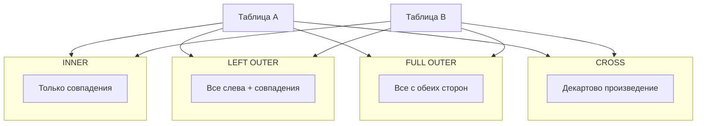

## Введение

JOIN — способ связать строки нескольких таблиц по условию. На собесе ждут не только названия типов, но и понимание, какие строки пропадут, где появятся NULL и чем опасен NATURAL JOIN. Примеры ниже для PostgreSQL; идея переносится на MySQL и SQL Server (с оговоркой по FULL OUTER JOIN в MySQL).

## Раздел: Зачем нужны соединения

Без JOIN пришлось бы вручную сопоставлять ключи во внешнем коде. В SQL соединение — декларативное описание: «возьми заказы и пользователей, где `orders.user_id = users.id`».

Базовый шаблон:

```sql
SELECT o.id, u.email, o.status
FROM orders AS o
INNER JOIN users AS u ON u.id = o.user_id
WHERE o.status = 'paid';
```

Ключевые идеи:
- условие соединения (`ON` / `USING`) задаёт соответствие строк;
- фильтр `WHERE` применяется к уже соединённому результату (с нюансами для внешних JOIN — см. ниже);
- алиасы (`o`, `u`) обязательны в речи на собесе, иначе легко запутаться в одноимённых `id`.

## Раздел: Типы JOIN подробно

**INNER JOIN** — только пары, где условие истинно. Заказ без пользователя (битый FK) или пользователь без заказов не попадут в результат (для пары «заказ–пользователь» пользователь без заказов отпадёт).

**LEFT (OUTER) JOIN** — все строки левой таблицы + совпадения справа; если совпадения нет, правые столбцы = NULL. Удобно искать «пользователи без заказов»:

```sql
SELECT u.id, u.email
FROM users u
LEFT JOIN orders o ON o.user_id = u.id
WHERE o.id IS NULL;
```

Важно: условие на правую таблицу в `WHERE` может «убить» LEFT и превратить его по сути в INNER. Фильтры на правую сторону часто кладут в `ON`.

**RIGHT (OUTER) JOIN** — зеркало LEFT (все справа). На практике чаще переписывают в LEFT, меняя порядок таблиц — так читаемее.

**FULL (OUTER) JOIN** — строки обеих сторон; NULL там, где нет пары. В PostgreSQL и SQL Server поддерживается; в MySQL historically нет FULL OUTER — эмулируют через UNION LEFT и RIGHT.

**SELF JOIN** — таблица соединяется сама с собой (иерархия сотрудников, граф друзей): алиасы обязательны.

**Антиджойны / семиджойны** (часто обсуждают рядом): «есть ли хотя бы одна связанная строка» (`EXISTS`) vs «нет связанных» (`NOT EXISTS` / `LEFT … IS NULL`).

## Раздел: CROSS JOIN и NATURAL JOIN

**CROSS JOIN** — декартово произведение: каждая строка A с каждой строкой B. Явный вид:

```sql
SELECT *
FROM sizes
CROSS JOIN colors;
```

Эквивалент старого `FROM a, b` без условия — опасен случайно: на больших таблицах взрывает объём. Осознанное применение — генерация комбинаций, календарные решётки, тестовые наборы.

**NATURAL JOIN** соединяет таблицы по **всем одноимённым столбцам** автоматически:

```sql
-- рискованно: сработает по всем общим именам столбцов
SELECT *
FROM orders
NATURAL JOIN users;
```

Почему на практике избегают:
- скрытое условие — легко сломать при добавлении столбца `created_at` в обе таблицы;
- читатель запроса не видит ключ связи;
- в команде предпочтительны `USING (user_id)` или явный `ON`.

`USING (user_id)` — компромисс: условие явное по имени столбца, в результате столбец не дублируется.

Итог для собеса: CROSS — декартово; NATURAL — неявное соединение по именам; в проде почти всегда пишите явный `ON`.

## Лаба

**Цель.** На схеме users/orders/order_items получить четыре результата разными JOIN и объяснить кардинальность.

**Шаги.**
1. Подготовьте 3 пользователя, у одного из них 0 заказов; 2 заказа с позициями.
2. Напишите INNER JOIN заказов с пользователями и посчитайте строки.
3. Напишите LEFT JOIN от users к orders и найдите пользователя без заказов через `IS NULL`.
4. Сделайте CROSS JOIN двух маленьких справочников (например, `priorities` × `channels`) — убедитесь, что число строк = произведение.
5. Попробуйте NATURAL JOIN на таблицах с общим лишним столбцом `updated_at` и объясните, почему результат «сломался» или стал пустым.

**В группу:** партнёр рисует круги Венна для INNER/LEFT/FULL — вы подписываете SQL-синонимы.

**Готово, если…**
- [ ] Объясняете INNER vs LEFT на пальцах и на примере с NULL
- [ ] Знаете, когда CROSS уместен и чем опасен случайный декарт
- [ ] Аргументированно отказываетесь от NATURAL JOIN в пользу ON/USING

## Схема: Типы соединений



## Тест

### Какой JOIN вернёт пользователей без заказов вместе с NULL в полях заказа?

**Ответ:** LEFT JOIN от users к orders (затем фильтр o.id IS NULL, если нужны только «без заказов»)

**Пояснение:** INNER отбросит пользователей без совпадений; LEFT сохранит их с NULL справа.

### Чем CROSS JOIN отличается от INNER JOIN?

**Ответ:** CROSS не требует условия и даёт все комбинации; INNER оставляет только строки, где условие истинно

**Пояснение:** INNER концептуально можно представить как CROSS + фильтр, но оптимизатор работает иначе.

### Почему NATURAL JOIN считают опасным?

**Ответ:** условие связи неявное и зависит от имён столбцов, которые могут измениться

**Пояснение:** добавление одноимённого столбца меняет семантику запроса без правки текста JOIN.

## Шпаргалка

<h3>Типы</h3>
<ul>
<li><b>INNER</b> — пересечение по условию</li>
<li><b>LEFT/RIGHT/FULL</b> — внешние, с NULL на стороне без пары</li>
<li><b>CROSS</b> — декартово произведение</li>
<li><b>NATURAL</b> — неявный JOIN по общим именам (избегать)</li>
</ul>
<h3>Практика</h3>
<pre><code>FROM users u
LEFT JOIN orders o ON o.user_id = u.id
WHERE o.id IS NULL;  -- пользователи без заказов
</code></pre>
<ul>
<li>Фильтры на правую таблицу во внешнем JOIN — осторожно: лучше в ON</li>
<li>MySQL: FULL OUTER часто эмулируют UNION</li>
</ul>

## Anki

### Front: Что делает LEFT JOIN?

Back: Возвращает все строки левой таблицы и подходящие справа; если пары нет — справа NULL

### Front: Когда уместен CROSS JOIN?

Back: Когда нужны все комбинации небольших наборов; не как случайный JOIN без ON

### Front: Чем заменить NATURAL JOIN?

Back: Явным ON или USING (column) с понятным ключом связи

## Итоги

- JOIN связывает наборы строк; тип определяет судьбу несовпавших
- LEFT + IS NULL — рабочий приём для «нет связанной записи»
- CROSS осознанно, NATURAL — почти никогда в прикладном коде

## Ссылки

- [OTUS / Хабр — топ вопросов по SQL, часть I](https://habr.com/ru/companies/otus/articles/461067/)
- [PostgreSQL: Joins](https://www.postgresql.org/docs/current/tutorial-join.html)
- Learn | /game/learn
- Далее: [Типы CHAR/VARCHAR и NULL](/game/learn/sql-types-null)
