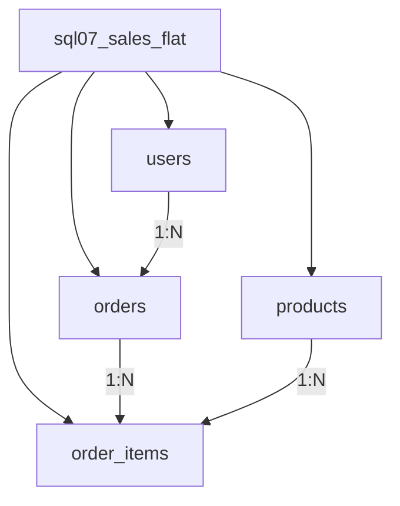

## Введение

Middle-уровень: уже мало назвать PK/FK — нужно проектировать модель. Этот выпуск связывает сущности и отношения, объясняет выгоды нормализации, разбирает 1NF–3NF и честно говорит, зачем иногда денормализуют. Примеры схематические, СУБД — PostgreSQL.

## Раздел: Сущности, связи и денормализация

**Сущность** — объект предметной области, о котором храним данные: пользователь, заказ, товар, платёж. В модели обычно становится таблицей (или набором таблиц при сложных случаях).

**Атрибут** — свойство сущности (email, статус). **Связь** — ассоциация между сущностями:
- 1:1 — профиль к пользователю;
- 1:N — пользователь и заказы;
- M:N — заказы и товары через таблицу связи `order_items`.

ER-мышление на собесе: сначала существительные и глаголы предметной области, потом таблицы, потом типы связей и ключи.

**Денормализация** — сознательное введение избыточности в уже нормализованную (или почти) схему ради чтения/отчётности/простоты запроса.

Примеры:
- хранить `orders.total_amount` рядом с позициями, хотя сумму можно считать;
- дублировать `user_email` в таблице событий аналитики;
- витрины и materialised views.

Цена денормализации: риск рассинхрона, сложнее UPDATE, нужны чёткие правила обновления (транзакция, триггер, ETL). На собесе важно слово **«осознанно»**: денормализация — не «забыли нормализовать».

## Раздел: Зачем нормализуют

**Нормализация** уменьшает избыточность и аномалии изменения.

Выгоды, которые ждут в ответе:
1. **Меньше дублирования** — ФИО клиента не копируется в каждый заказ как единственный источник правды.
2. **Меньше аномалий вставки/обновления/удаления** — не теряем данные о товаре, удаляя последний заказ с его «вшитым» описанием.
3. **Проще целостность** — одно место правки + FK/UK.
4. **Гибкость эволюции схемы** — новые атрибуты сущности не размножают столбцы по фактам.

Цена нормализации: больше JOIN при чтении, иногда сложнее ад-hoc отчёты. Отсюда баланс 3NF для OLTP и денормализованные витрины для OLAP.

## Раздел: 1NF, 2NF, 3NF

Говорите отталкиваясь от ключей и функциональных зависимостей.

**1NF (первая нормальная форма)**  
- атомарные значения атрибутов (не список телефонов в одной ячейке через запятую);
- нет повторяющихся групп (`phone1`, `phone2`, `phone3` как «массив столбцов»);
- есть первичный ключ, строки уникально идентифицируемы.

Плохо: `phones = '111,222'`. Лучше: таблица `user_phones(user_id, phone)`.

**2NF (вторая нормальная форма)**  
- выполняется 1NF;
- каждый неключевой атрибут зависит от **всего** составного ключа, а не от его части.

Классика: в `order_items(order_id, product_id, product_name, qty)` имя товара зависит только от `product_id` → вынести в `products`.

**3NF (третья нормальная форма)**  
- выполняется 2NF;
- нет транзитивных зависимостей неключевых атрибутов: неключевой → другой неключевой.

Пример: `employees(id, dept_id, dept_name)` — `dept_name` зависит от `dept_id`, не напрямую от сотрудника → справочник `departments`.

Выше 3NF (BCNF и далее) на middle-собесе упоминают по желанию; уверенный рассказ 1–3NF + пример денормализации обычно достаточен.

```text
orders(id, user_id, ...)
products(id, name, price)
order_items(order_id, product_id, qty)  -- M:N связь, без product_name
```

## Лаба

**Цель.** Взять «плохую» широкую таблицу продаж и привести её к 3NF, затем осознанно денормализовать одно поле.

**Шаги.**
1. Создайте денормализованную `sql07_sales_flat` с полями: order_id, order_date, user_id, user_email, product_id, product_name, qty, line_total, order_total.
2. Разнесите на `users`, `products`, `orders`, `order_items` до 3NF; перенесите данные `INSERT … SELECT`.
3. Найдите, какие аномалии исчезли (смена email, смена названия товара).
4. Добавьте в `orders` поле `total_amount` и заполните из суммы позиций — зафиксируйте правило обновления (триггер или только приложение).
5. Подготовьте устный ответ на 90 секунд: «что такое 2NF» с вашим примером.

**В группу:** партнёр предлагает хранить JSON со всеми позициями в `orders` — обсудите, когда это 1NF-нарушение, а когда осознанный документный подход (и что тогда с FK).

**Готово, если…**
- [ ] Рисуете сущности и 1:N / M:N без подсказки
- [ ] Даёте определения 1NF/2NF/3NF и по одному нарушению
- [ ] Отличаете денормализацию от «плохо спроектировали»

## Схема: От плоской таблицы к 3NF



## Тест

### Что нарушает 1NF?

**Ответ:** многозначные или неатомарные атрибуты и повторяющиеся группы в одной строке

**Пояснение:** нормальная форма требует атомарности и отсутствия «массивов в ячейке» как основного способа модели.

### Чем 2NF отличается от 1NF?

**Ответ:** при составном ключе неключевые атрибуты не должны зависеть от части ключа

**Пояснение:** типичный фикс — вынести атрибуты сущности товара/заказа в свои таблицы.

### Денормализация — это всегда ошибка?

**Ответ:** нет, это осознанная избыточность ради производительности или простоты чтения

**Пояснение:** важно описать, как поддерживается согласованность копий данных.

## Шпаргалка

<h3>Формы</h3>
<ul>
<li><b>1NF</b> — атомарность, нет повторяющихся групп</li>
<li><b>2NF</b> — нет зависимости от части составного ключа</li>
<li><b>3NF</b> — нет транзитивных зависимостей между неключевыми</li>
</ul>
<h3>Модель</h3>
<ul>
<li>Сущности → таблицы; M:N → таблица связи</li>
<li>Нормализация для OLTP; витрины/поля-кэши — денормализация</li>
</ul>
<h3>Аномалии без нормализации</h3>
<ul>
<li>Update: меняем имя в 100 строках</li>
<li>Insert: нельзя завести товар без заказа</li>
<li>Delete: удалили заказ — потеряли единственную копию атрибута</li>
</ul>

## Anki

### Front: Что такое 3NF своими словами?

Back: Таблица в 2NF и ни один неключевой атрибут не зависит транзитивно от ключа через другой неключевой

### Front: Как моделируют связь many-to-many?

Back: Отдельной таблицей связи с FK на обе стороны и обычно составным/суррогатным PK

### Front: Пример оправданной денормализации?

Back: Кэш суммы заказа в orders или email в таблице аналитических событий при чётком правиле обновления

## Итоги

- Сначала сущности и связи, потом нормальные формы
- 1–3NF убирают главные аномалии OLTP-моделей
- Денормализация — инструмент производительности, а не оправдание хаоса

## Ссылки

- [OTUS / Хабр — топ вопросов по SQL, часть I](https://habr.com/ru/companies/otus/articles/461067/)
- [PostgreSQL: Table Basics](https://www.postgresql.org/docs/current/ddl-basics.html)
- Learn | /game/learn
- Далее: [ACID и транзакции](/game/learn/sql-acid-transactions)
