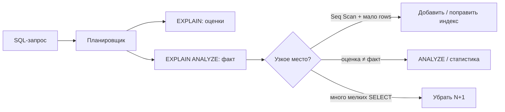

## Введение

Знать JOIN мало: на senior ждут «почему медленно» и «что смотреть». Этот выпуск — практичный слой сверх Q1–Q30: `EXPLAIN (ANALYZE)`, здравый смысл индексов и классика N+1 между приложением и БД.

## Раздел: EXPLAIN и EXPLAIN ANALYZE

В PostgreSQL:

```sql
EXPLAIN
SELECT * FROM orders WHERE customer_id = 42;

EXPLAIN (ANALYZE, BUFFERS, FORMAT TEXT)
SELECT c.email, o.total
FROM orders o
JOIN customers c ON c.id = o.customer_id
WHERE o.status = 'paid';
```

- **`EXPLAIN`** — план *ожидаемый* (оценки строк, стоимость).
- **`EXPLAIN ANALYZE`** — план *исполненный* (реальное время и rows); **выполняет** запрос (для пишущих DML опаснее — обычно откатывают транзакцию или используют копию).

Что читать в первую очередь:

1. Тип узла: `Seq Scan`, `Index Scan`, `Index Only Scan`, `Bitmap Heap Scan`, `Hash Join`, `Nested Loop`, `Sort`.
2. Расхождение `rows` estimated vs actual — повод для `ANALYZE` таблицы / плохой статистики.
3. Толстые `Seq Scan` на больших таблицах при селективном фильтре — кандидат на индекс.
4. `Sort` + большой объём — возможный `work_mem` / индекс под `ORDER BY`.

Стоимость — условные единицы планировщика, не миллисекунды; для времени смотрите `actual time` в ANALYZE.

## Раздел: Индексы, covering и N+1

**Когда индекс помогает:** высокая селективность (`customer_id = ?`, email UNIQUE), JOIN/FK-колонки, частые `ORDER BY` + `LIMIT`, предикаты диапазона по времени.

**Когда вредит или бесполезен:**

- почти все строки всё равно нужны (селективность ≈ 1) — Seq Scan дешевле;
- низкая кардинальность (`boolean`, статус из 3 значений) без дополнительной колонки;
- функция на столбце (`WHERE lower(email) = …`) — нужен индекс по выражению;
- слишком много индексов — замедляют `INSERT`/`UPDATE`/`DELETE` и раздувают storage.

**Идея covering / Index Only Scan:** индекс содержит все нужные столбцы, heap не читаем (в PG помогает `VACUUM` видимости / `INCLUDE` в CREATE INDEX).

```sql
CREATE INDEX ON orders (customer_id) INCLUDE (status, total);
```

**N+1:** приложение делает 1 запрос список заказов + N запросов « sucй клиента» в цикле. Симптом: тысячи одинаковых `SELECT … WHERE id = $1` в логах. Лечение: JOIN / `WHERE id IN (…)`, batch, dataloader; на стороне SQL — один наборный запрос. На собесе свяжите с ORM (`select_related` / `joinedload`).

Связка с SQL06: типы индексов (B-tree по умолчанию в PG) — база; здесь акцент на **наблюдаемости плана**, а не на зубрёжке названий.

Кратко по диалектам: в MSSQL — план в SSMS, `SET STATISTICS IO`; в MySQL — `EXPLAIN ANALYZE` (в новых версиях). Идея та же: смотреть доступ к данным и JOIN strategy.

## Лаба

**Цель.** Снять планы до/после индекса и смоделировать N+1 vs один JOIN.

**Шаги.**
1. На схеме SQL12 залейте достаточно строк (тысячи orders — скриптом генерации).
2. Сделайте `EXPLAIN ANALYZE` выборки `WHERE customer_id = …` без индекса по `customer_id` (временно дропните) и с индексом.
3. Найдите запрос с `WHERE status = 'paid'` на большой таблице — обсудите, почему один индекс по status может не использоваться.
4. Напишите псевдокод N+1 в Python/любом языке и эквивалент одним SQL JOIN.
5. Создайте индекс с `INCLUDE` и поймайте `Index Only Scan` (или объясните, почему его ещё нет — visibility map).

**В группу:** один ломает статистику (`DELETE` массы строк без `ANALYZE`), второй читает план и ставит диагноз.

**Готово, если…**
- [ ] Отличаете EXPLAIN от EXPLAIN ANALYZE
- [ ] Называете 2 случая «индекс не поможет»
- [ ] Объясняете N+1 и исправление наборным запросом

## Схема: От запроса к плану



## Тест

### Чем EXPLAIN ANALYZE опаснее обычного EXPLAIN?

**Ответ:** он реально выполняет запрос, включая побочные эффекты DML

**Пояснение:** для диагностики SELECT на проде всё равно осторожны с нагрузкой; для UPDATE/DELETE — только в транзакции с ROLLBACK или на копии.

### Когда Seq Scan может быть правильным выбором?

**Ответ:** когда нужно прочитать большую долю таблицы — случайный доступ по индексу дороже последовательного чтения

**Пояснение:** senior не орёт «везде индексы», а говорит о селективности и стоимости.

### Что такое N+1?

**Ответ:** один запрос за список + по запросу на каждую связанную сущность в цикле

**Пояснение:** лечится JOIN/IN/batch; часто приходит из наивного ORM.

## Шпаргалка

<h3>Планы</h3>
<pre><code>EXPLAIN (ANALYZE, BUFFERS) &lt;sql&gt;;</code></pre>
<ul>
<li>Смотри: Scan/Join тип, rows estimate vs actual, Sort</li>
<li>После больших DML — ANALYZE таблицы</li>
</ul>
<h3>Индексы и N+1</h3>
<ul>
<li>Помогают при высокой селективности и JOIN/FK</li>
<li>Вредят при write-heavy и «почти full scan»</li>
<li>Covering: INCLUDE / Index Only Scan</li>
<li>N+1 → один наборный SQL или batch</li>
</ul>

## Anki

### Front: EXPLAIN vs EXPLAIN ANALYZE?

Back: Оценки плана vs реальное исполнение с фактическим временем и rows

### Front: Когда индекс не помогает?

Back: Низкая селективность / нужен почти full scan / выражение без expression index; плюс цена на запись

### Front: Как объяснить N+1 на собесе?

Back: 1+N запросов в цикле приложения; чинить JOIN/IN/batch/ORM eager load

## Итоги

- План — главный артефакт разговора о perf в SQL
- Индекс — инструмент селективного доступа, не магия
- N+1 — стык приложения и БД; senior обязан его узнать в логах

## Ссылки

- [OTUS / Хабр — топ SQL, часть I](https://habr.com/ru/companies/otus/articles/461067/)
- [PostgreSQL: Using EXPLAIN](https://www.postgresql.org/docs/current/using-explain.html)
- [PostgreSQL: CREATE INDEX](https://www.postgresql.org/docs/current/sql-createindex.html)
- Learn | /game/learn/sql-cte-window
