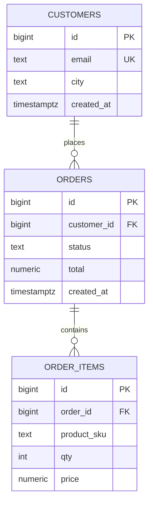

## Введение

Теория Q1–Q30 без клавиатуры выветривается. Этот выпуск — **сводная лаба** на одной схеме: ключи и JOIN, удаление данных, агрегаты, подзапросы. Цель — уверенно писать запросы вслух и в psql, как на live-coding части собеса.

## Раздел: Учебная схема магазина

```sql
CREATE TABLE customers (
  id          bigserial PRIMARY KEY,
  email       text UNIQUE NOT NULL,
  city        text,
  created_at  timestamptz NOT NULL DEFAULT now()
);

CREATE TABLE orders (
  id           bigserial PRIMARY KEY,
  customer_id  bigint NOT NULL REFERENCES customers(id),
  status       text NOT NULL CHECK (status IN ('new', 'paid', 'cancelled')),
  total        numeric(12,2) NOT NULL CHECK (total >= 0),
  created_at   timestamptz NOT NULL DEFAULT now()
);

CREATE TABLE order_items (
  id          bigserial PRIMARY KEY,
  order_id    bigint NOT NULL REFERENCES orders(id) ON DELETE CASCADE,
  product_sku text NOT NULL,
  qty         int NOT NULL CHECK (qty > 0),
  price       numeric(12,2) NOT NULL CHECK (price >= 0)
);

CREATE INDEX ON orders (customer_id);
CREATE INDEX ON orders (created_at);
CREATE INDEX ON order_items (order_id);
```

Смысл сущностей (связка с нормализацией из SQL07): клиент 1—N заказов; заказ 1—N позиций. Денормализовать `total` можно, но в лабе считайте сумму и сверяйте.

Минимум данных: 4 клиента (один без заказов), 5+ заказов разных статусов, позиции с разными `qty`.

## Раздел: Набор задач «как на собесе»

Выполните и **проговорите** зачем каждый приём:

1. **INNER JOIN** — заказы с email клиента.
2. **LEFT JOIN** — все клиенты и число заказов (`count(o.id)`), включая нули.
3. **Anti-join** — клиенты без заказов (`NOT EXISTS` или `LEFT … WHERE o.id IS NULL`).
4. **Подзапрос** — заказы с `total` выше среднего по `paid`.
5. **COUNT** — `count(*)` заказов за сегодня vs `count(*) FILTER (WHERE status = 'paid')`.
6. **DELETE vs TRUNCATE** — в транзакции удалите позиции одного заказа (`DELETE`); отдельно на копии таблицы сравните `TRUNCATE` (сброс identity, нельзя WHERE; в PG — быстрее, меньше WAL при полном очищении, права иные).
7. **Целостность** — попробуйте вставить `order_items` с несуществующим `order_id` — ожидайте FK error.
8. **Операторы** — выборка `status IN (…)`, `total BETWEEN`, скидка `price * qty * 0.9`.

Это покрывает практику вокруг Q1–Q30: подмножества SQL, ключи, JOIN, NULL/COUNT, удаление, подзапросы, операторы, дату.

## Лаба

**Цель.** Поднять схему, залить фикстуры и закрыть чеклист из восьми задач выше с проверкой результатов.

**Шаги.**
1. Создайте БД/схему `sql12_lab` и три таблицы со всеми CHECK/FK/индексами.
2. Вставьте фикстуры (в т.ч. клиент без заказов и заказ без… нет, позиции пусть будут у всех заказов, кроме одного «пустого» для anti-join по items — по желанию).
3. Решите задачи 1–5; сохраните SQL в файл `lab12.sql`.
4. В одной транзакции сделайте `DELETE FROM order_items WHERE order_id = …; ROLLBACK;` — убедитесь, что данные на месте; затем осознанный `COMMIT` на тестовой копии.
5. На временной таблице сравните `DELETE` без WHERE и `TRUNCATE`: время, `IDENTITY`, возможность `WHERE`.
6. Напишите краткий README: какие вопросы из Q1–Q30 закрыла каждая задача.

**В группу:** code review чужого `lab12.sql` — ищите `NOT IN` с nullable столбцом, деление integer, фильтр «сегодня» через `::date` на столбце.

**Готово, если…**
- [ ] Схема поднимается с нуля одним скриптом
- [ ] Есть INNER, LEFT, anti-join, subquery, агрегаты
- [ ] Можете за 60 секунд объяснить DELETE vs TRUNCATE на примере этой схемы

## Схема: ER магазина



## Тест

### Как найти клиентов без заказов без NOT IN?

**Ответ:** `NOT EXISTS` или `LEFT JOIN orders … WHERE orders.id IS NULL`

**Пояснение:** оба — anti-join; `NOT IN` рискован при NULL в подзапросе.

### Чем TRUNCATE принципиально отличается от DELETE всех строк?

**Ответ:** TRUNCATE — DDL-подобная очистка всей таблицы без WHERE, обычно быстрее; DELETE — DML построчно с возможностью WHERE и триггеров ROW

**Пояснение:** детали прав, identity/sequence, WAL и блокировок зависят от СУБД — в ответе назовите 2–3 отличия для PostgreSQL.

### Зачем в лабе одновременно `orders.total` и сумма по `order_items`?

**Ответ:** проверить согласованность денормализованного поля или правило расчёта

**Пояснение:** на собесе это связка нормализации, агрегатов и тестовых инвариантов для QA/аналитика.

## Шпаргалка

<h3>Каркас лабы</h3>
<ul>
<li>customers 1—N orders 1—N order_items</li>
<li>JOIN / anti-join / subquery / COUNT / дата / DELETE vs TRUNCATE</li>
</ul>
<pre><code>-- anti-join
SELECT c.* FROM customers c
WHERE NOT EXISTS (
  SELECT 1 FROM orders o WHERE o.customer_id = c.id);

-- заказы выше среднего paid
SELECT * FROM orders
WHERE total &gt; (
  SELECT avg(total) FROM orders WHERE status = 'paid');</code></pre>

## Anki

### Front: Минимальная схема для SQL live-coding?

Back: customers → orders → order_items с PK/FK и парой индексов

### Front: Три запроса, которые почти всегда просят на практике?

Back: JOIN с атрибутами родителя; anti-join «без детей»; агрегат COUNT/SUM с GROUP BY

### Front: Что проговорить про DELETE vs TRUNCATE?

Back: WHERE только у DELETE; TRUNCATE чистит всё быстрее; отличаются права, identity, триггеры, WAL

## Итоги

- Одна схема закрывает большую часть практики Q1–Q30
- Умение выбрать JOIN / NOT EXISTS / подзапрос важнее заучивания определений
- После лабы переходите к CTE, окнам и EXPLAIN (SQL13–14)

## Ссылки

- [OTUS / Хабр — топ SQL, часть I (Q1–Q30)](https://habr.com/ru/companies/otus/articles/461067/)
- Learn | /game/learn/sql-agg-dates-count
- Learn | /game/learn/sql-cte-window
