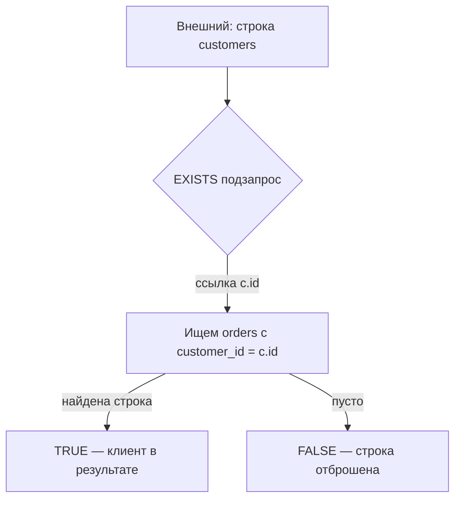

## Введение

Подзапрос — частый способ «запроса внутри запроса» на middle-собесе. Q28 просит определение и виды; Q29 — разницу коррелированного и некоррелированного. Ниже — определения своими словами и живые примеры на схеме заказов в PostgreSQL.

## Раздел: Что такое подзапрос (Q28)

**Подзапрос** — SELECT, вложенный в другой SQL-оператор (в `SELECT`, `FROM`, `WHERE`, `HAVING`, иногда в `INSERT`/`UPDATE`). Результат подзапроса используется внешним запросом как значение, набор строк или таблица.

По форме результата:

| Вид | Ожидание | Пример места |
|-----|----------|--------------|
| Скалярный | одна строка, один столбец | `WHERE total > (SELECT avg(total) …)` |
| Список значений | один столбец, N строк | `WHERE id IN (SELECT …)` |
| Таблица (derived) | набор столбцов | `FROM (SELECT …) AS t` |
| Проверка существования | true/false по наличию | `WHERE EXISTS (SELECT 1 …)` |

Правила, которые любят проверять:

- скалярный подзапрос **не должен** вернуть больше одной строки — иначе ошибка;
- `IN` с NULL внутри списка коварен; часто безопаснее `EXISTS`;
- в PostgreSQL подзапрос в `FROM` обязан иметь алиас.

Пример некоррелированного скаляра:

```sql
SELECT id, total
FROM orders
WHERE total > (SELECT avg(total) FROM orders WHERE status = 'paid');
```

Внутренний запрос можно вычислить один раз — он не ссылается на внешнюю строку.

## Раздел: Correlated vs noncorrelated (Q29)

**Некоррелированный (noncorrelated):** внутренний SELECT независим от текущей строки внешнего запроса. Оптимизатор часто выполняет его один раз (или материализует).

**Коррелированный (correlated):** внутренний запрос ссылается на столбцы внешней таблицы — логически «для каждой внешней строки». Классика — поиск клиентов без заказов или «заказ с максимальной суммой в своей группе».

Пример корреляции через `EXISTS` (предпочтительно для anti-join «есть ли хотя бы одна»):

```sql
-- клиенты, у которых есть хотя бы один paid-заказ
SELECT c.id, c.email
FROM customers c
WHERE EXISTS (
  SELECT 1
  FROM orders o
  WHERE o.customer_id = c.id
    AND o.status = 'paid'
);
```

Пример коррелированного скаляра (на каждый заказ — среднее по тому же клиенту):

```sql
SELECT o.id,
       o.customer_id,
       o.total,
       (SELECT avg(o2.total)
        FROM orders o2
        WHERE o2.customer_id = o.customer_id) AS avg_for_customer
FROM orders o;
```

Anti-join через `NOT EXISTS` (часто читаемее, чем `NOT IN`):

```sql
SELECT c.id
FROM customers c
WHERE NOT EXISTS (
  SELECT 1 FROM orders o WHERE o.customer_id = c.id
);
```

На собесе добавьте: корреляция ≠ всегда медленно — при хорошем индексе по `orders(customer_id)` `EXISTS` отлично работает; зато «подзапрос в SELECT на миллион строк» без нужды лучше заменить JOIN + агрегатом или оконкой (см. SQL13).

Кратко по диалектам: идея одна; синтаксис lateral в PostgreSQL (`JOIN LATERAL`) — явная форма корреляции в `FROM`, удобна, когда подзапрос возвращает несколько столбцов на строку.

## Лаба

**Цель.** Написать четыре подзапроса: скаляр, IN, EXISTS (correlated), anti-join NOT EXISTS.

**Шаги.**
1. Создайте `customers` и `orders` с 3+ клиентами и заказами в разных статусах (один клиент без заказов).
2. Выберите заказы дороже среднего `total` по всей таблице (noncorrelated).
3. Выберите клиентов, чьи `id` входят в `IN (SELECT customer_id FROM orders WHERE status = 'paid')`.
4. Перепишите пункт 3 через `EXISTS` и сравните планы (`EXPLAIN`).
5. Найдите клиентов без заказов через `NOT EXISTS` и отдельно через `LEFT JOIN … WHERE o.id IS NULL`.

**В группу:** партнёр нарочно делает скалярный подзапрос, возвращающий 2 строки — вы объясняете ошибку и как ограничить (`LIMIT 1` — костыль; лучше агрегат или иная форма).

**Готово, если…**
- [ ] Даёте определение подзапроса и 3 места встраивания
- [ ] На пальцах отличаете correlated от noncorrelated
- [ ] Для «нет дочерних строк» выбираете NOT EXISTS / anti-join, а не слепой NOT IN

## Схема: Корреляция EXISTS



## Тест

### Что такое подзапрос в одном предложении?

**Ответ:** вложенный SELECT, чей результат использует внешний SQL-оператор

**Пояснение:** уточните вид (скаляр / список / таблица / EXISTS) — так ответ звучит middle, а не junior.

### Чем коррелированный подзапрос отличается от некоррелированного?

**Ответ:** коррелированный ссылается на столбцы внешней строки и логически зависит от неё

**Пояснение:** некоррелированный можно понять и часто выполнить отдельно; коррелированный — «в контексте» внешней таблицы.

### Почему для «клиенты без заказов» часто предпочитают NOT EXISTS, а не NOT IN?

**Ответ:** NOT IN ломается на NULL в списке; NOT EXISTS предсказуемее и хорошо индексируется

**Пояснение:** если подзапрос вернёт NULL среди id, `NOT IN` может дать пустой результат — классическая ловушка собеса.

## Шпаргалка

<h3>Виды</h3>
<ul>
<li>Скаляр / IN-список / derived table / EXISTS</li>
<li>Noncorrelated — автономен; correlated — ссылка на внешнюю строку</li>
</ul>
<h3>Шаблоны</h3>
<pre><code>WHERE total &gt; (SELECT avg(total) FROM orders);
WHERE EXISTS (SELECT 1 FROM orders o WHERE o.customer_id = c.id);
WHERE NOT EXISTS (SELECT 1 FROM orders o WHERE o.customer_id = c.id);</code></pre>
<ul>
<li>Алиас обязателен для подзапроса в FROM (PostgreSQL)</li>
<li>Скаляр ≠ много строк</li>
</ul>

## Anki

### Front: Q28 — что такое subquery?

Back: SELECT внутри другого оператора; результат — значение, набор или таблица

### Front: Q29 — correlated subquery?

Back: Внутренний запрос ссылается на столбцы внешнего; логически per outer row

### Front: Клиенты без заказов — какой шаблон?

Back: NOT EXISTS (SELECT 1 FROM orders o WHERE o.customer_id = c.id) или anti-join

## Итоги

- Подзапрос — вложенный SELECT; важно уметь назвать форму результата
- Noncorrelated независим; correlated завязан на внешнюю строку
- EXISTS / NOT EXISTS — рабочие лошадки; осторожнее с NOT IN и скалярами «на миллион строк»

## Ссылки

- [OTUS / Хабр — топ SQL, часть I (Q28–Q29)](https://habr.com/ru/companies/otus/articles/461067/)
- [PostgreSQL: Subquery Expressions](https://www.postgresql.org/docs/current/functions-subquery.html)
- Learn | /game/learn/sql-triggers-operators
