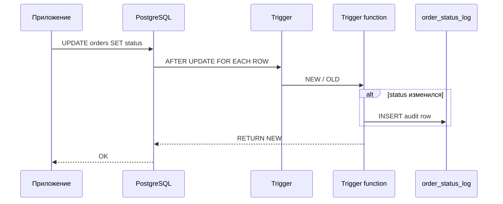

## Введение

После ACID на собесе часто спрашивают: «что такое триггер?» и «какие операторы знаете в SQL?». Это Q24 и Q25 из топ-списка. Ниже — рабочие определения, типичные сценарии в PostgreSQL и ловушки (особенно NULL и приоритет), без зубрёжки чужих формулировок.

## Раздел: Триггеры (Q24)

**Триггер** — именованный обработчик, который СУБД вызывает автоматически при событии на таблице (или представлении): `INSERT`, `UPDATE`, `DELETE`, иногда `TRUNCATE`. Логика лежит в функции (в PostgreSQL — обычно `LANGUAGE plpgsql`), а `CREATE TRIGGER` только связывает событие, момент и функцию.

Ключевые оси ответа на собесе:

| Ось | Что сказать |
|-----|-------------|
| Момент | `BEFORE` / `AFTER` (и `INSTEAD OF` для view) |
| Уровень | `FOR EACH ROW` vs `FOR EACH STATEMENT` |
| Данные | в row-триггере доступны `NEW` и/или `OLD` |
| Условие | `WHEN (...)` — фильтр срабатывания |

Пример каркаса в PostgreSQL:

```sql
CREATE OR REPLACE FUNCTION audit_order_status()
RETURNS trigger AS $$
BEGIN
  IF NEW.status IS DISTINCT FROM OLD.status THEN
    INSERT INTO order_status_log(order_id, old_status, new_status, changed_at)
    VALUES (OLD.id, OLD.status, NEW.status, now());
  END IF;
  RETURN NEW;
END;
$$ LANGUAGE plpgsql;

CREATE TRIGGER trg_orders_status_audit
AFTER UPDATE OF status ON orders
FOR EACH ROW
WHEN (OLD.status IS DISTINCT FROM NEW.status)
EXECUTE FUNCTION audit_order_status();
```

**Когда уместны:** аудит, денормализованные счётчики, запрет «опасных» переходов статуса, синхронизация служебных полей. **Когда вредны:** сложная бизнес-логика «спрятана» от приложения, неочевидные каскады, тяжёлые внешние вызовы внутри триггера — на собесе это признак зрелости: «триггер — последний рубеж целостности, не замена сервиса».

Кратко по диалектам: в MSSQL триггеры опираются на таблицы `inserted`/`deleted`; в MySQL синтаксис ближе к «тело в `CREATE TRIGGER`»; в PostgreSQL почти всегда отдельная функция + `EXECUTE FUNCTION` / `EXECUTE PROCEDURE` (зависит от версии).

## Раздел: Операторы SQL (Q25)

Группы, которые ждут на middle:

**Сравнение:** `=`, `<>` / `!=`, `<`, `>`, `<=`, `>=`, `BETWEEN`, `IN`, `LIKE` / `ILIKE` (PG), `IS NULL` / `IS NOT NULL`, `IS DISTINCT FROM` (удобно для NULL-safe сравнения в PostgreSQL).

**Логические:** `AND`, `OR`, `NOT`. Приоритет: `NOT` выше `AND`, `AND` выше `OR` — скобки спасают от сюрпризов.

**Арифметика:** `+`, `-`, `*`, `/`, `%` (остаток; в PG также `mod()`). Деление целых в PostgreSQL даёт целое (`5/2 = 2`) — для дроби приводят тип: `5::numeric / 2`.

**Прочее часто всплывает рядом:** конкатенация `||`, операторы множества `UNION` / `INTERSECT` / `EXCEPT`, JSON/array-операторы в PG (`->`, `@>`, `&&`) — упомянуть как «диалектное расширение», если уровень позволяет.

Ловушка NULL: `WHERE col = NULL` никогда не отберёт строки; нужно `IS NULL`. Выражение `NULL OR true` → `true`, `NULL AND true` → `NULL` (в фильтре WHERE это «ложь»). На собесе коротко: «трёхзначная логика».

## Лаба

**Цель.** Создать AFTER UPDATE триггер аудита и набор запросов с операторами сравнения/логики/арифметики.

**Шаги.**
1. В PostgreSQL создайте `orders(id, status text, total numeric)` и `order_status_log(...)`.
2. Реализуйте функцию и триггер, пишущий лог только при смене `status`.
3. Обновите заказ дважды: с той же и с новой статусной меткой — убедитесь, что лог растёт только во втором случае.
4. Напишите `SELECT` с `AND`/`OR`, `BETWEEN`, `IN`, `IS DISTINCT FROM` и арифметикой скидки (`total * 0.9`).
5. Покажите запрос, где без скобок `OR` даёт неожиданный набор, а со скобками — ожидаемый.

**В группу:** партнёр добавляет BEFORE INSERT триггер, который отклоняет `total < 0` через `RAISE EXCEPTION` — вы объясняете, чем BEFORE отличается от AFTER.

**Готово, если…**
- [ ] Объясняете NEW/OLD и BEFORE vs AFTER без шпаргалки
- [ ] Называете минимум три группы операторов с примером
- [ ] Помните про NULL и приоритет AND/OR

## Схема: Срабатывание row-триггера



## Тест

### Чем триггер отличается от обычной хранимой процедуры?

**Ответ:** процедура вызывается явно; триггер — автоматически при DML-событии

**Пояснение:** на собесе важно добавить момент (BEFORE/AFTER) и уровень (ROW/STATEMENT), иначе ответ звучит слишком плоско.

### Почему `WHERE email = NULL` не находит строки?

**Ответ:** сравнение с NULL даёт UNKNOWN, а WHERE пропускает только TRUE

**Пояснение:** корректно писать `email IS NULL`; в PostgreSQL для сравнения «равно с учётом NULL» удобен `IS NOT DISTINCT FROM`.

### Что вернёт `5 / 2` в PostgreSQL для типа integer?

**Ответ:** `2` (целочисленное деление)

**Пояснение:** для 2.5 приводят операнды к `numeric`/`float`; это частая ловушка в отчётах и тестах.

## Шпаргалка

<h3>Триггер</h3>
<ul>
<li>Событие → момент (BEFORE/AFTER) → уровень (ROW/STATEMENT) → функция</li>
<li>NEW / OLD; WHEN; аудит и инварианты, не «весь бизнес»</li>
</ul>
<h3>Операторы</h3>
<ul>
<li>Сравнение: = &lt;&gt; &lt; &gt; BETWEEN IN LIKE IS NULL</li>
<li>Логика: NOT &gt; AND &gt; OR; скобки обязательны при сомнении</li>
<li>Арифметика: + - * / %; смотри типы при делении</li>
</ul>
<pre><code>CREATE TRIGGER ... AFTER UPDATE ON t
FOR EACH ROW EXECUTE FUNCTION f();</code></pre>

## Anki

### Front: Что такое SQL-триггер?

Back: Автоматический обработчик DML/DDL-события на объекте БД; в PostgreSQL обычно функция + CREATE TRIGGER

### Front: Какие три группы операторов ждут в Q25?

Back: Арифметические, логические (AND/OR/NOT), сравнения (=, &lt;&gt;, BETWEEN, IN, LIKE, IS NULL…)

### Front: Как безопасно сравнить два значения с возможным NULL в PostgreSQL?

Back: IS DISTINCT FROM / IS NOT DISTINCT FROM вместо = / &lt;&gt;

## Итоги

- Триггер — реакция СУБД на событие; называйте момент, уровень и NEW/OLD
- Операторы делятся на арифметику, логику и сравнения; NULL ломает интуицию
- PostgreSQL: функция триггера отдельно; целые делятся нацело; приоритет AND/OR — со скобками

## Ссылки

- [OTUS / Хабр — топ SQL, часть I (Q24–Q25)](https://habr.com/ru/companies/otus/articles/461067/)
- [PostgreSQL: CREATE TRIGGER](https://www.postgresql.org/docs/current/sql-createtrigger.html)
- Learn | /game/learn/sql-acid-transactions
