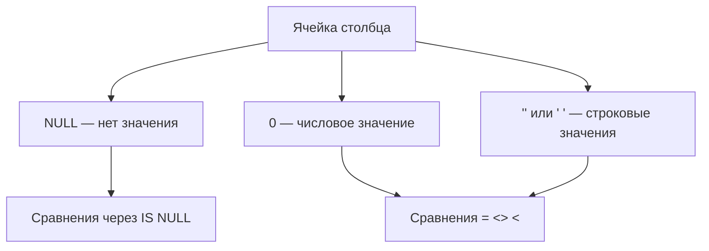

## Введение

Два частых «простых» вопроса: чем `CHAR` отличается от `VARCHAR` и чем `NULL` отличается от нуля и пробела. Ошибки здесь дорогие — неправильные сравнения в `WHERE`, ложные уникальности и раздутые строки фиксированной длины. Разбираем на PostgreSQL с короткими заметками про другие диалекты.

## Раздел: CHAR и VARCHAR

Оба типа хранят текстовые строки, но контракт разный.

**CHAR(n)** — строка фиксированной длины n. При записи значение дополняется пробелами справа до n (поведение padding зависит от стандарта и СУБД; в сравнениях пробелы часто игнорируются по правилам SQL).

**VARCHAR(n)** / **CHARACTER VARYING(n)** — строка переменной длины до n символов (в PostgreSQL лимит — в символах, не в байтах для этих типов).

В **PostgreSQL** на практике:
- чаще используют `text` без лимита или `varchar(n)` если нужен явный максимум;
- `char(n)` редко нужен: хранение с padding неудобно, выигрыш минимален;
- пустая строка `''` — это валидное значение типа character, **не** NULL.

В **MySQL** исторически различия CHAR/VARCHAR сильнее связаны с хранением в строках таблиц разных engine; всё равно смысл «фиксированная vs переменная длина» сохраняется.

В **SQL Server** есть `char`/`varchar` и отдельно `nchar`/`nvarchar` (Unicode); плюс `varchar(max)`.

Когда уместен CHAR: коды фиксированной ширины (`country_code char(2)`), если команда осознанно хочет padding. Для имён, email, описаний — `text`/`varchar`.

```sql
CREATE TABLE sql05_codes (
  iso2 char(2) PRIMARY KEY,          -- 'RU'
  label varchar(100) NOT NULL,       -- переменная длина
  comment text                       -- без жёсткого лимита (PG)
);
```

## Раздел: NULL, ноль и пробел

**NULL** означает «значение отсутствует / неизвестно». Это не данные, а маркер отсутствия.

Сравнения:
- `0` — число ноль, осмысленное значение;
- `' '` или `''` — строки из пробела / пустая строка, тоже значения;
- `NULL` — нет значения.

Трёхзначная логика SQL: предикаты дают `TRUE`, `FALSE` или `UNKNOWN`. Сравнение с NULL даёт UNKNOWN:

```sql
SELECT 1 = NULL;          -- NULL/unknown
SELECT NULL = NULL;       -- NULL/unknown, не TRUE
SELECT NULL IS NULL;      -- TRUE
SELECT NULL IS NOT NULL;  -- FALSE
```

В `WHERE` строка проходит только при TRUE; UNKNOWN отфильтровывается. Поэтому `WHERE col = NULL` почти никогда не находит «пустые» — нужен `col IS NULL`.

Агрегаты: `COUNT(*)` считает строки; `COUNT(col)` игнорирует NULL в col; `SUM`/`AVG` тоже пропускают NULL.

Пустая строка vs NULL в бизнес-модели: «пользователь не указал отчество» можно моделировать NULL или `''` — важно выбрать одно правило и не смешивать. В PostgreSQL `'' IS NULL` → false.

```sql
-- найти «не задано»
SELECT * FROM users WHERE middle_name IS NULL;

-- пустая строка — другое множество
SELECT * FROM users WHERE middle_name = '';
```

На собесе полезно добавить: в уникальном индексе PostgreSQL несколько NULL допустимы; пустая строка — одна.

## Лаба

**Цель.** Наглядно увидеть padding/длину CHAR/VARCHAR и поведение NULL в фильтрах и агрегатах.

**Шаги.**
1. Создайте таблицу `sql05_demo(a char(5), b varchar(5), c int)`.
2. Вставьте строки: `('x','x',0)`, `('x','x',NULL)`, `('', '', NULL)` — если СУБД позволит по длине.
3. Выполните `WHERE c = NULL`, `WHERE c IS NULL`, `WHERE c = 0` — сравните результаты.
4. Посчитайте `COUNT(*)`, `COUNT(c)`, `SUM(c)` по таблице.
5. В PostgreSQL сравните `length(a)` и `length(b)` / `trim` для CHAR — обсудите padding.

**В группу:** партнёр загадывает «нет значения», «ноль», «пробел» — вы пишете предикат.

**Готово, если…**
- [ ] Объясняете CHAR vs VARCHAR без путаницы с NULL
- [ ] Никогда не пишете `= NULL` для поиска пустых
- [ ] Отличаете 0, '', ' ' и NULL на примере

## Схема: Значение vs отсутствие



## Тест

### Чем VARCHAR(10) отличается от CHAR(10)?

**Ответ:** VARCHAR хранит строку переменной длины до 10; CHAR — фиксированной длины 10 с дополнением пробелами по правилам типа

**Пояснение:** для большинства прикладных полей в PostgreSQL удобнее text/varchar, чем char.

### Почему WHERE age = NULL не находит строки без возраста?

**Ответ:** сравнение с NULL даёт UNKNOWN, а WHERE пропускает только TRUE; нужен IS NULL

**Пояснение:** NULL — не обычное значение, а маркер отсутствия.

### NULL и 0 — одно и то же?

**Ответ:** нет; 0 — значение «ноль», NULL — «неизвестно/не задано»

**Пояснение:** SUM и бизнес-логика трактуют их по-разному; путать нельзя.

## Шпаргалка

<h3>Типы строк</h3>
<ul>
<li><b>CHAR(n)</b> — фиксированная длина</li>
<li><b>VARCHAR(n)</b> — переменная до n</li>
<li>В PG часто <b>text</b> без лимита</li>
</ul>
<h3>NULL</h3>
<ul>
<li>NULL ≠ 0 ≠ '' ≠ ' '</li>
<li>Проверка: <code>IS NULL</code> / <code>IS NOT NULL</code></li>
<li><code>COUNT(col)</code> пропускает NULL</li>
</ul>
<pre><code>WHERE col IS NULL;     -- правильно
WHERE col = NULL;      -- почти всегда бесполезно
</code></pre>

## Anki

### Front: Когда уместен CHAR(n)?

Back: Для кодов фиксированной ширины; для обычного текста обычно varchar/text

### Front: Как найти строки с неизвестным значением столбца?

Back: Предикатом IS NULL, не через = NULL

### Front: Чем пустая строка отличается от NULL?

Back: '' — значение нулевой длины; NULL — отсутствие значения; сравнения и уникальность ведут себя иначе

## Итоги

- CHAR фиксирует ширину, VARCHAR — переменная длина; в PostgreSQL text — рабочая лошадка
- NULL — отдельная семантика, не «ноль» и не «пробел»
- Трёхзначная логика объясняет половину багов в WHERE и JOIN

## Ссылки

- [OTUS / Хабр — топ вопросов по SQL, часть I](https://habr.com/ru/companies/otus/articles/461067/)
- [PostgreSQL: Character Types](https://www.postgresql.org/docs/current/datatype-character.html)
- Learn | /game/learn
- Далее: [Основы индексов](/game/learn/sql-indexes-basics)
