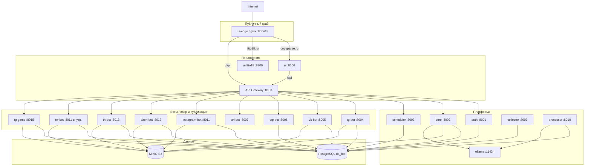
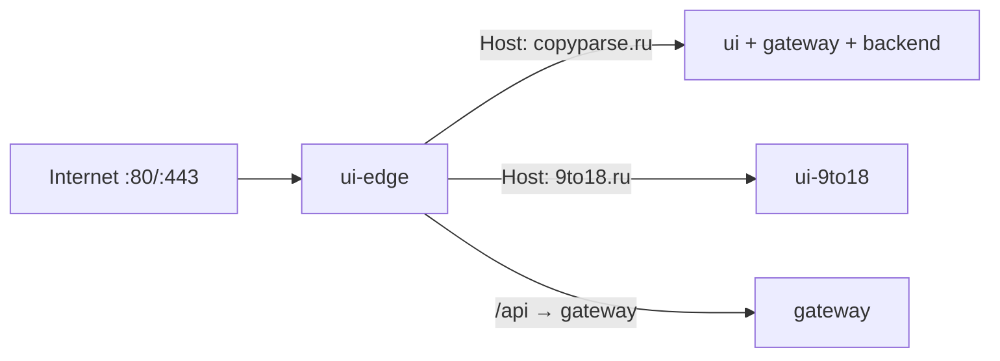
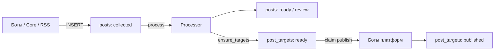
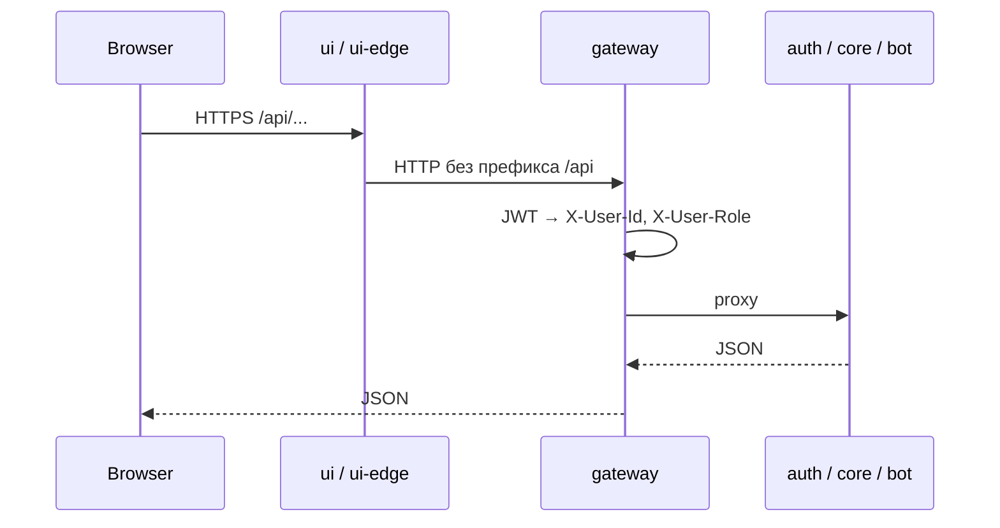

# Архитектура CopyParse

Актуально по `docker-compose.yaml` (август 2026).

## 1. Высокоуровневая схема

## 2. Деплой-юниты

Три независимых юнита на общей Docker-сети `edge_net`:

| Юнит | Compose | Роль |
|------|---------|------|
| copyparse (монорепо) | `docker-compose.yaml` | UI, gateway, auth, core, scheduler, collector, processor, боты, MinIO, Ollama |
| ui-9to18 | `deploy/ui-9to18/docker-compose.yml` | Статический сайт на nginx :8200; Learn API через edge `/api/learn` + `/api/auth` → gateway |
| ui-edge | `deploy/ui-edge/docker-compose.yml` | Публичный reverse-proxy :80/:443 |
| e2e-tester | `deploy/e2e-tester/docker-compose.yml` | On-demand E2E (1 container + SQLite), 127.0.0.1:8300 |

Подробности: [../deploy/DEPLOYMENT.md](../deploy/DEPLOYMENT.md).

## 3. Пайплайн постов

Центральная таблица `posts` + очередь публикации `post_targets`.

Сети публикации (`post_targets.platform`): tg, wp, vk, dzen, instagram, tw, threads.

Детали статусов: [POSTS_LIFECYCLE.md](POSTS_LIFECYCLE.md).

## 4. Карта сервисов и портов

| Сервис | Порт | Назначение |
|--------|------|------------|
| gateway | 8000 | JWT, CORS, rate limit, прокси |
| auth | 8001 | Пользователи, токены, email |
| core | 8002 | Профили платформ, посты, SMM, админка |
| scheduler | 8003 | Опрос расписаний, старт ботов |
| tg-bot | 8004 | Telegram MTProto: сбор / публикация |
| vk-bot | 8005 | VK: сбор / публикация |
| wp-bot | 8006 | WordPress |
| url-bot | 8007 | Скрапинг Custom URL |
| collector | 8009 | RSS Дзен, метрики очереди |
| processor | 8010 | Обработка текста / AI |
| instagram-bot | 8011 | Instagram |
| dzen-bot | 8012 | Яндекс Дзен |
| th-bot | 8013 | Threads |
| tw-bot | 8011 (внутр.), host 8014 | Twitter / X |
| tg-game | 8015 | Telegram mini-game / заказы |
| ui | 8100 | React SPA |
| minio | 9000 / 9001 | S3 API / Console |
| ollama | 11434 | Локальные LLM |

Сеть Docker: `monitoring_network` (172.20.0.0/16). Gateway и UI также в `edge_net`.  
Host-порты ботов/MinIO/Ollama/collector/processor привязаны к **127.0.0.1** (публичный вход — ui-edge).

## 4.1 Replica-safety

| Компонент | Multi-replica |
|-----------|----------------|
| Collector RSS / metrics | Не claim-очередь |
| Processor | Да (claim → processing) |
| Bot publishers (tg/vk/ig/tw/dzen) | Да (claim `post_targets` → `publishing`) |
| Scheduler poll | Да (`pg_try_advisory_lock`) |
| Gateway rate limit | Нет (in-memory; scale → Redis, фаза 2) |
| Gateway JWT blacklist | Да (Redis `jwt:bl:*`; fallback HTTP → auth/Postgres) |
| Ollama / MinIO | Один инстанс по дизайну |

## 5. Поток запроса UI → API

Публичные пути без JWT: login, register, refresh, verify, reset-password, health, часть RSS/game.

## 6. Внешние платформы

| Платформа | Сбор | Публикация |
|-----------|------|------------|
| Telegram | tg-bot | tg-bot |
| VKontakte | vk-bot | vk-bot / Core API |
| Instagram | instagram-bot | instagram-bot |
| Threads | th-bot | th-bot |
| Twitter / X | tw-bot | tw-bot |
| WordPress | wp-bot | wp-bot |
| Дзен | dzen-bot / RSS | RSS + dzen-bot |
| Custom URL | url-bot | в `posts` + `post_targets` |
| Ручной пост | Core `/cpost` | через collector → боты |

## 7. Асинхронность: Postgres-очередь, не Kafka

На текущем этапе (SMB SaaS, единый хост, десятки тенантов) **полный переход на Event-Driven Architecture с Kafka/RabbitMQ и event sourcing не внедряем**.

Постинг уже асинхронный:

- статусы в `posts` / `*_posts` + `FOR UPDATE SKIP LOCKED` = очередь в PostgreSQL;
- collector / processor / боты — poll-циклы (`PUBLISH_INTERVAL_SEC` ~30–90 с);
- hot-path SMM: после materialize пост сразу `ready`, Core будит бота `POST /internal/publish-now`;
- финальный статус SMM job (`published` / `failed` / `partial`) выставляется по `POST /internal/smm/posts/publish-result`, а не в момент INSERT строки.

Аудит жизненного цикла — append-only таблица `post_lifecycle_events` (журнал переходов), **не** event sourcing как источник истины.

Redis используется для JWT blacklist, не как брокер задач.

### Когда пересмотреть брокер

1. Lock contention / poll не успевает при росте тенантов.
2. Много независимых подписчиков на одно событие (вебхуки, биллинг, аналитика) без новых HTTP-связок.
3. Нужен replay потока или внешняя data-platform.
4. Боты на нескольких хостах без общей БД как очереди.

До этих сигналов: Postgres queue + HTTP wake-up. Если позже понадобится шина — transactional outbox + RabbitMQ/Redis Streams (не Kafka), без смены модели истины в Postgres.

## 8. Связанные документы

- [SERVICES_OVERVIEW.md](SERVICES_OVERVIEW.md) — эндпоинты и БД
- [POSTS_LIFECYCLE.md](POSTS_LIFECYCLE.md) — статусы постов
- [INSTALLATION.md](INSTALLATION.md) — установка
- [SECURITY_HARDENING.md](SECURITY_HARDENING.md) — hardening и ротация секретов
- [USER_GUIDE.md](USER_GUIDE.md) — инструкция пользователя
- [../deploy/DEPLOYMENT.md](../deploy/DEPLOYMENT.md) — прод-деплой
- [../k8s/README.md](../k8s/README.md) — Kubernetes / Minikube
