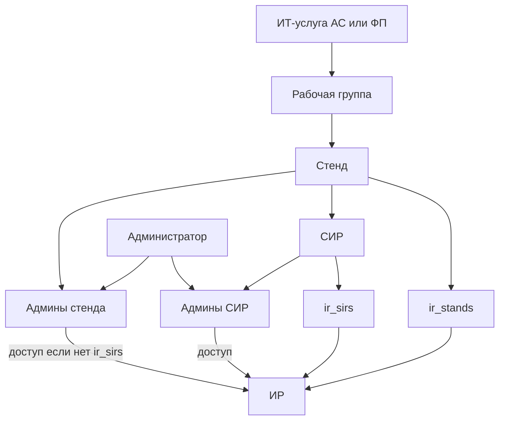
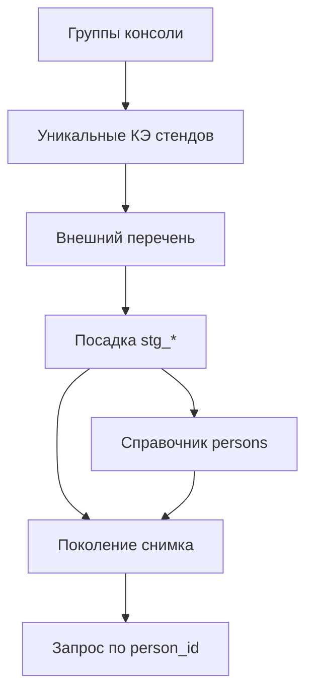
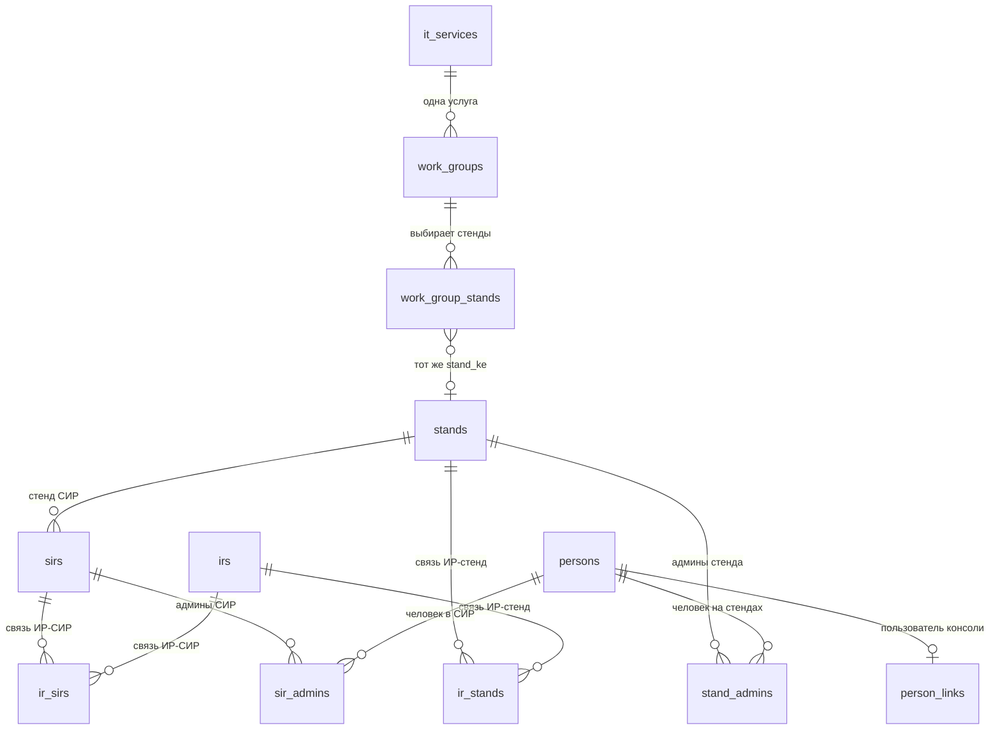
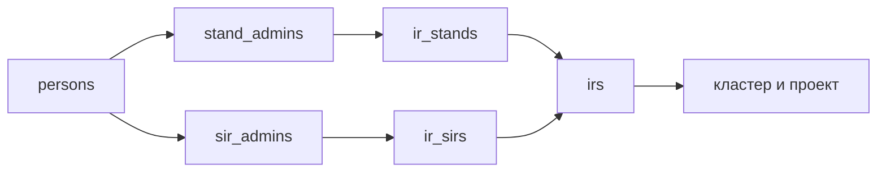
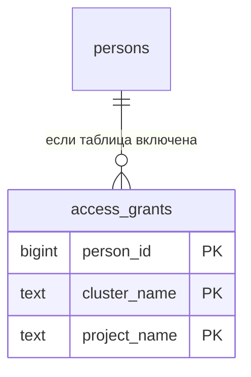
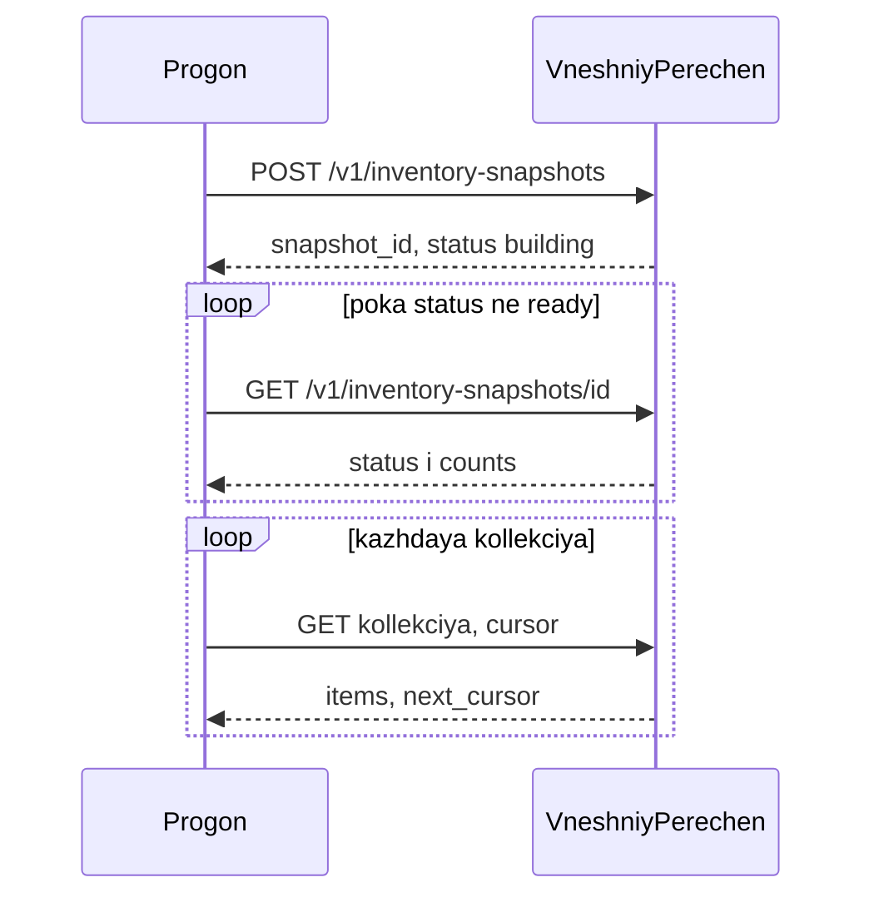

# План: доступ к проектам по админам стенда и СИР

Рабочая группа задаёт, какие стенды исследовать. При 10 тысячах стендов, 60 тысячах ИР и 30 тысячах админов снимок грузится пакетом по уникальным стендам. Перечень «кластер + проект» для человека читается по индексу его членства.

Постоянная таблица «админ × ИР» в схеме не хранится.

## Правило доступа

ИТ-услуга — автоматизированная система (АС) или функциональная подсистема (ФП). Подключение к консоли идёт по её конфигурационному элементу (КЭ).

К ИТ-услуге привязаны стенды: разработка (`DEV`), тестирование (`IFT`, `PSI`), промышленный (`PROM`). Стенд связан с СИР напрямую: у СИР один стенд. ИР со стендом и с СИР напрямую не связан. Эти связи лежат в отдельных таблицах `ir_stands` и `ir_sirs`. Одна строка — одна пара. У одного ИР может быть несколько стендов и несколько СИР.

Списки админов есть у стенда и у СИР. У ИР есть имя проекта и имя кластера. Родителя на строке ИР нет.

- Если у ИР есть хотя бы одна строка в `ir_sirs`, его видят админы этих СИР. Строки `ir_stands` того же ИР доступ не дают.
- Если строк в `ir_sirs` нет, ИР видят админы стендов из `ir_stands`.
- ИР без обеих связей не попадает ни в одну выдачу.
- Присутствие человека на КЭ ИТ-услуги само по себе доступ не даёт.
- Выдача человеку — уникальные пары «кластер + имя проекта». Среда стенда хранится на стенде и в ключ выдачи пока не входит.
- Один человек на нескольких стендах получает объединение пар. Повтор одной и той же пары схлопывается.



## Как устроена рабочая группа

Рабочая группа — единица подключения в консоли. В ней нет списка админов: люди берутся из списков стенда и СИР.

Группа хранит один КЭ ИТ-услуги и несколько КЭ стендов этой услуги. Одна услуга может иметь несколько групп с разными наборами стендов. Один стенд может входить в несколько групп; на выдачу это не влияет.

Исследование забирает из внешнего перечня только стенды, которые входят хотя бы в одну группу:

- СИР стенда;
- ИР и строки связей `ir_stands`, `ir_sirs`;
- список админов стенда и список админов каждого СИР.

Снимок стенда каждый раз заменяется целиком. Стенд, который больше не входит ни в одну группу, из снимка удаляется. КЭ стенда при исследовании должен принадлежать КЭ ИТ-услуги группы.



## Связи таблиц

Сплошная связь на диаграмме — внешний ключ. Связь группы со стендом идёт по текстовому `stand_ke`: стенд можно привязать до того, как он появится в снимке, поэтому внешнего ключа на `stands` нет.



Чтение проектов одного человека идёт по двум путям членства. Обратного произведения «все админы × все ИР» нет.

Путь через `ir_stands` действует, только если у этого ИР нет строк в `ir_sirs`.



Необязательная свёртка `access_grants` повторяет уже посчитанные пары и на справочники стенда не ссылается.



## Список таблиц

| Слой | Таблица | Когда живёт | Назначение |
|------|---------|-------------|------------|
| Область | `it_services` | постоянно | Подключённый КЭ ИТ-услуги |
| Область | `work_groups` | постоянно | Рабочая группа на одну услугу |
| Область | `work_group_stands` | постоянно | КЭ стендов, выбранных в группу |
| Люди | `persons` | постоянно | Внешний ключ админа и стабильный `person_id` |
| Люди | `person_links` | постоянно | Связь админа с пользователем консоли |
| Снимок | `stands` | поколение, подмена раз в сутки | Стенд и его среда |
| Снимок | `sirs` | поколение | СИР на одном стенде |
| Снимок | `irs` | поколение | ИР: проект и кластер, без родителя |
| Снимок | `ir_stands` | поколение | Связь ИР и стенда |
| Снимок | `ir_sirs` | поколение | Связь ИР и СИР |
| Снимок | `stand_admins` | поколение | Членство админа на стенде |
| Снимок | `sir_admins` | поколение | Членство админа в СИР |
| Посадка | `stg_stands` | только прогон | КЭ стендов из источника |
| Посадка | `stg_sirs` | только прогон | КЭ СИР из источника |
| Посадка | `stg_irs` | только прогон | КЭ ИР: проект и кластер |
| Посадка | `stg_ir_stands` | только прогон | Пары КЭ ИР и КЭ стенда |
| Посадка | `stg_ir_sirs` | только прогон | Пары КЭ ИР и КЭ СИР |
| Посадка | `stg_stand_admins` | только прогон | Админы стенда текстом |
| Посадка | `stg_sir_admins` | только прогон | Админы СИР текстом |
| Выдача | `access_grants` | по необходимости | Свёртка «человек, кластер, проект» |

Один стенд в снимке хранится один раз, даже если он входит в несколько групп.

## Состав колонок

### `it_services`

| Колонка | Тип | Ключ | Комментарий |
|---------|-----|------|-------------|
| `it_service_ke` | `text` | PK | КЭ ИТ-услуги |
| `it_service_kind` | `text` | | `AS` или `FP` |
| `name` | `text` | | Отображаемое имя, может быть пустым |
| `created_at` | `timestamptz` | | Когда услугу подключили в консоли |

### `work_groups`

| Колонка | Тип | Ключ | Комментарий |
|---------|-----|------|-------------|
| `id` | `uuid` | PK | Идентификатор группы |
| `name` | `text` | | Имя группы в консоли |
| `it_service_ke` | `text` | FK | Одна услуга на группу |
| `created_at` | `timestamptz` | | Создание группы |
| `researched_at` | `timestamptz` | | Когда стенды группы последний раз вошли в успешный снимок |

### `work_group_stands`

| Колонка | Тип | Ключ | Комментарий |
|---------|-----|------|-------------|
| `work_group_id` | `uuid` | PK, FK | Группа, каскадное удаление |
| `stand_ke` | `text` | PK | КЭ стенда, как его завели до исследования |
| `created_at` | `timestamptz` | | Когда стенд добавили в группу |

После исследования `stands.stand_ke` совпадает с этим КЭ, а `stands.it_service_ke` совпадает с услугой группы.

### `persons`

`person_id` при суточной подмене снимка не пересоздаётся. Новый внешний ключ добавляется, старый идентификатор остаётся.

| Колонка | Тип | Ключ | Комментарий |
|---------|-----|------|-------------|
| `person_id` | `bigint` | PK | Стабильный суррогат, `identity` |
| `person_key` | `text` | UNIQUE | Стабильный внешний идентификатор админа |
| `display_name` | `text` | | Имя для экрана, может быть пустым |
| `created_at` | `timestamptz` | | Первое появление ключа |

### `person_links`

| Колонка | Тип | Ключ | Комментарий |
|---------|-----|------|-------------|
| `person_id` | `bigint` | PK, FK | Админ из `persons` |
| `console_user_id` | `uuid` | UNIQUE | Пользователь консоли |
| `linked_at` | `timestamptz` | | Когда связь создали |

Список проектов отдаётся только людям со строкой в `person_links`. Админ из внешнего перечня без сопоставления в снимке остаётся.

### `stands`

| Колонка | Тип | Ключ | Комментарий |
|---------|-----|------|-------------|
| `stand_id` | `bigint` | PK | Суррогат поколения, при подмене назначается заново |
| `stand_ke` | `text` | UNIQUE | КЭ стенда |
| `it_service_ke` | `text` | | КЭ ИТ-услуги стенда в источнике |
| `environment` | `text` | | `DEV`, `IFT`, `PSI`, `PROM` или пусто |
| `name` | `text` | | Имя стенда |
| `synced_at` | `timestamptz` | | Время этого поколения |

### `sirs`

Один СИР принадлежит одному стенду.

| Колонка | Тип | Ключ | Комментарий |
|---------|-----|------|-------------|
| `sir_id` | `bigint` | PK | Суррогат поколения |
| `sir_ke` | `text` | UNIQUE | КЭ СИР |
| `stand_id` | `bigint` | FK | Стенд |
| `name` | `text` | | Имя СИР |
| `synced_at` | `timestamptz` | | Время этого поколения |

### `irs`

На строке ИР нет `stand_id` и `sir_id`. Стенд и СИР задаются только таблицами связи.

| Колонка | Тип | Ключ | Комментарий |
|---------|-----|------|-------------|
| `ir_id` | `bigint` | PK | Суррогат поколения |
| `ir_ke` | `text` | UNIQUE | КЭ ИР |
| `project_name` | `text` | | Имя проекта |
| `cluster_name` | `text` | | Имя кластера |
| `synced_at` | `timestamptz` | | Время этого поколения |

### `ir_stands`

Связь многие-ко-многим. Один ИР может быть на нескольких стендах, на одном стенде много ИР.

| Колонка | Тип | Ключ | Комментарий |
|---------|-----|------|-------------|
| `ir_id` | `bigint` | PK, FK | ИР |
| `stand_id` | `bigint` | PK, FK | Стенд |

Первичный ключ `(ir_id, stand_id)`. Индекс чтения `(stand_id, ir_id)` — ИР стенда при обходе админов.

Строка даёт доступ админам стенда только если у этого `ir_id` нет ни одной строки в `ir_sirs`.

### `ir_sirs`

Связь многие-ко-многим. Один ИР может входить в несколько СИР.

| Колонка | Тип | Ключ | Комментарий |
|---------|-----|------|-------------|
| `ir_id` | `bigint` | PK, FK | ИР |
| `sir_id` | `bigint` | PK, FK | СИР |

Первичный ключ `(ir_id, sir_id)`. Индекс чтения `(sir_id, ir_id)`. Дополнительный индекс `(ir_id)` нужен проверке «есть ли у ИР СИР», когда доступ считается по стенду.

Если у ИР есть и `ir_stands`, и `ir_sirs`, доступ считают только связи с СИР. Строки стенда при этом в снимке остаются: по ним видно, откуда пришла связь, но в выдачу они не входят.

### `stand_admins`

Один админ работает на нескольких стендах: на каждого стенда своя строка с тем же `person_id`.

| Колонка | Тип | Ключ | Комментарий |
|---------|-----|------|-------------|
| `stand_id` | `bigint` | PK, FK | Стенд |
| `person_id` | `bigint` | PK, FK | Админ |

Первичный ключ `(stand_id, person_id)` удобен замене снимка стенда. Выборка проектов человека идёт по дополнительному индексу `(person_id, stand_id)`.

### `sir_admins`

| Колонка | Тип | Ключ | Комментарий |
|---------|-----|------|-------------|
| `sir_id` | `bigint` | PK, FK | СИР |
| `person_id` | `bigint` | PK, FK | Админ |

Дополнительный индекс: `(person_id, sir_id)`.

### Посадка

Таблицы `UNLOGGED`, без внешних ключей. Индексы по `stand_ke`, `sir_ke` и `person_key` создаются после `COPY`, перед сборкой поколения.

| Таблица | Колонки |
|---------|---------|
| `stg_stands` | `stand_ke`, `it_service_ke`, `environment`, `name` |
| `stg_sirs` | `sir_ke`, `stand_ke`, `name` |
| `stg_irs` | `ir_ke`, `project_name`, `cluster_name` |
| `stg_ir_stands` | `ir_ke`, `stand_ke` |
| `stg_ir_sirs` | `ir_ke`, `sir_ke` |
| `stg_stand_admins` | `stand_ke`, `person_key` |
| `stg_sir_admins` | `sir_ke`, `person_key` |

Индексы посадки после `COPY`: `stg_ir_stands (stand_ke)`, `stg_ir_sirs (sir_ke)`, `stg_ir_sirs (ir_ke)`, `stg_irs (ir_ke)`. Индекс по `ir_ke` в `stg_ir_sirs` закрывает проверку «у ИР уже есть СИР».

### `access_grants`

Включается, когда понадобится частый вопрос «кто видит этот проект» по всем людям или прямой запрос одного человека перестанет укладываться в единицы миллисекунд.

| Колонка | Тип | Ключ | Комментарий |
|---------|-----|------|-------------|
| `person_id` | `bigint` | PK | Админ |
| `cluster_name` | `text` | PK | Кластер |
| `project_name` | `text` | PK | Проект |

Стенд, СИР, КЭ ИР и среда в строке не хранятся: это уже свёртка.

## DDL

```sql
CREATE TABLE it_services (
  it_service_ke    text PRIMARY KEY,
  it_service_kind  text NOT NULL CHECK (it_service_kind IN ('AS', 'FP')),
  name             text,
  created_at       timestamptz NOT NULL DEFAULT now()
);

COMMENT ON TABLE it_services IS
  'Подключённые к консоли КЭ ИТ-услуг. АС или ФП.';
COMMENT ON COLUMN it_services.it_service_ke IS
  'Конфигурационный элемент ИТ-услуги.';
COMMENT ON COLUMN it_services.it_service_kind IS
  'AS — автоматизированная система, FP — функциональная подсистема.';

CREATE TABLE work_groups (
  id              uuid PRIMARY KEY,
  name            text NOT NULL,
  it_service_ke   text NOT NULL REFERENCES it_services (it_service_ke),
  created_at      timestamptz NOT NULL DEFAULT now(),
  researched_at   timestamptz
);

CREATE INDEX work_groups_it_service_ke ON work_groups (it_service_ke);

COMMENT ON TABLE work_groups IS
  'Рабочая группа: одна ИТ-услуга и набор стендов для исследования. Админов группы нет.';
COMMENT ON COLUMN work_groups.researched_at IS
  'Момент, когда стенды группы последний раз вошли в успешное поколение снимка.';

CREATE TABLE work_group_stands (
  work_group_id  uuid NOT NULL REFERENCES work_groups (id) ON DELETE CASCADE,
  stand_ke       text NOT NULL,
  created_at     timestamptz NOT NULL DEFAULT now(),
  PRIMARY KEY (work_group_id, stand_ke)
);

CREATE INDEX work_group_stands_stand_ke ON work_group_stands (stand_ke);

COMMENT ON TABLE work_group_stands IS
  'Стенды, выбранные в группу. Связь со снимком по stand_ke, без внешнего ключа на stands.';
COMMENT ON COLUMN work_group_stands.stand_ke IS
  'КЭ стенда. Можно записать до появления стенда в снимке.';

CREATE TABLE persons (
  person_id     bigint GENERATED ALWAYS AS IDENTITY PRIMARY KEY,
  person_key    text NOT NULL UNIQUE,
  display_name  text,
  created_at    timestamptz NOT NULL DEFAULT now()
);

COMMENT ON TABLE persons IS
  'Админы внешнего перечня. person_id стабилен между суточными подменами снимка.';
COMMENT ON COLUMN persons.person_key IS
  'Стабильный внешний идентификатор. Сопоставление по отображаемому имени не используется.';

CREATE TABLE person_links (
  person_id         bigint PRIMARY KEY REFERENCES persons (person_id),
  console_user_id   uuid NOT NULL UNIQUE,
  linked_at         timestamptz NOT NULL DEFAULT now()
);

COMMENT ON TABLE person_links IS
  'Какому пользователю консоли соответствует админ. Без строки список проектов не отдаётся.';

CREATE TABLE stands (
  stand_id       bigint GENERATED ALWAYS AS IDENTITY PRIMARY KEY,
  stand_ke       text NOT NULL UNIQUE,
  it_service_ke  text NOT NULL,
  environment    text CHECK (environment IN ('DEV', 'IFT', 'PSI', 'PROM')),
  name           text,
  synced_at      timestamptz NOT NULL
);

COMMENT ON TABLE stands IS
  'Поколение стендов, входящих хотя бы в одну рабочую группу.';
COMMENT ON COLUMN stands.environment IS
  'DEV, IFT, PSI, PROM. В ключ выдачи кластер-проект пока не входит.';
COMMENT ON COLUMN stands.stand_id IS
  'Суррогат текущего поколения. При подмене таблиц назначается заново.';

CREATE TABLE sirs (
  sir_id      bigint GENERATED ALWAYS AS IDENTITY PRIMARY KEY,
  sir_ke      text NOT NULL UNIQUE,
  stand_id    bigint NOT NULL REFERENCES stands (stand_id) ON DELETE CASCADE,
  name        text,
  synced_at   timestamptz NOT NULL
);

CREATE INDEX sirs_stand_id ON sirs (stand_id);

COMMENT ON TABLE sirs IS
  'Составной информационный ресурс. Один СИР принадлежит одному стенду.';

CREATE TABLE irs (
  ir_id          bigint GENERATED ALWAYS AS IDENTITY PRIMARY KEY,
  ir_ke          text NOT NULL UNIQUE,
  project_name   text NOT NULL,
  cluster_name   text NOT NULL,
  synced_at      timestamptz NOT NULL
);

COMMENT ON TABLE irs IS
  'Информационный ресурс. Имя ИР — имя проекта, рядом имя кластера. Стенд и СИР задаются таблицами связи.';
COMMENT ON COLUMN irs.project_name IS 'Имя проекта в выдаче.';
COMMENT ON COLUMN irs.cluster_name IS 'Имя кластера в выдаче.';

CREATE TABLE ir_stands (
  ir_id      bigint NOT NULL REFERENCES irs (ir_id) ON DELETE CASCADE,
  stand_id   bigint NOT NULL REFERENCES stands (stand_id) ON DELETE CASCADE,
  PRIMARY KEY (ir_id, stand_id)
);

CREATE INDEX ir_stands_stand ON ir_stands (stand_id, ir_id);

COMMENT ON TABLE ir_stands IS
  'Связь ИР и стенда. Доступ админам стенда даёт только если у ИР нет строк в ir_sirs.';

CREATE TABLE ir_sirs (
  ir_id    bigint NOT NULL REFERENCES irs (ir_id) ON DELETE CASCADE,
  sir_id   bigint NOT NULL REFERENCES sirs (sir_id) ON DELETE CASCADE,
  PRIMARY KEY (ir_id, sir_id)
);

CREATE INDEX ir_sirs_sir ON ir_sirs (sir_id, ir_id);
CREATE INDEX ir_sirs_ir ON ir_sirs (ir_id);

COMMENT ON TABLE ir_sirs IS
  'Связь ИР и СИР. Если строка есть, доступ идёт по sir_admins, связь ir_stands тот же ИР не открывает.';
COMMENT ON INDEX ir_sirs_ir IS
  'Проверка, что у ИР есть СИР, на пути доступа через стенд.';

CREATE TABLE stand_admins (
  stand_id   bigint NOT NULL REFERENCES stands (stand_id) ON DELETE CASCADE,
  person_id  bigint NOT NULL REFERENCES persons (person_id),
  PRIMARY KEY (stand_id, person_id)
);

CREATE INDEX stand_admins_person ON stand_admins (person_id, stand_id);

COMMENT ON TABLE stand_admins IS
  'Админы стенда. Один person_id может встречаться на многих стендах.';
COMMENT ON INDEX stand_admins_person IS
  'Выборка стендов одного человека. Первичный ключ с stand_id этот поиск не закрывает.';

CREATE TABLE sir_admins (
  sir_id     bigint NOT NULL REFERENCES sirs (sir_id) ON DELETE CASCADE,
  person_id  bigint NOT NULL REFERENCES persons (person_id),
  PRIMARY KEY (sir_id, person_id)
);

CREATE INDEX sir_admins_person ON sir_admins (person_id, sir_id);

COMMENT ON TABLE sir_admins IS
  'Админы СИР. Дают доступ к ИР, связанным с этим СИР через ir_sirs.';

CREATE UNLOGGED TABLE stg_stands (
  stand_ke       text NOT NULL,
  it_service_ke  text NOT NULL,
  environment    text,
  name           text
);

CREATE UNLOGGED TABLE stg_sirs (
  sir_ke    text NOT NULL,
  stand_ke  text NOT NULL,
  name      text
);

CREATE UNLOGGED TABLE stg_irs (
  ir_ke          text NOT NULL,
  project_name   text NOT NULL,
  cluster_name   text NOT NULL
);

CREATE UNLOGGED TABLE stg_ir_stands (
  ir_ke     text NOT NULL,
  stand_ke  text NOT NULL
);

CREATE UNLOGGED TABLE stg_ir_sirs (
  ir_ke   text NOT NULL,
  sir_ke  text NOT NULL
);

CREATE UNLOGGED TABLE stg_stand_admins (
  stand_ke    text NOT NULL,
  person_key  text NOT NULL
);

CREATE UNLOGGED TABLE stg_sir_admins (
  sir_ke      text NOT NULL,
  person_key  text NOT NULL
);

COMMENT ON TABLE stg_stands IS
  'Посадка прогона. Натуральные КЭ, без индексов на время COPY.';
COMMENT ON TABLE stg_ir_stands IS
  'Пары КЭ ИР и КЭ стенда из источника.';
COMMENT ON TABLE stg_ir_sirs IS
  'Пары КЭ ИР и КЭ СИР из источника. Наличие пары отменяет доступ по stg_ir_stands для того же ИР.';
```

`COMMENT ON INDEX` в части версий Postgres требует, чтобы индекс уже существовал в том же скрипте; при применении скрипта целиком порядок выше это соблюдает.

## Контракты внешнего перечня

Консоль ходит во внешнюю систему только за стендами, которые уже лежат в `work_group_stands`. Полный перечень КЭ мира не забирается. Ответ каждого метода — полный текущий состав, не дельта: чего нет в снимке, того нет в новом поколении.

Суточный прогон открывает один согласованный снимок на весь список КЭ стендов и читает его постранично. Пока страницы читаются, источник не подмешивает следующее обновление. Повторное исследование нескольких стендов открывает отдельный снимок на этот короткий список.



Аутентификация — служебный токен консоли (`Authorization: Bearer`). Идемпотентность создания снимка — заголовок `Idempotency-Key`: повтор с тем же ключом и тем же телом возвращает уже открытый `snapshot_id`.

Общий конверт страницы:

```json
{
  "snapshot_id": "snap_01",
  "items": [],
  "next_cursor": "opaque-or-null"
}
```

`limit` по умолчанию 1000, максимум 5000. Курсор непрозрачный и действует только внутри этого `snapshot_id`. `next_cursor: null` — страница последняя.

Ошибка:

```json
{
  "error": {
    "code": "snapshot_expired",
    "message": "Снимок уже закрыт"
  }
}
```

| Код | HTTP | Когда |
|-----|------|--------|
| `invalid_request` | 400 | Пустой список КЭ, неверный `limit`, битое тело |
| `too_many_stand_kes` | 400 | В снимке больше 10 000 КЭ стендов |
| `snapshot_not_found` | 404 | Неизвестный `snapshot_id` |
| `snapshot_expired` | 409 | Снимок старше срока жизни, ориентир 6 часов |
| `snapshot_not_ready` | 409 | Коллекцию читают, пока статус ещё `building` |

Если создание снимка или чтение страницы завершилось ошибкой, поколение в консоли не подменяется.

### Выбор стендов в группу

Эти два метода нужны экрану группы, не суточному прогону.

`GET /v1/it-services/{it_service_ke}`

```json
{
  "it_service_ke": "KE-AS-100",
  "it_service_kind": "AS",
  "name": "Платёжный контур"
}
```

`it_service_kind`: `AS` или `FP`. Неизвестный КЭ — `404` и код `it_service_not_found`.

`GET /v1/it-services/{it_service_ke}/stands?limit=1000&cursor=`

```json
{
  "items": [
    {
      "stand_ke": "KE-ST-1",
      "name": "ПРОМ-1",
      "environment": "PROM"
    }
  ],
  "next_cursor": null
}
```

`environment`: `DEV`, `IFT`, `PSI`, `PROM` или `null`, если источник среду ещё не заполнил.

### Снимок для загрузки

`POST /v1/inventory-snapshots`

```json
{
  "stand_kes": ["KE-ST-1", "KE-ST-2"]
}
```

Ответ `202`:

```json
{
  "snapshot_id": "snap_01",
  "status": "building",
  "expires_at": "2026-09-28T01:00:00Z",
  "stand_kes_accepted": ["KE-ST-1"],
  "unknown_stand_kes": ["KE-ST-2"]
}
```

В снимок входят только принятые КЭ. `unknown_stand_kes` — КЭ, которых в источнике нет; консоль пишет их в отчёт прогона и не держит для них старые СИР, ИР и админов в новом поколении. Если неизвестных КЭ неожиданно много относительно прошлого успешного прогона, подмену поколения лучше остановить: иначе сбой источника сотрёт доступ.

`GET /v1/inventory-snapshots/{snapshot_id}`

```json
{
  "snapshot_id": "snap_01",
  "status": "ready",
  "expires_at": "2026-09-28T01:00:00Z",
  "counts": {
    "stands": 2,
    "sirs": 3,
    "irs": 40,
    "ir_stand_links": 30,
    "ir_sir_links": 18,
    "stand_admins": 120,
    "sir_admins": 40
  }
}
```

`status`: `building`, `ready`, `failed`. Коллекции читаются при `ready`.

Состав снимка — всё, что достижимо от принятых стендов:

- сами стенды;
- СИР этих стендов;
- связи ИР со стендами и связи ИР с этими СИР;
- ИР, которые встречаются в этих связях;
- админы этих стендов и этих СИР.

ИР без связи с принятым стендом и без связи с СИР такого стенда в ответ не входит. Админы ИТ-услуги не запрашиваются.

### Коллекции снимка

Все методы ниже: `GET /v1/inventory-snapshots/{snapshot_id}/... ?limit=&cursor=`

Поля ответа совпадают с колонками посадки.

| Метод | Посадка | Поля элемента |
|-------|---------|----------------|
| `/stands` | `stg_stands` | `stand_ke`, `it_service_ke`, `environment`, `name` |
| `/sirs` | `stg_sirs` | `sir_ke`, `stand_ke`, `name` |
| `/irs` | `stg_irs` | `ir_ke`, `project_name`, `cluster_name` |
| `/ir-stand-links` | `stg_ir_stands` | `ir_ke`, `stand_ke` |
| `/ir-sir-links` | `stg_ir_sirs` | `ir_ke`, `sir_ke` |
| `/stand-admins` | `stg_stand_admins` | `stand_ke`, `person_key`, `display_name` |
| `/sir-admins` | `stg_sir_admins` | `sir_ke`, `person_key`, `display_name` |

`display_name` в посадку админов не пишется. Прогон один раз собирает из него справочник `persons`, ключ сопоставления — только `person_key`.

Пример стенда:

```json
{
  "stand_ke": "KE-ST-1",
  "it_service_ke": "KE-AS-100",
  "environment": "PROM",
  "name": "ПРОМ-1"
}
```

`it_service_ke` стенда сверяется с услугой группы. Стенд другой услуги в поколение этой группы не берётся.

Пример ИР и связей. Родителя на ИР нет: стенд и СИР приходят отдельными парами.

```json
{
  "ir_ke": "KE-IR-9",
  "project_name": "billing-api",
  "cluster_name": "prod-msk"
}
```

```json
{ "ir_ke": "KE-IR-9", "stand_ke": "KE-ST-1" }
```

```json
{ "ir_ke": "KE-IR-9", "sir_ke": "KE-SIR-3" }
```

Пример админа стенда:

```json
{
  "stand_ke": "KE-ST-1",
  "person_key": "emp-10492",
  "display_name": "Иванов Иван"
}
```

Пустой список на стенде — это пустые страницы, не ошибка. У стенда может не быть СИР, у СИР может не быть админов. ИР без `project_name` или без `cluster_name` источник в `/irs` не отдаёт; такие КЭ попадают в отчёт снимка полем `skipped`, если система умеет их посчитать:

```json
{
  "skipped": [
    {
      "ir_ke": "KE-IR-10",
      "reason": "project_name_empty"
    }
  ]
}
```

`skipped` необязателен и живёт в `GET /v1/inventory-snapshots/{snapshot_id}`, рядом с `counts`. Причины: `project_name_empty`, `cluster_name_empty`, `person_key_empty`. Строка без `person_key` в коллекции админов не приходит.

Порядок загрузки в посадку: стенды, СИР, ИР, обе связи, оба списка админов. Связь, чей КЭ стенда, СИР или ИР в этом снимке отсутствует, прогон пропускает и пишет в отчёт. На доступ это не влияет: выдача строится только по целым парам.

## Масштаб

Справочники для Postgres небольшие: 10 тысяч стендов, 60 тысяч ИР, 30 тысяч разных людей. Таблицы связи при одной-двух парах на ИР остаются в том же порядке: десятки или сотни тысяч строк.

Число строк членства задаёт то, на скольких стендах сидит один человек:

| Допущение | Строк в `stand_admins` и `sir_admins` |
|-----------|----------------------------------------|
| 30 тысяч человек, в среднем 5 стендов или СИР | около 150 тысяч |
| 30 тысяч человек, в среднем 50 стендов или СИР | около 1,5 миллиона |

Повтор одной пары «кластер + проект» с нескольких стендов в выдаче схлопывается. Партиции при этих объёмах не нужны.

Узкое место при 10 тысячах групп — повторное исследование одного стенда и тысячи отдельных транзакций.

## Суточный прогон

Прогон берёт множество стендов, а не обходит группы:

```sql
SELECT DISTINCT stand_ke
FROM work_group_stands;
```

Стенд из десяти групп читается из источника один раз. Внешние вызовы идут параллельно, пулом порядка 8–16. В базу пишет один загрузчик.

Обновление — полная замена поколения:

1. `COPY` в `UNLOGGED` staging без индексов и без внешних ключей.
2. Новые `person_key` дописываются в `persons`. Старые `person_id` сохраняются.
3. Индексы посадки создаются после `COPY`, затем `ANALYZE`.
4. Собираются таблицы нового поколения: `stands`, `sirs`, `irs`, `ir_stands`, `ir_sirs` и оба списка админов уже с `stand_id`, `sir_id`, `ir_id`, `person_id`.
5. Живые таблицы снимка подменяются переименованием в одной транзакции.

`persons` и `person_links` при подмене не трогаются. Для сессии загрузки `maintenance_work_mem` порядка 1 ГБ.

Индексы чтения:

| Индекс | Зачем |
|--------|--------|
| `stand_admins (person_id, stand_id)` | Стенды одного админа |
| `sir_admins (person_id, sir_id)` | СИР одного админа |
| `ir_stands (stand_id, ir_id)` | ИР, связанные со стендом |
| `ir_sirs (sir_id, ir_id)` | ИР, связанные с СИР |
| `ir_sirs (ir_id)` | Есть ли у ИР связь с СИР |

## Чтение проектов одного админа

Запрос смотрит членство этого `person_id` и ИР его стендов и СИР. При нескольких десятках стендов это сотни строк.

```sql
SELECT DISTINCT ir.cluster_name, ir.project_name
FROM stand_admins sa
JOIN ir_stands link ON link.stand_id = sa.stand_id
JOIN irs ir ON ir.ir_id = link.ir_id
WHERE sa.person_id = $1
  AND NOT EXISTS (
    SELECT 1
    FROM ir_sirs via_sir
    WHERE via_sir.ir_id = ir.ir_id
  )
UNION
SELECT DISTINCT ir.cluster_name, ir.project_name
FROM sir_admins sa
JOIN ir_sirs link ON link.sir_id = sa.sir_id
JOIN irs ir ON ir.ir_id = link.ir_id
WHERE sa.person_id = $1;
```

`UNION` оставляет одну пару, если она пришла с нескольких стендов или СИР этого человека.

Пояснение «почему проект виден» для одного человека строится тем же соединением, с добавлением стенда, среды и признака пути (`stand` или `sir`).

Отдельная таблица путей для этого не нужна. Materialized view поверх снимка для этого запроса тоже не нужен.

## Сводная таблица выдачи

`access_grants` собирается одним хэш-соединением посадки. Соединение идёт по КЭ стенда или КЭ СИР. В сессии задания `work_mem` порядка 256 МБ, чтобы `DISTINCT` не сбрасывался на диск.

```sql
CREATE TABLE access_grants_next AS
SELECT DISTINCT p.person_id, ir.cluster_name, ir.project_name
FROM stg_ir_stands link
JOIN stg_irs ir ON ir.ir_ke = link.ir_ke
JOIN stg_stand_admins sa ON sa.stand_ke = link.stand_ke
JOIN persons p ON p.person_key = sa.person_key
WHERE NOT EXISTS (
  SELECT 1
  FROM stg_ir_sirs via_sir
  WHERE via_sir.ir_ke = ir.ir_ke
)
UNION
SELECT DISTINCT p.person_id, ir.cluster_name, ir.project_name
FROM stg_ir_sirs link
JOIN stg_irs ir ON ir.ir_ke = link.ir_ke
JOIN stg_sir_admins sa ON sa.sir_ke = link.sir_ke
JOIN persons p ON p.person_key = sa.person_key;

CREATE UNIQUE INDEX access_grants_next_pk
  ON access_grants_next (person_id, cluster_name, project_name);
```

Дальше таблица переименовывается на место `access_grants`. Индекс с `person_id` в начале закрывает выборку человека. Второе materialized view поверх тех же пар хранит ту же свёртку ещё раз.

Суточный цикл пересобирает поколение целиком. Точечная замена остаётся для ручного повторного исследования нескольких стендов между прогонами: после подмены снимка этих стендов запрос человека читает новое поколение.
