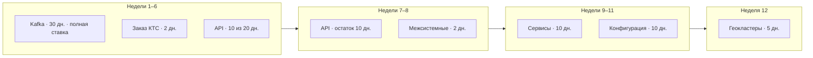
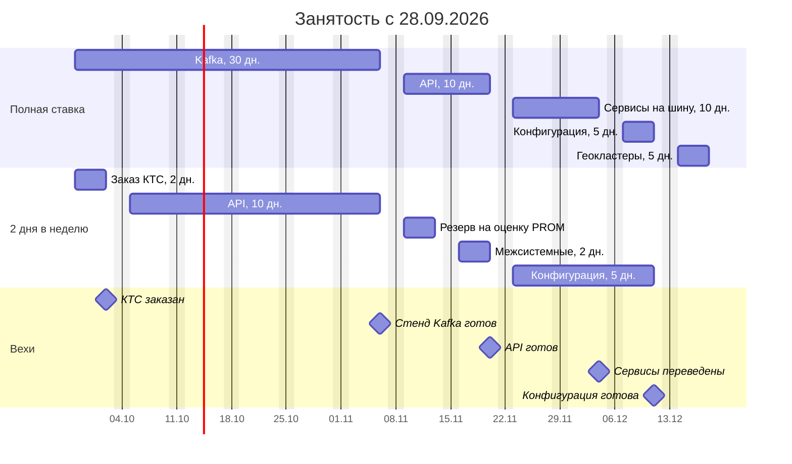
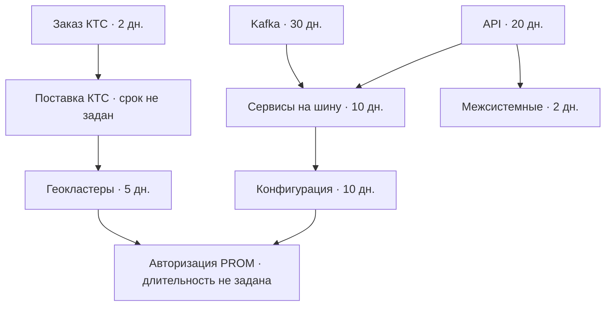

# План работ: переход на шину данных Kafka

Базовый горизонт: **12 недель**, с **28 сентября по 18 декабря 2026**.

Известные работы — **79 человеко-дней**. Вдвоём за неделю доступно **7** человеко-дней (сотрудник 1: 5 дн., сотрудник 2: 2 дн.). Резерв внутри этих 12 недель — **5 человеко-дней**.

Длительность «изменения правил авторизации на PROM» не задана — в срок не входит.  
Два дня на заказ комплекса технических средств — это трудозатраты на сам заказ; срок поставки в оценке нет.  
Геокластеры стоят на 12-й неделе только если оборудование уже на площадке.

## Стримы

| Стрим | Оценка, чел.-дн. |
|-------|-----------------:|
| Настройка шины данных на Kafka | 30 |
| Изменение API для работы сервисов | 20 |
| Изменение сервисов для работы с единой шиной данных | 10 |
| Изменение правил авторизации на PROM-инсталляции | не задано |
| Создание широких межсистемных взаимодействий | 2 |
| Заказ комплекса технических средств | 2 |
| Конфигурация сервисов | 10 |
| Настройка георезервируемых кластеров | 5 |
| **Итого (известные)** | **79** |

## Как разложить людей

Длинную работу ведёт сотрудник на полной ставке. Сотрудник на два дня в неделю забирает короткие и параллельные куски. Если отдать ему API целиком, 20 дней растянутся на 10 недель и станут длиннее настройки Kafka.

| Недели | Полная ставка | 2 дня в неделю | Результат |
|--------|---------------|----------------|-----------|
| 1 | Kafka, 5 дн. | Заказ КТС, 2 дн. | Заказ размещён, пошёл срок поставки |
| 2–6 | Kafka, 25 дн. | API, 10 дн. | Стенд шины готов, API сделан наполовину |
| 7–8 | API, оставшиеся 10 дн. | 7-я неделя — резерв на оценку авторизации PROM; 8-я — межсистемные взаимодействия, 2 дн. | Контракт API зафиксирован |
| 9–10 | Сервисы на шину, 10 дн. | Конфигурация, 4 дн. | Сервисы переведены |
| 11 | Конфигурация, 5 дн. | Конфигурация, 1 дн. | Конфигурация готова (итого 10 дн.) |
| 12 | Геокластеры, 5 дн. | Резерв | Площадка готова, если КТС уже поставлен |

Полосы сотрудника на два дня в неделю на календаре занимают всю неделю: это неделя, в которую он назначен, а не пять рабочих дней.

Зависимости: сервисы стартуют после стенда Kafka и готового API; конфигурация — после сервисов; межсистемные взаимодействия — после API; геокластеры — после поставки КТС; окно авторизации на PROM — после конфигурации и геокластеров.

## Волны (слайд на согласование)

## Две дорожки (слайд контроля)

## Зависимости (слайд для архитектуры и безопасности)

## Ёмкость (ресурсный комитет)

| | Человеко-дни |
|---|---:|
| Известные работы | 79 |
| Ёмкость за 12 недель | 84 |
| Резерв | 5 |

Резерв поглощает оценку авторизации PROM примерно до пяти дней. Всё, что длиннее, сдвигает дату после 18 декабря.  
Поставка КТС позже 14 декабря сдвигает геокластеры и окно PROM; Kafka, API, сервисы и конфигурация при этом заканчиваются 11 декабря.

---

# Календарь рабочих дней: 05.10.2026 — 01.10.2027

Правила заполнения:

- **Сотрудник 1** — все рабочие дни недели (полная ставка).
- **Сотрудник 2** — первые два рабочих дня недели (2 дня в неделю). Если в неделе меньше двух рабочих дней, у второго сотрудника их столько же, сколько в неделе.
- Календарь федеральный: ст. 112 ТК РФ, постановление Правительства № 1466 от 24.09.2025 и № 1187 от 17.09.2026.
- Суббота **20.02.2027** — рабочая (перенос выходного на 22.02).
- Предпраздничные дни (03.11.2026, 20.02.2027, 30.04.2027, 11.06.2027) считаются полными рабочими днями: сокращение на один час на число дней не влияет.

| дата понедельника | количество рабочих дней в неделе | рабочие дни сотрудника 1 | рабочие дни сотрудника 2 |
|-------------------|---------------------------------:|--------------------------|--------------------------|
| 05.10.2026 | 5 | 05.10–09.10 | 05.10, 06.10 |
| 12.10.2026 | 5 | 12.10–16.10 | 12.10, 13.10 |
| 19.10.2026 | 5 | 19.10–23.10 | 19.10, 20.10 |
| 26.10.2026 | 5 | 26.10–30.10 | 26.10, 27.10 |
| 02.11.2026 | 4 | 02.11, 03.11, 05.11, 06.11 | 02.11, 03.11 |
| 09.11.2026 | 5 | 09.11–13.11 | 09.11, 10.11 |
| 16.11.2026 | 5 | 16.11–20.11 | 16.11, 17.11 |
| 23.11.2026 | 5 | 23.11–27.11 | 23.11, 24.11 |
| 30.11.2026 | 5 | 30.11, 01.12–04.12 | 30.11, 01.12 |
| 07.12.2026 | 5 | 07.12–11.12 | 07.12, 08.12 |
| 14.12.2026 | 5 | 14.12–18.12 | 14.12, 15.12 |
| 21.12.2026 | 5 | 21.12–25.12 | 21.12, 22.12 |
| 28.12.2026 | 3 | 28.12, 29.12, 30.12 | 28.12, 29.12 |
| 04.01.2027 | 0 | — | — |
| 11.01.2027 | 5 | 11.01–15.01 | 11.01, 12.01 |
| 18.01.2027 | 5 | 18.01–22.01 | 18.01, 19.01 |
| 25.01.2027 | 5 | 25.01–29.01 | 25.01, 26.01 |
| 01.02.2027 | 5 | 01.02–05.02 | 01.02, 02.02 |
| 08.02.2027 | 5 | 08.02–12.02 | 08.02, 09.02 |
| 15.02.2027 | 6 | 15.02–19.02, 20.02 | 15.02, 16.02 |
| 22.02.2027 | 3 | 24.02, 25.02, 26.02 | 24.02, 25.02 |
| 01.03.2027 | 5 | 01.03–05.03 | 01.03, 02.03 |
| 08.03.2027 | 4 | 09.03–12.03 | 09.03, 10.03 |
| 15.03.2027 | 5 | 15.03–19.03 | 15.03, 16.03 |
| 22.03.2027 | 5 | 22.03–26.03 | 22.03, 23.03 |
| 29.03.2027 | 5 | 29.03–31.03, 01.04, 02.04 | 29.03, 30.03 |
| 05.04.2027 | 5 | 05.04–09.04 | 05.04, 06.04 |
| 12.04.2027 | 5 | 12.04–16.04 | 12.04, 13.04 |
| 19.04.2027 | 5 | 19.04–23.04 | 19.04, 20.04 |
| 26.04.2027 | 5 | 26.04–30.04 | 26.04, 27.04 |
| 03.05.2027 | 4 | 04.05–07.05 | 04.05, 05.05 |
| 10.05.2027 | 4 | 11.05–14.05 | 11.05, 12.05 |
| 17.05.2027 | 5 | 17.05–21.05 | 17.05, 18.05 |
| 24.05.2027 | 5 | 24.05–28.05 | 24.05, 25.05 |
| 31.05.2027 | 5 | 31.05, 01.06–04.06 | 31.05, 01.06 |
| 07.06.2027 | 5 | 07.06–11.06 | 07.06, 08.06 |
| 14.06.2027 | 4 | 15.06–18.06 | 15.06, 16.06 |
| 21.06.2027 | 5 | 21.06–25.06 | 21.06, 22.06 |
| 28.06.2027 | 5 | 28.06–30.06, 01.07, 02.07 | 28.06, 29.06 |
| 05.07.2027 | 5 | 05.07–09.07 | 05.07, 06.07 |
| 12.07.2027 | 5 | 12.07–16.07 | 12.07, 13.07 |
| 19.07.2027 | 5 | 19.07–23.07 | 19.07, 20.07 |
| 26.07.2027 | 5 | 26.07–30.07 | 26.07, 27.07 |
| 02.08.2027 | 5 | 02.08–06.08 | 02.08, 03.08 |
| 09.08.2027 | 5 | 09.08–13.08 | 09.08, 10.08 |
| 16.08.2027 | 5 | 16.08–20.08 | 16.08, 17.08 |
| 23.08.2027 | 5 | 23.08–27.08 | 23.08, 24.08 |
| 30.08.2027 | 5 | 30.08, 31.08, 01.09–03.09 | 30.08, 31.08 |
| 06.09.2027 | 5 | 06.09–10.09 | 06.09, 07.09 |
| 13.09.2027 | 5 | 13.09–17.09 | 13.09, 14.09 |
| 20.09.2027 | 5 | 20.09–24.09 | 20.09, 21.09 |
| 27.09.2027 | 5 | 27.09–30.09, 01.10 | 27.09, 28.09 |
| **Итого, 52 недели** | **247** | **247** | **102** |

Недели, где число дней отличается от пяти:

| Неделя | Рабочих дней | Причина |
|--------|-------------:|---------|
| 02.11.2026 | 4 | 4 ноября — праздник |
| 28.12.2026 | 3 | 31.12 — перенос, 01.01 — праздник |
| 04.01.2027 | 0 | каникулы 4–8 января |
| 15.02.2027 | 6 | рабочая суббота 20.02 |
| 22.02.2027 | 3 | 22.02 — перенос, 23.02 — праздник |
| 08.03.2027 | 4 | 8 марта — праздник |
| 03.05.2027 | 4 | перенос с 1 мая |
| 10.05.2027 | 4 | перенос с 9 мая |
| 14.06.2027 | 4 | перенос с 12 июня |
