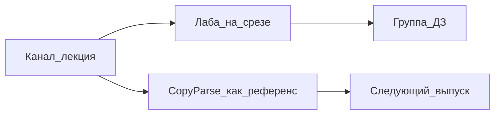

# Личный бренд на CopyParse

Стратегия канала и рабочий контур в продукте. Не фича-разработка и не бэклог коннекторов.

Исходный разбор: [chat-Развитие личного бренда в IT.txt](chat-Развитие%20личного%20бренда%20в%20IT.txt).

**Старт контента — учебный сезон для студентов в Telegram**, не манифест для фаундеров. Вектор бренда тот же: универсал, который собирает сервис как в проде и сразу показывает, где энтерпрайз лишний. CopyParse — сквозной стенд, не учебник SMM.

**Вне скоупа:** LinkedIn, Instagram, коннекторы и автопостинг в Хабр / VC.ru, блог на `copyparse.ru`.

## Треки

| Трек | Когда | Аудитория | Что это |
|------|--------|-----------|---------|
| A. Учебный сезон | Сейчас, дни 1–90 | Студенты, джуны, мидлы, которые собирают сервис | Нумерованная серия в TG |
| B. Кухня фаундера / PO | Фоном 1 пост из 5, сильнее после сезона 1 | Фаундеры, SA, топы | Провалы, убитые фичи, CFP |
| C. Продукт CopyParse | Отдельный бренд в аккаунте | Пользователи сервиса | Релизы, не учебник |

Канал = лекции и карта курса (закреп). Закрытая учебная группа = ДЗ, скрины, вопросы. В канал не тащить разбор каждой домашки.

## Позиционирование

**Вектор: Enterprise-Grade Indie Maker.** Один человек строит SaaS с надёжностью энтерпрайза и скоростью инди, без лишних фич. CopyParse — лаборатория и доказательство, не витрина.

Для студентов это звучит так: собираем настоящий сервис так, как его собирают в проде, и сразу видим, где энтерпрайз уже лишний.

Поддерживающие слои (не отдельные блоги):

- **Риск-линза PO** — убивать фичи, считать стоимость ошибки, стресс-тестировать гипотезы.
- **Карьерный нарратив универсала** — путь Service Desk → риски → SA/PO → свой SaaS. В сезон 1 не чаще короткого поста на модуль.

Не делать блог «для SMM про автопостинг». SMM — вторичная аудитория и канал продаж продукта.

**Аудитория сейчас:** студенты и специалисты, которые учатся собирать Python + React + Minikube. **Аудитория бренда дальше:** B2B-фаундеры, интрапренеры, синьоры/техлиды, системные аналитики.

**Био Telegram-канала (старт сезона):**

> Учу собирать сервисы: Python (FastAPI) + React + Postgres, Docker и Minikube.
> Стенд — мой SaaS кросспостинга. Ещё пишу, где банковские паттерны (Kafka, SA, риски) нужны, а где вредны.
> МФТИ / МИФИ. SA и PO в FinTech.

## Площадки

Только то, что уже есть в продукте. Не строить коннекторы «на вырост».

| Роль | Площадка | Зачем |
|------|----------|--------|
| Дом | Telegram-канал | Учебный сезон, затем кухня бренда |
| Продукт | copyparse.ru | SaaS, онбординг, релизы бренда CopyParse — не личный блог |
| Вторичное распространение | VK, Дзен, Twitter/X, Threads | Короткие тезисы, не курс целиком |
| Радар (только чтение) | RSS / Custom URL | После сезона 1; без публикации на Хабр/VC |

Хабр и VC.ru возможны позже как **ручные** лонгриды. В пайплайн продукта их не кладём.

## Блог: не на copyparse.ru

Личный блог на домене продукта не делать. На первые 90 дней отдельный блог тоже не поднимать — канон живёт в Telegram. Если позже понадобится owned-архив — отдельный персональный домен, не `copyparse.ru` и не `blog.copyparse.ru`.

Почему не сайт продукта:

- Личный голос и SaaS — два бренда. `/blog` на `copyparse.ru` снова склеивает эксперта и вендора.
- `copyparse.ru` — приложение (Brands, Channels, Inbox), не медиа. См. [deploy/ui-edge](../deploy/ui-edge/README.md).
- Архив личного бренда не должен уехать вместе с продуктом.

Поддомен `blog.copyparse.ru` для SEO часто считается отдельным сайтом, а имя всё равно продуктовое.

Через 3–6 месяцев, если накопится пачка сильных длинных текстов: персональный домен по тому же принципу, что `9to18.ru`. Третий медиа-бренд с отдельным именем издания не заводить.

## Трек A: формат учебного сезона

Telegram плохо держит простыни и сырой код. Один выпуск = один квант.

**Карточка выпуска** (пост 1.5–2.5 тыс. знаков или тред из 3 сообщений: тезис → разбор → лаба):

1. Код выпуска: `S01E04 · SA · контракт API`
2. Зачем это в живом сервисе — 1 предложение про CopyParse (файл или сервис: `docker-compose.yaml`, `gateway`, `k8s/ingress.yaml`)
3. Теория: 5–9 пунктов
4. Одна граница: must have vs уже лишняя фича
5. Лаба 20–40 мин: конкретная команда или место в репо
6. Проверка в учебную группу: скрин `kubectl get pods`, коллекция Insomnia, `git log`, свой `EXPLAIN`
7. Следующий выпуск одной строкой

**Ритм:** 2 выпуска в неделю (теория + лаба) или 3, если лаба короткая. Не смешивать в одном посте FastAPI и Kafka.

**Закреп:** оглавление S01E01–E19 + ссылки на [INSTALLATION.md](INSTALLATION.md) и [k8s/README.md](../k8s/README.md) как на стенд, не как на ДЗ целиком. Студент в первую неделю не поднимает весь монорепо.

**Сквозной учебный продукт** — не форк CopyParse: свой маленький сервис (задачи / заявки / посты) с теми же слоями — API, UI, БД, Compose, затем Minikube. CopyParse — референс взрослого сервиса («так выглядит, когда сервисов уже 15»).

Черновики выпусков S01E01–E10 (текст канала, лабы, ссылки, mermaid): [telegram-s01](telegram-s01/).

**Не делать в канале:** стены Dockerfile, лекции на 8 тыс. знаков, автопостинг курса во все сети.

## Карта обучения

Ядро: Python-сервисы, React UI, Minikube, SQL, Kafka, Docker, Compose. Инструменты инженера: Git/GitHub, Insomnia, регулярные выражения, Redis, Jenkins.

### 0. Карта системы

- Как читать чужой монорепо за один вечер
- Сервисы CopyParse: gateway, auth, core, scheduler, collector, processor, боты ([ARCHITECTURE.md](ARCHITECTURE.md))
- Монорепо vs микросервисы: зачем резать и когда рано
- Путь запроса: браузер → ui-edge → UI / `/api` → gateway → сервис

### 1. Git и GitHub

- Репозиторий, commit, ветка; не коммитить в `main` с первой лабы
- `.gitignore`: `.env`, `secret.yaml`, `__pycache__`, `node_modules`
- GitHub: clone, push, Pull Request, code review
- Смотреть дифф в чужом PR, не «кнопку merge»
- Теги и релизы — позже; в сезон 1 хватит ветки и PR

### 2. Системный анализ

- От боли пользователя к списку сервисов, не к списку экранов
- Контракт REST до первой строчки кода
- Доменная модель на статусах (`collected → review → ready → published`)
- ТЗ на одну страницу: что должно сломаться явно
- MVP: какие фичи убить до спринта

### 3. Python-сервис

- FastAPI: роутер, Pydantic, зависимости
- `async` для БД и HTTP, где sync ещё нормален
- Ошибки: ранний return, HTTPException
- JWT, сессии, bcrypt — зачем шлюз и зачем auth отдельно
- Конфиг из env, секреты не в git
- httpx, таймауты, ретраи
- Insomnia: коллекция, окружения local/minikube, заголовок Authorization — API до UI
- Регулярные выражения: валидация, парсинг логов и URL; где regex вреден (HTML целиком)

### 4. SQL и PostgreSQL

- Таблицы, FK, типы; почему не одна JSON-простыня
- Индексы: что ускоряет SELECT и что замедляет INSERT
- Транзакции и потерянный апдейт статуса
- `EXPLAIN` без магии
- Пул соединений
- SQL для аналитика: GROUP BY, окна
- Миграции как дисциплина

### 5. React UI

- Vite, страницы, layout, маршруты
- Слой api client: `baseURL /api`, JWT
- Формы и ошибки с бэка
- Когда хватит useState, когда уже context
- Не тащить дизайн-систему в первый учебный сервис

### 6. Docker и Compose

- Образ, слои, кэш, `.dockerignore`
- Dockerfile Python vs Node
- Compose: сервисы, сети, volumes, healthcheck, `depends_on`
- Почему `docker compose up` — ещё не прод
- Несколько compose-файлов (dev / edge / отдельный юнит)

### 7. Minikube и Kubernetes

- Pod, Deployment, Service, Ingress, Secret
- Сборка образов в Docker Minikube (`minikube docker-env`)
- Probes, ресурсы CPU/RAM
- `kubectl get/logs/describe`
- Ingress addon
- Что ломается при переносе Compose → манифесты ([k8s/README.md](../k8s/README.md))
- Minikube vs прод: чего в учебном кластере нет

### 8. Потоки данных: не только Kafka

- Когда хватит таблицы статусов и poller (scheduler/collector)
- Очередь vs Kafka vs «пока Postgres»
- Redis: кэш, сессия, rate limit, очередь задач — и когда Postgres ещё хватает
- Redis vs Kafka: короткоживущее состояние vs лог событий
- Kafka: топик, consumer group, at-least-once — банку нужно, учебному CRUD нет
- Пайплайн CopyParse: collect → process → distribute → publish
- Rate limits внешних API
- MinIO/S3 вместо диска пода
- Nginx как край (ui-edge)

### 9. Качество и эксплуатация

- Healthchecks
- Логи как контракт
- pytest на чистые функции; e2e не в первый месяц
- Insomnia в регрессии: коллекция в репо
- Jenkins: пайплайн после push (lint/test/image), credentials; это не замена GitHub
- Секреты, `.env.example`
- ИИ пишет код быстро: как ревьюить, чтобы не притащить ненужную фичу

### 10. Профессия универсала

- Демо стенда за 5 минут
- CustDev на своей группе: что они не смогли поднять
- Оценка риска пет-проекта без Базеля в каждом посте
- Как рассказывать архитектуру на собесе и на митапе
- Python для аналитика: pandas рядом с SQL, не вместо него

## Сезон 1 — 19 выпусков

К финалу студент поднимает свой срез на Minikube, не весь CopyParse. Git, Insomnia и regex — в сезоне 1. Redis и Jenkins — сезон 2.

1. S01E01 · Зачем собирать сервис слоями (UI / API / БД / деплой)
2. S01E02 · Карта CopyParse за 10 минут: кто кому звонит
3. S01E03 · Git / GitHub: commit, ветка, `.gitignore`, первый PR
4. S01E04 · SA: от боли к контракту API, не к экранам
5. S01E05 · FastAPI: первый роутер и Pydantic
6. S01E06 · Insomnia: коллекция, env, проверка API до UI
7. S01E07 · PostgreSQL: таблица, PK, простой SELECT
8. S01E08 · SQL: JOIN и зачем индекс
9. S01E09 · Регулярные выражения: валидация и парсинг, где regex уже вреден
10. S01E10 · React: страница списка и вызов API
11. S01E11 · JWT: логин без самоделки криптографии
12. S01E12 · Docker: образ API, что не класть в слой
13. S01E13 · Compose: API + Postgres + UI на одной сети
14. S01E14 · Healthcheck и почему «висит, но не живо»
15. S01E15 · Env и секреты: что сломает minikube, если захардкодить
16. S01E16 · Minikube: первый Deployment и Service
17. S01E17 · Ingress: как браузер находит UI и `/api`
18. S01E18 · Secret в k8s и почему compose-привычки там врут
19. S01E19 · Склейка: тот же срез на Minikube + что смотреть в `kubectl`

**Сезон 2** (не мешать, пока нет Compose): Redis, Kafka vs таблица статусов, MinIO, scheduler, пайплайн постов, nginx-edge, pytest, Jenkins, ИИ-ревью.

Трек B в сезон 1 — не чаще одного короткого поста на модуль (после E04 и E19: какую фичу не дали тащить).

## Настройка в CopyParse

### Два бренда

- **Александр** — учебный канал и позже трек B
- **CopyParse** — релизы, статус инцидентов; не учебник

Отдельные календари и CTA. Ссылка на copyparse.ru — в био и в редких нативных упоминаниях.

### Контент-фабрика сезона 1

1. Канон сразу в Telegram (карточка выпуска). Черновик в `/posts` — по желанию.
2. Для курса лучше почти без AI-переписывания: термины не должны поплыть.
3. Calendar: слоты S01E01–E19, ритм 2 в неделю.
4. Радар, competitor и кросспост курса в Дзен/VK — не включать, пока идёт сезон 1.
5. После сезона 1: Inbox review, точечные тезисы во вторичные сети, радар CFP.

## Чего не делать в продукте

- Коннекторы и автопостинг Хабр / VC.ru
- LinkedIn и Instagram — ни как каналы бренда, ни как задачи в бэклог
- Блог на `copyparse.ru` или `blog.copyparse.ru`
- Привязка 9to18 к учебному сезону и к бренду SA/фаундера
- Кросспост курса целиком во вторичные сети

## 90 дней

**Дни 1–14.** Био под учебный сезон, закреп с оглавлением S01E01–E19. Два бренда в CopyParse. Выпуски E01–E06 (до Insomnia включительно). Не регистрировать блоговый домен.

**Дни 15–60.** Ритм 2 выпуска в неделю до E19. Лабы — в группу. В канал не лить ДЗ.

**Дни 61–90.** Сезон 2: Redis, Kafka «где надо», Jenkins, эксплуатация. 2–3 поста трека B. Черновик CFP: «как я учу собирать сервисы на своём SaaS». Персональный домен не регистрировать.

## Метрики

Сезон 1 (главные):

- Доля дошедших до Compose (E13) и до склейки на Minikube (E19)
- Повторяющиеся вопросы в группе — дыра в выпуске
- Артефакты: PR на GitHub, коллекция Insomnia, скрин `kubectl`
- Kill-критерий курса: к E13 никто не поднял Compose — упростить срез, не добавлять Redis/Kafka/Jenkins

Бренд (вторичны, пока идёт сезон 1):

- Ритм в Telegram
- Входящие лички, приглашения, CFP submitted / accepted
- Визиты на copyparse.ru из контента, регистрации
- Не заводить блог, если нет доводимости курса

## Трек B — заготовка после сезона 1

1. Пост-манифест: кто я на самом деле (не свитчер, а гибрид)
2. Где энтерпрайз-архитектура вредна соло-SaaS
3. Пять фич, которые я убил
4. Анатомия пайплайна collect → AI process → review → publish
5. Minikube vs прод
6. Почему SA без CustDev и sales — переводчик, а не PO
7. Первый клиент микросервиса
8. ИИ пишет код быстро. Делает ли он нужный код
9. Стресс-тест канала
10. Чек-лист «ваш продукт не пустят в банк» — заготовка доклада
