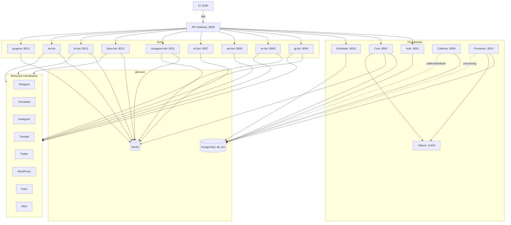

# Обзор сервисов: UI, API Gateway, эндпоинты и доступ к БД

Актуальные диаграммы деплоя и пайплайна: [ARCHITECTURE.md](ARCHITECTURE.md).

## 0. Диаграмма взаимодействия сервисов

## 1. Запросы с UI

UI использует `apiClient` с `baseURL: '/api'`. Vite proxy перенаправляет `/api` на API Gateway и убирает префикс `/api`, поэтому фактические запросы идут на Gateway по путям без `/api`.

### 1.1 Auth (auth-service.ts)

| Метод | Путь (от UI) | Описание |
|-------|----------------|----------|
| POST | `/auth/login` | Вход |
| POST | `/auth/register` | Регистрация |
| POST | `/auth/logout` | Выход (тело: `refresh_token`) |
| POST | `/auth/all-logout` | Выход со всех устройств |
| GET | `/auth/profile` | Профиль пользователя |
| POST | `/auth/profile` | Обновление профиля |
| POST | `/auth/reset-password` | Запрос сброса пароля |
| POST | `/auth/reset-password/confirm` | Подтверждение сброса пароля |
| POST | `/auth/refresh` | Обновление пары токенов |
| POST | `/auth/verify` | Верификация email (код) |
| GET | `/auth/groups/my` | Активный workspace (group) |
| PUT | `/auth/groups/active` | Переключить `active_group_id` |
| POST | `/auth/groups` | Создать workspace (создатель = Owner) |
| POST | `/auth/groups/{id}/invites` | Инвайт: editor / approver / viewer |
| GET | `/smm/jobs/{id}/comments` | Комментарии к черновику |
| POST | `/smm/jobs/{id}/comments` | Добавить комментарий (опц. text anchor) |
| GET | `/smm/jobs/{id}/revisions` | История правок job |
| POST | `/smm/jobs/{id}/revisions/{rid}/restore` | Восстановить ревизию |

Workspace roles: `owner` | `editor` | `approver` | `viewer` (legacy aliases: admin→owner, author→editor, analyst→viewer). Seats: `max_team_seats` по тарифу создателя группы. Approval: только Owner/Approver; self-approve запрещён, если есть другой Approver/Owner.

### 1.2 Core (core-service.ts)

| Метод | Путь | Описание |
|-------|------|----------|
| GET | `/core/healthchecks` | Healthcheck всех сервисов |
| GET | `/core/statistics` | Статистика |

### 1.3 Create Post (create-post-service.ts)

| Метод | Путь | Описание |
|-------|------|----------|
| GET | `/cpost/profile` | Профиль ручных постов (default_platforms) |
| POST | `/cpost/profile` | Сохранение профиля |
| POST | `/cpost/post` | Создание поста |

### 1.4 Custom URL (custom-url-service.ts)

| Метод | Путь | Описание |
|-------|------|----------|
| GET | `/curl/settings` | Настройки cURL/скрапинга по URL |
| POST | `/curl/settings` | Сохранение настроек |

### 1.5 Telegram (telegram-service.ts)

| Метод | Путь | Описание |
|-------|------|----------|
| GET | `/tg/profile` | Профиль Telegram |
| POST | `/tg/profile` | Сохранение профиля |
| POST | `/tg/post` | Создание поста (multipart: text, image) |

### 1.6 Twitter (twitter-service.ts)

| Метод | Путь | Описание |
|-------|------|----------|
| GET | `/tw/profile` | Профиль Twitter |
| POST | `/tw/profile` | Сохранение профиля |
| POST | `/tw/post` | Создание поста |

### 1.7 VKontakte (vkontakte-service.ts)

| Метод | Путь | Описание |
|-------|------|----------|
| GET | `/vk/profile` | Профиль VK |
| POST | `/vk/profile` | Сохранение профиля |
| POST | `/vk/post` | Создание поста |

### 1.8 Instagram (instagram-service.ts)

| Метод | Путь | Описание |
|-------|------|----------|
| GET | `/instagram/profile` | Профиль Instagram |
| POST | `/instagram/profile` | Сохранение профиля |
| GET | `/instagram/posts` | Список постов Instagram |
| GET | `/instagram/post/{id}` | Один пост |
| POST | `/instagram/post` | Создание поста (JSON или multipart: caption, images[]) |
| PUT | `/instagram/post/{id}` | Обновление поста |
| DELETE | `/instagram/post/{id}` | Удаление поста (status=deleted) |

### 1.9 Дзен (dzen-service.ts)

| Метод | Путь | Описание |
|-------|------|----------|
| GET | `/dzen/profile` | Профиль Дзен |
| POST | `/dzen/profile` | Сохранение профиля |
| GET | `/dzen/posts` | Список постов Дзен |
| GET | `/dzen/post/{id}` | Один пост |
| POST | `/dzen/post` | Создание поста (JSON или multipart: text, title, images, videos) |
| PUT | `/dzen/post/{id}` | Обновление поста |
| DELETE | `/dzen/post/{id}` | Удаление поста (status=deleted) |
| GET | `/dzen/rss/{user_id}` | Публичная RSS-лента для робота Дзена (опционально ?token=...) |

### 1.10 WordPress (wordpress-service.ts)

| Метод | Путь | Описание |
|-------|------|----------|
| GET | `/wp/profile` | Профиль WordPress |
| POST | `/wp/profile` | Сохранение профиля |
| POST | `/wp/post` | Создание поста (поддерживает загрузку изображений в контент и caption) |
| GET | `/wp/posts` | Список постов WP |

### 1.11 Test / SelectCB (test-service.ts)

| Метод | Путь | Описание |
|-------|------|----------|
| GET | `/test/products` | Список продуктов |
| GET | `/test/search/{orderId}` | Поиск заказа |
| POST | `/test/submit` | Создание заказа |

---

## 2. API Gateway — маршрутизация и правила

- **Порт:** 8000  
- **Поведение:** проксирование запросов в сервисы, добавление заголовков `X-User-Id` и `X-User-Role` из JWT.
- **Публичные пути (без JWT):**  
  `/auth/login`, `/auth/register`, `/auth/refresh`, `/auth/verify`, `/auth/reset-password`, `/auth/reset-password/confirm`, `/health`.
- **Rate limiting:** задаётся в `api-gateway/config.py` по путям (логин, регистрация, core, боты и т.д.).

### 2.1 Роутеры и маппинг на сервисы

| Префикс Gateway | Целевой сервис | Назначение |
|-----------------|----------------|------------|
| `/auth` | Auth (8001) | Регистрация, логин, профиль, refresh, logout, verify, reset-password, users |
| `/core` | Core (8002) или Scheduler (8003) | Статистика, healthcheck, расписания, discovery, start-bot, уведомления |
| `/wp` | Core | WordPress профили и посты |
| `/tg` | Core | Telegram профили и посты |
| `/tw` | Core | Twitter профили и посты |
| `/vk` | Core | VK профили и посты |
| `/dzen` | Core | Дзен профили, посты; GET `/dzen/rss/{user_id}` — публичная RSS-лента |
| `/instagram` | Core | Instagram профили, посты |
| `/curl` | Core | Настройки cURL/скрапинга |
| `/cpost` | Core | Ручные посты (профиль, CRUD постов) |
| `/smm` | Core | SMM-аналитика, бренды, каналы, inbox |
| `/threads` | Core | Threads профили и посты |
| `/tg-bot/schedule` | TG Bot (8004) | POST → `/schedule` |
| `/wp-bot/schedule` | WP Bot (8006) | POST → `/schedule` |
| `/vk-bot/schedule` | VK Bot (8005) | POST → `/schedule` |
| `/url-bot/schedule` | URL Bot (8007) | POST → `/schedule` |
| `/url-bot/run` | URL Bot (8007) | POST → `/run` (без JWT) |
| bot proxy | dzen / ig / tw / th / tg-game | Прокси к ботам (см. `bot_proxy.py`) |
| Stubs | — | отдельные `/scheduler/*`, `/*-bot/*` без реализации — 501 |

### 2.2 Особенности маппинга

- `POST /auth/profile` на Gateway → `PUT /profile` на Auth.
- `GET /core/healthcheck` на Gateway → `GET /healthchecks` на Core.
- У большинства маршрутов (кроме публичных и `/url-bot/run`) используется `Depends(get_current_user)` — требуется JWT.

---

## 3. Эндпоинты по сервисам

### 3.1 Auth (порт 8001)

| Метод | Путь | Описание |
|-------|------|----------|
| GET | `/` | Корень |
| GET | `/health` | Health |
| POST | `/register` | Регистрация |
| POST | `/login` | Вход |
| POST | `/refresh` | Обновление токенов |
| POST | `/logout` | Выход |
| GET | `/profile` | Профиль |
| PUT | `/profile` | Обновление профиля |
| GET | `/users` | Список пользователей (admin) |
| GET | `/verify/{token}` | Верификация email по токену |
| POST | `/verify-token` | Проверка токена (для других сервисов) |
| POST | `/reset-password` | Инициация сброса пароля |
| POST | `/reset-password/confirm` | Подтверждение сброса |
| POST | `/all_logout` | Выход со всех устройств |

### 3.2 Core (порт 8002)

| Префикс | Метод | Путь (относительно префикса) | Описание |
|---------|--------|------------------------------|----------|
| — | GET | `/healthchecks` | Healthcheck всех сервисов |
| — | GET | `/statistics` | Статистика |
| — | GET | `/users-statistics` | Статистика по пользователям |
| — | GET | `/schedules` | Сводка расписаний (для scheduler) |
| — | GET | `/schedule` | Расписания из schedule_snapshots (admin) |
| `/tg` | GET/POST | `/profile` | Профиль Telegram |
| `/tg` | GET | `/profiles` | Все TG-профили |
| `/tg` | GET/POST | `/post`, `/posts`, `/post/{id}` | CRUD постов TG |
| `/tw` | GET/POST | `/profile`, `/profiles`, `/post` | Twitter |
| `/vk` | GET/POST | `/profile`, `/profiles`, `/post` | VK |
| `/dzen` | GET/POST | `/profile`, `/profiles`, `/posts`, `/post`, `/post/{id}` | Дзен |
| `/dzen` | GET | `/rss/{user_id}` | Публичная RSS-лента (для робота Дзена, опционально ?token=) |
| `/instagram` | GET/POST | `/profile`, `/profiles`, `/posts`, `/post`, `/post/{id}` | Instagram |
| `/wp` | GET/POST | `/profile`, `/publish-profile`, `/collect-profile`, `/profiles` | Профили WP |
| `/wp` | GET/POST/PUT/DELETE | `/post`, `/posts`, `/post/{id}` | Посты WP |
| `/curl` | GET/POST | `/settings` | Настройки cURL |
| `/cpost` | GET/POST | `/profile` | Профиль ручных постов |
| `/cpost` | GET/POST/PUT/DELETE | `/posts`, `/post`, `/post/{id}` | Ручные посты |
| `/notifications` | GET/POST/DELETE | ``, `/{id}` | Уведомления |

Идентификация пользователя в Core: заголовки `X-User-Id`, `X-User-Role` (проставляются Gateway из JWT).

### 3.3 Scheduler (порт 8003)

| Метод | Путь | Описание |
|-------|------|----------|
| GET | `/`, `/health` | Корень и health |
| POST | `/start-discovery` | Один цикл сбора расписаний (JWT) |
| GET | `/schedules` | Получение и сохранение расписаний (JWT) |
| POST | `/start-bot` | Запуск ботов по платформам (JWT) |

### 3.4 TG Bot (порт 8004)

| Префикс | Метод | Путь | Описание |
|---------|--------|------|----------|
| `/tg` | — | — | Роутер с prefix `/tg` |
| `/tg/auth` | POST | `/code` | Код подтверждения |
| `/tg/auth` | POST | `/password` | 2FA пароль |
| `/tg/auth` | GET | `/status/{user_id}` | Статус авторизации |
| — | GET | `/health` | Health |

Через Gateway вызывается только `POST /tg-bot/schedule` → `POST /schedule` на боте. В текущем коде tg-bot зарегистрирован только роутер `auth` (prefix `/tg`, эндпоинты `/tg/auth/code`, `/tg/auth/password`, `/tg/auth/status/{user_id}`). Эндпоинт `POST /schedule` для приёма команд от scheduler в репозитории не реализован (возможен в другой ветке или по плану).

### 3.5 Instagram Bot (порт 8011)

| Метод | Путь | Описание |
|-------|------|----------|
| GET | `/health` | Health |
| POST | `/instagram/reload` | Запуск одного цикла сбора постов (в фоне) |

Сервис использует instagrapi (и опционально Selenium) для сбора и публикации из `instagram_posts` со статусом `ready`. БД: `db_bot`.

### 3.5a Прочие боты

| Сервис | Порт | Назначение |
|--------|------|------------|
| dzen-bot | 8012 | Дзен (сессия Яндекса, диагностика в MinIO) |
| th-bot | 8013 | Threads |
| tw-bot | 8011 внутр. / host 8014 | Twitter / X |
| tg-game | 8015 | Telegram game / заказы / медиа |
| collector | 8009 | collect + distribute |
| processor | 8010 | обработка `posts` + AI |

### 3.6 URL Bot (порт 8007)

| Метод | Путь | Описание |
|-------|------|----------|
| GET | `/`, `/health` | Корень и health |
| POST | `/run` | Тестовый запуск скрапинга (url, xpath, take_screenshot) |
| POST | `/schedule` | Обработка расписаний от scheduler (platform=url) |

---

## 4. Базы данных и таблицы по сервисам

### 4.1 Общая схема

- Большинство сервисов используют одну БД **db_bot** (PostgreSQL) через `DATABASE_URL`.
- **url-bot** своей БД не использует (HTTP к Core).
- Медиа и диагностика — **MinIO** (bucket `uploads`).

### 4.2 Auth

- **Таблицы:** `users` (incl. `active_group_id`), `refresh_tokens`, `blacklisted_tokens`, `password_reset_tokens`, `email_verification_tokens`, `groups`, `group_members` (roles: owner/editor/approver/viewer), `group_invites`.
- **JWT blacklist hot path:** Redis (`REDIS_URL`) — auth пишет/прогревает, gateway читает `jwt:bl:*`; без Redis — HTTP `/token/blacklist-check` → Postgres.

### 4.3 Core

- **Таблицы:** `posts`, `tg_*`, `tw_*`, `wp_*`, `vk_*`, `dzen_*`, `instagram_*`, `threads_*`, `url_*`, `cpost_*`, `curl_settings`, `notifications`, SMM/brands/channels, `smm_publish_jobs`, `smm_job_comments`, `smm_job_revisions` (по мере миграций).
- Флаги распределения в `posts`: `to_tg`, `to_wp`, `to_vk`, `to_dzen`, `to_instagram`, `to_tw`.
- Читает `schedule_snapshots` (пишет scheduler).

### 4.4 Scheduler / Collector / Processor

| Сервис | Таблицы |
|--------|---------|
| Scheduler | `schedule_snapshots`, `schedule_snapshots_wp` |
| Collector | чтение/запись `posts` и всех `*_posts` из `SOURCE_TABLES` |
| Processor | `posts` (collected → processing → ready/review) |

### 4.5 Боты

Используют профили и `*_posts` своей платформы (+ MinIO для медиа). Сессии Telegram — volume `tg-bot-sessions`.

### 4.6 URL Bot

- **БД:** нет. Скрапинг и вызовы `/run`, `/schedule`.

---

## 5. Сводная таблица доступа к БД

| Сервис | База | Использование |
|--------|------|---------------|
| Auth | db_bot | users, tokens |
| Core | db_bot | профили, посты, SMM, notifications |
| Scheduler | db_bot | schedule_snapshots* |
| Collector / Processor | db_bot | posts + *_posts |
| tg / vk / wp / ig / dzen / th / tw bots | db_bot | платформенные таблицы |
| tg-game | db_bot | game orders / media meta |
| URL Bot | — | нет |
| MinIO | — | файлы uploads |
