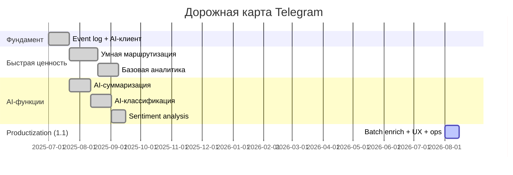
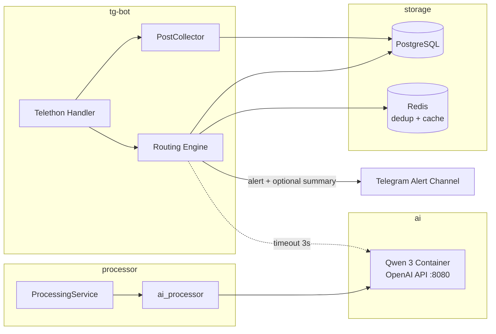

# План совершенствования раздела Telegram

Рекомендуемая дорожная карта по развитию функционала Telegram: умная маршрутизация, аналитика, AI-суммаризация, классификация и sentiment analysis. Предполагается, что AI-модель **Qwen 3** развёрнута в соседнем контейнере.

См. также: [POSTS_LIFECYCLE.md](POSTS_LIFECYCLE.md), [TELEGRAM_POSTING_DIAGNOSTICS.md](TELEGRAM_POSTING_DIAGNOSTICS.md), [SERVICES_OVERVIEW.md](SERVICES_OVERVIEW.md).

---

## Текущее состояние

Фазы 0–3a из этой дорожной карты **реализованы**. Раздел Telegram — зрелый продукт: единый event log, умная маршрутизация, аналитика, AI-дайджесты и enrichment.

| Область | Сейчас | Примечание |
|---------|--------|------------|
| Алертинг | `RoutingEngine`: priority, dedup, rate-limit, time windows, sentiment filter | Единый Telethon-handler → collect + route |
| Event log | `tg_events` через `EventLogger` (единственный INSERT-путь) | Типы: collected / alert_matched / alert_sent / alert_suppressed |
| Сбор | `save_conditions` + profile/brand-channel collect | Brand channel flow + counters |
| AI | `shared/ai_client.py` (Ollama/Qwen), classify/sentiment/digest | Квота `smm_ai_usage` через `shared/ai_quota.py` |
| Enrichment | Realtime (classification_enabled) или **batch** (`batch_enrichment_enabled`) | Batch не блокирует Telethon; пишет в `tg_posts.metadata` + `tg_events.metadata` |
| Аналитика | `/tg/analytics/*` + UI panel; CSV export; deep-link из `/channels/:id?tab=telegram` | Фильтр `chat_id`, сохранённый period |
| Digests | `SummaryAggregator` + preview в UI Processing | AI quota на каждый digest |
| Ops | Retention 90д + hourly cleanup; `/tg/analytics/health`; tg-bot `/health` counters | Индексы на `tg_events` / `tg_digests` |

Ключевые файлы:

| Компонент | Файл |
|-----------|------|
| Unified handler | `tg-bot/services/telegram_bot_service.py` |
| Event log | `tg-bot/services/event_logger.py` |
| Routing | `tg-bot/services/routing_engine.py` |
| Enrichment | `tg-bot/services/post_enrichment.py` |
| Digests | `tg-bot/services/summary_aggregator.py` |
| Analytics API | `core/services/tg_analytics_service.py` |
| AI client / quota | `shared/ai_client.py`, `shared/ai_quota.py` |
| UI analytics | `ui-app/src/pages/smm-analytics/telegram-analytics.tsx` |
| UI settings | `ui-app/src/pages/telegram/telegram.tsx`, `processing-tab.tsx` |

### Audit: пути записи в `tg_events`

Единственный writer — `EventLogger.log_event`. Вызовы:

1. `telegram_bot_service` → `collected`
2. `routing_engine` → `alert_matched` / `alert_sent` / `alert_suppressed`

Dual Telethon handlers **устранены** (`_register_unified_handler`).

### Ops: retention и индексы

- Retention: `EventLogger.RETENTION_DAYS = 90`; hourly `_maintenance_loop` вызывает `cleanup_old_events` + `cleanup_expired_dedup`.
- Индексы: `(user_id, created_at)`, `(event_type, created_at)`, `(text_hash, chat_id)`, `(rule_id, created_at)`, `(chat_id, created_at)`, `(user_id, event_type, created_at)`.
- Партиционирование по `created_at` — опционально при росте; для текущего объёма достаточно индексов + retention.
- Health: `GET /tg/analytics/health` (alert_sent / suppressed / digests); tg-bot `GET /health` отдаёт enrichment/digest latency counters.

---

## Рекомендуемый порядок внедрения



**Логика приоритетов (историческая):**

1. **Фундамент** — без журнала событий аналитика и AI не имеют данных.
2. **Умная маршрутизация** — расширяет уже работающий алертинг, не требует AI, даёт быстрый эффект.
3. **Аналитика** — строится поверх event log и таблицы алертов.
4. **AI-функции** — общий клиент Qwen; суммаризация первой, затем классификация и sentiment.
5. **Productization (план 1.1)** — batch enrichment, digest UX/quota, analytics filters/export, ops health.

---

## Фаза 0. Фундамент (обязательна для всего остального)

### 0.1. Единый журнал событий Telegram

Новая таблица `tg_events` (или `tg_message_events`):

```sql
tg_events (
  id, user_id, chat_id, message_id,
  event_type,          -- collected | alert_matched | alert_sent | alert_suppressed
  rule_id,             -- индекс/UUID правила
  matched_conditions,  -- JSONB
  text_hash,           -- для дедупликации
  text_preview,        -- первые 500 символов
  metadata,            -- JSONB: author, has_media, ...
  created_at
)
```

Запись события — в `TelegramBotService` при сборе и при срабатывании правил. Это основа для аналитики, дедупликации и AI batch-обработки.

### 0.2. Общий AI-клиент (Qwen 3)

Отдельный модуль `shared/ai_client.py` (или сервис `ai-gateway`):

```
POST http://qwen:8080/v1/chat/completions   # OpenAI-compatible API
```

Конфиг в `docker-compose`:

```yaml
qwen:
  image: vllm/vllm-openai:latest  # или ollama
  ...
processor:
  environment:
    - AI_SERVICE_URL=http://qwen:8080
    - AI_MODEL=qwen3-8b-instruct
tg-bot:
  environment:
    - AI_SERVICE_URL=http://qwen:8080
```

Единый интерфейс:

```python
async def complete(prompt: str, system: str, max_tokens: int) -> str
async def classify(text: str, categories: list[str]) -> dict
async def summarize(text: str, max_length: int) -> str
async def sentiment(text: str) -> Literal["positive", "negative", "neutral"]
```

Таймауты, retry, circuit breaker — обязательны: AI не должен блокировать реалтайм-алертинг.

---

## 1. Умная маршрутизация

### Видение

Текущая модель — плоский список правил с OR-логикой по ключевым словам. Целевая — **многоуровневая система маршрутизации** с явными приоритетами, подавлением шума и маршрутизацией по контексту.

### 1.1. Расширенная модель правил

Расширить `TelegramAlertRule` в `core/schemas.py`:

```python
class ConditionOperator(str, Enum):
    CONTAINS = "contains"       # текущее поведение
    NOT_CONTAINS = "not_contains"
    REGEX = "regex"
    ALL_OF = "all_of"           # AND группа
    ANY_OF = "any_of"           # OR группа (текущее)

class TelegramAlertRule(BaseModel):
    id: str = Field(default_factory=uuid4)  # стабильный ID для аналитики
    priority: int = 0                        # выше = важнее
    enabled: bool = True
    chats_to_read: List[str]
    conditions: ConditionGroup               # вложенные AND/OR
    channel_to_post: str
    alert_text: str
    # Новые поля:
    dedup_window_sec: int = 3600             # окно дедупликации
    rate_limit_per_hour: Optional[int] = None
    time_windows: List[TimeInterval] = []    # только в эти часы
    min_text_length: int = 0
    include_ai_summary: bool = False         # краткая выжимка в алерте
    tags: List[str] = []                     # для аналитики
    stop_on_match: bool = False              # не проверять правила ниже
```

### 1.2. Движок маршрутизации

Новый сервис `tg-bot/services/routing_engine.py`:

```
Входящее сообщение
    │
    ▼
[Фильтр чата] ──no──► skip
    │ yes
    ▼
[Фильтр времени] ──no──► skip
    │ yes
    ▼
[Сортировка правил по priority DESC]
    │
    ▼
Для каждого правила:
    ├─ evaluate(conditions) ──no──► next
    ├─ dedup_check(text_hash, chat_id, window) ──dup──► log suppressed, next
    ├─ rate_limit_check(rule_id) ──exceeded──► log suppressed, next
    ├─ send_alert (+ optional AI summary)
    ├─ log tg_events
    └─ stop_on_match? ──yes──► break
```

### 1.3. Дедупликация

Три уровня:

| Уровень | Механизм | Когда |
|---------|----------|-------|
| Exact | `sha256(normalize(text))` + `chat_id` + окно | Одинаковые репосты |
| Fuzzy | SimHash / Jaccard по n-gram (>0.85) | Перефразировки |
| Cross-rule | Один `text_hash` → одно уведомление в канал за окно | Несколько правил на один чат |

Хранение: Redis (TTL = `dedup_window_sec`) или PostgreSQL `tg_dedup_cache` с `expires_at`.

### 1.4. Объединение handlers

Сейчас на один чат могут висеть два `NewMessage` handler (сбор + алерт). Рефакторинг `TelegramBotService`:

```
Один handler на чат → dispatch в collector и routing_engine
```

Меньше дублирования, единая точка логирования.

### 1.5. UI

В `ui-app/src/pages/telegram/telegram.tsx`:

- Приоритет правила (drag-and-drop или число)
- Режим условий: «любое» / «все» / regex
- Настройки дедупликации и rate limit
- Превью: «последние 10 сработавших правил»

---

## 2. Базовая аналитика

### Видение

Вкладка **«Аналитика»** в разделе Telegram — дашборд на данных из `tg_events`, `tg_posts`, `tg_alerts`.

### 2.1. API (Core)

```
GET /tg/analytics/overview?period=7d
GET /tg/analytics/channels?period=7d&limit=10
GET /tg/analytics/keywords?period=7d&limit=20
GET /tg/analytics/alerts?period=7d
GET /tg/analytics/timeline?period=7d&granularity=hour
```

Ответ `overview`:

```json
{
  "messages_collected": 1240,
  "alerts_sent": 87,
  "alerts_suppressed": 34,
  "unique_channels": 12,
  "top_channel": { "chat_id": "-100...", "name": "...", "count": 320 },
  "period": "7d"
}
```

### 2.2. Агрегация

**Вариант A (быстрый старт):** SQL-запросы по `tg_events` с `created_at` и индексами.

**Вариант B (масштаб):** nightly job / materialized view `tg_analytics_daily`:

```sql
tg_analytics_daily (user_id, date, chat_id, keyword, alerts_count, collected_count)
```

### 2.3. UI

- Карточки: собрано / алертов / подавлено / уникальных каналов
- Bar chart: топ каналов
- Word cloud или таблица: топ ключевых слов (из `matched_conditions`)
- Timeline: активность по часам
- Фильтры: период, канал, правило

Использовать существующий паттерн статистики из `core/services/statistics_service.py`, но с актуальными статусами pipeline (`collected`, `ready`, `published`).

---

## 3. AI-суммаризация

### Сценарии

| Сценарий | Триггер | Где |
|----------|---------|-----|
| Длинный пост → публикация | Processor pipeline | `ai_processor.summarize_text()` |
| Несколько постов одного канала | Batch job раз в N минут | новый `tg-bot/services/summary_aggregator.py` |
| Алерт с выжимкой | `include_ai_summary=true` в правиле | `AlertService.build_alert_message()` |

### Реализация

Заменить заглушку в `processor/services/ai_processor.py`:

```python
async def summarize_text(text: str, max_length: int) -> str:
    prompt = f"Сократи текст до ~{max_length} символов, сохрани ключевые факты:\n\n{text}"
    return await ai_client.complete(prompt, system=SUMMARIZE_SYSTEM, max_tokens=512)
```

**Агрегация по каналу** (batch):

```
Каждые 30 мин:
  SELECT chat_id, array_agg(post_text) FROM tg_posts
  WHERE created_at > now() - interval '30 min' AND status='collected'
  GROUP BY chat_id, user_id
  → Qwen: "Сделай дайджест из N сообщений канала X"
  → Сохранить в tg_digests или отправить в alert-канал
```

### Настройки в профиле

```python
summarize_enabled: bool = False
summarize_min_length: int = 500      # суммаризировать если длиннее
digest_interval_min: int = 30        # для batch-дайджестов
digest_channel: Optional[str] = None # куда слать дайджест
```

### Важно

- Суммаризация в алертах — **асинхронно с таймаутом 3 с**: если Qwen не ответил, отправить алерт без выжимки.
- Кэш: `text_hash → summary` в Redis, TTL 24 ч.

---

## 4. AI-классификация

### Видение

Автоматическая категоризация каждого собранного сообщения. Категории — настраиваемые пользователем или предустановленные.

### 4.1. Схема

```python
# tg_profiles
classification_enabled: bool = False
classification_categories: List[str] = [
    "новости", "реклама", "технологии", "финансы", "другое"
]
```

Результат в `tg_posts` или `tg_events`:

```json
{
  "category": "технологии",
  "confidence": 0.87,
  "model": "qwen3-8b"
}
```

### 4.2. Pipeline

```
Сообщение собрано (tg_posts.status=collected)
    │
    ▼
[async task] classify_with_ai(text, categories)
    │
    ▼
UPDATE tg_posts SET metadata = metadata || {category, confidence}
    │
    ▼
Routing engine: новое условие condition.type = "category"
    → маршрутизация по теме, не только по ключевым словам
```

### 4.3. Prompt (structured output)

```python
prompt = f"""Классифицируй сообщение в одну из категорий: {categories}.
Ответь JSON: {{"category": "...", "confidence": 0.0-1.0}}

Сообщение: {text}"""
```

Qwen 3 хорошо работает с JSON-mode / structured output.

### 4.4. Интеграция с маршрутизацией

Правило: «если category=финансы AND contains(биткоин) → канал A». Это связывает пункты 1 и 4.

---

## 5. Sentiment analysis

### Видение

Определение тональности для фильтрации шума и приоритизации алертов.

### 5.1. Реализация

```python
async def analyze_sentiment(text: str) -> SentimentResult:
    # positive | negative | neutral
    # score: -1.0 .. 1.0
```

Результат в `metadata` поста/события.

### 5.2. Применение

| Use case | Логика |
|----------|--------|
| Фильтр алертов | `only_negative: true` — алерт только на негатив |
| Приоритизация | negative + high priority rule → немедленный алерт |
| Аналитика | Доля позитива/негатива по каналам на дашборде |
| Дайджест | «Негативные сигналы за день» в digest-канал |

### 5.3. Batch vs realtime

- **Realtime** (в алертах): только если `sentiment_filter` в правиле — один вызов Qwen, таймаут 2 с.
- **Batch** (для аналитики): Processor обогащает все `collected` посты — можно объединить с классификацией в **один** вызов:

```python
prompt = """Проанализируй сообщение. Ответь JSON:
{"category": "...", "sentiment": "positive|negative|neutral", "score": 0.0}"""
```

Один inference вместо двух — экономия latency и GPU.

---

## Архитектура с Qwen 3



### Рекомендации по Qwen 3

| Параметр | Рекомендация |
|----------|--------------|
| Модель | `Qwen3-8B-Instruct` — баланс скорость/качество для classification + sentiment |
| Serving | vLLM с OpenAI-compatible API |
| Контекст | 4K достаточно; для дайджестов — 8K |
| GPU | 1× GPU 16GB+ или CPU с квантизацией (медленнее) |
| Очередь | Для batch: простая таблица `ai_tasks(status, payload)` + worker в Processor |

---

## Матрица зависимостей

| Функция | Зависит от | Блокирует |
|---------|------------|-----------|
| Event log | — | Аналитика, дедупликация |
| AI-клиент | Qwen container | Суммаризация, классификация, sentiment |
| Умная маршрутизация | Event log, Redis | — |
| Аналитика | Event log | — |
| AI-суммаризация | AI-клиент | Дайджесты, алерты с выжимкой |
| AI-классификация | AI-клиент | Маршрутизация по категориям |
| Sentiment | AI-клиент | Фильтры в правилах, аналитика тональности |

---

## Риски и митигация

| Риск | Митигация |
|------|-----------|
| Qwen недоступен | Circuit breaker, fallback без AI, алерты не блокируются |
| Latency AI в реалтайме | Таймаут 2–3 с, async enrichment для некритичных путей |
| Дубли handlers | Рефакторинг в один handler на чат (фаза 1) |
| Рост `tg_events` | Партиционирование по `created_at`, retention 90 дней |
| Regex в правилах | ReDoS-защита: timeout на `re.match`, лимит длины паттерна |

---

## Итоговая рекомендация по приоритетам

| # | Функция | Ценность | Сложность | Приоритет |
|---|---------|----------|-----------|-----------|
| 0 | Event log + AI-клиент | Высокая (фундамент) | Средняя | **Сначала** |
| 1 | Умная маршрутизация | Очень высокая | Средняя | **Фаза 1** |
| 2 | Базовая аналитика | Высокая | Низкая–средняя | **Фаза 2** |
| 3 | AI-суммаризация | Высокая | Средняя | **Фаза 3a** |
| 4 | AI-классификация | Средняя–высокая | Средняя | **Фаза 3b** |
| 5 | Sentiment analysis | Средняя | Низкая (если объединить с 4) | **Фаза 3c** |

### Оптимальный MVP за 2 итерации

1. **Итерация 1:** Event log → умная маршрутизация (дедупликация, приоритеты, rate limit) → базовый дашборд.
2. **Итерация 2:** Qwen 3 + замена заглушек → суммаризация в Processor и алертах → combined classify+sentiment → маршрутизация по категориям/тональности.
