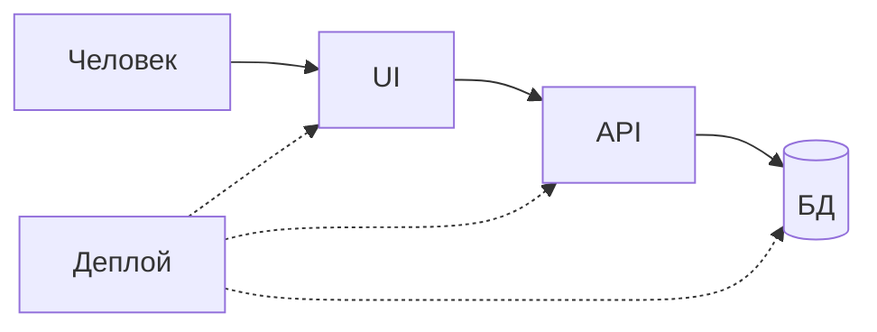

# S01E01 · Зачем собирать сервис слоями

## Пост

S01E01 · Слои · UI / API / БД / деплой

Сервис — это не «один файл Python, который рисует HTML». Как только появляются второй пользователь, обновление кода и падение базы, слои начинают окупаться.

Четыре слоя, которые вы соберёте за сезон:

1. UI — то, что видит человек (у нас позже React).
2. API — контракт: HTTP, JSON, ошибки. Без экранов.
3. БД — факты, которые переживают перезапуск процесса (PostgreSQL).
4. Деплой — как это запускают одинаково у вас и на стенде (сначала Compose, потом Minikube).

Зачем это в живом сервисе. У CopyParse браузер не ходит в базу: он говорит с UI и с `/api`, дальше шлюз, сервисы, Postgres. Если смешать всё в одном процессе, нельзя заменить только бота или только фронт.

Граница. Слой «оркестратор / Kafka / микросервисы на каждый чих» в первую неделю — лишняя фича. Сначала четыре коробки и понятные стрелки.

Следующий выпуск: карта CopyParse — кто кому звонит, без клонирования всего монорепо.

## Лаба

20 минут. На бумаге или в любом редакторе нарисуйте свой учебный сервис «Заявки» четырьмя прямоугольниками: UI, API, БД, деплой. Подпишите одну стрелку: кто кого вызывает при «создать заявку».

В группу: фото схемы. Не код.

Проверка: на схеме база не торчит в браузер напрямую.

## Ссылки

- CopyParse (регистрация, учебный контур): https://www.copyparse.ru/sign-up?utm_source=tg&utm_campaign=s01e01
- Двенадцать факторов: процессы, конфиг, подключённые сервисы — https://12factor.net/ru/
- HTTP как транспорт API (методы, статус-коды) — https://developer.mozilla.org/ru/docs/Web/HTTP/Overview
- Как устроен стенд курса (когда дойдёте руками): docs/ARCHITECTURE.md в репозитории CopyParse

## Схема

