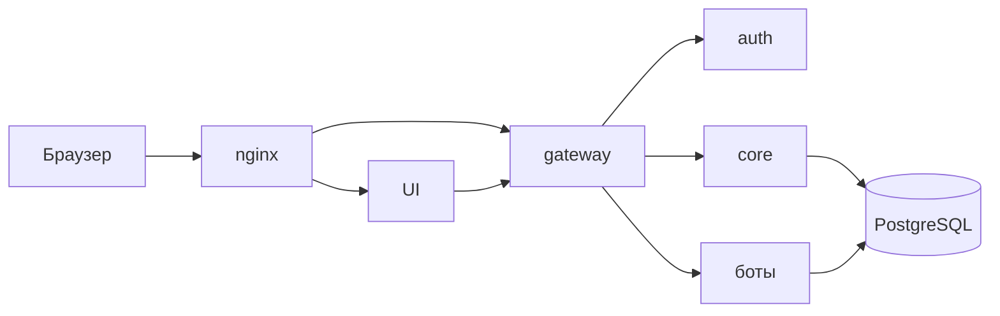

# S01E02 · Карта CopyParse за 10 минут

## Пост

S01E02 · Карта · кто кому звонит

Сегодня не поднимаем стенд. Учимся читать чужую систему по коробкам, а не по файлам.

Упрощённо CopyParse:

- Край: nginx принимает HTTPS и режет по Host.
- UI — React. Браузер ходит на UI и на `/api`.
- Шлюз (gateway) — JWT, CORS, прокси во внутренние сервисы.
- Платформа: auth, core, scheduler, collector, processor.
- Боты площадок: Telegram, VK и остальные.
- Данные: PostgreSQL и объектное хранилище S3 (MinIO).

Путь «опубликовать пост»: UI или бот → данные в Postgres → collector/processor гоняют статусы → бот площадки публикует. Это конвейер со статусами, не один скрипт `send()`.

Зачем это вам. Ваш сервис заявок в миниатюре повторит ту же идею: UI не пишет в БД в обход API, деплой не равен «у меня на ноутбуке завелось».

Граница. Не клонируйте весь монорепо на первой неделе и не пытайтесь понять каждый бот. Пять коробок достаточно.

Следующий выпуск: Git и GitHub — чтобы лабы жили в ветке, а не в архиве на Рабочем столе.

## Лаба

20 минут. Перерисуйте схему ниже своими словами (можно 6–7 блоков, не 20). Подпишите красным путь одного действия: «пользователь нажал Опубликовать».

В группу: фото/скрин схемы.

Проверка: на пути есть API или шлюз; UI не подключён к Postgres напрямую.

## Ссылки

- Высокоуровневая схема стенда — docs/ARCHITECTURE.md (репозиторий курса / CopyParse)
- Что делает UI после входа — docs/USER_GUIDE.md, раздел про кросспостинг
- Зачем шлюз перед микросервисами (обзор паттерна BFF/gateway) — https://learn.microsoft.com/ru-ru/azure/architecture/microservices/design/gateway

## Схема

