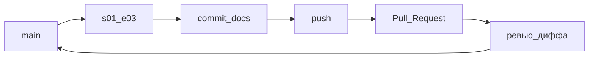

# S01E03 · Git / GitHub

## Пост

S01E03 · Git · commit, ветка, PR — на примерах

Код без истории — черновик на Рабочем столе. Git фиксирует *что* изменилось. GitHub — *где это обсудить*, не кидая zip в мессенджер.

Сквозной пример сезона: репозиторий учебного сервиса **«Заявки»** (`tickets`).

### 1. Репозиторий

Один учебный проект — один repo. На GitHub: New repository → имя `tickets` (private нормально) → **без** README, если будете `git init` локально (иначе путаница с первым push).

Локально:

```bash
mkdir tickets
cd tickets
git init
git branch -M main
```

### 2. .gitignore сразу, до первого commit

Иначе `.env` и `venv/` уедут в историю навсегда.

Пример `.gitignore`:

```
.env
venv/
.venv/
__pycache__/
*.pyc
node_modules/
.idea/
.vscode/
*.pem
```

Плохо: закоммитить `.env` с `DATABASE_URL=...` и потом «удалить файл» — секрет уже в истории.

### 3. Commit — снимок с понятным сообщением

```bash
# README на три строки: что за сервис
git add .gitignore README.md
git status
git commit -m "init: учебный сервис заявок, gitignore"
```

| Плохо | Хорошо |
|-------|--------|
| `fix` | `init: учебный сервис заявок, gitignore` |
| `asdf` | `docs: схема слоёв UI/API/БД` |
| `update` | `feat: черновик статусов заявки` |

### 4. Ветка: `main` бережём

Лаба не пишется прямо в `main`. Пример:

```bash
git switch -c s01-e03
# правите docs/layers.md (схема из E01 текстом)
git add docs/layers.md
git commit -m "docs: схема слоёв для сервиса заявок"
```

Имена веток: `s01-e03`, `feature/tickets-api` — коротко и по делу.

### 5. Push и Pull Request

```bash
git remote add origin https://github.com/<you>/tickets.git
git push -u origin main
git push -u origin s01-e03
```

На GitHub: Compare & pull request → `s01-e03` → `main`. В PR смотрите **Files changed** (дифф), не кнопку Merge. Merge — после взгляда одногруппника или куратора.

Зачем это в живом сервисе. В CopyParse секреты не кладут в git (`secret.yaml` собирают из example). Один пароль БД в истории = ротация у всех.

Граница. Теги, rebase «как в банке» и монорепо-тулинг подождут. В сезон 1: ветка + понятный commit + PR.

Следующий выпуск: системный анализ — контракт API до первой строчки FastAPI.

## Лаба

30–40 минут. Цель: один PR без секретов.

1. Создайте пустой репозиторий `tickets` на GitHub (private ок). **Не** ставьте галку «Add a README», если идёте путём ниже.
2. Локально:

```bash
mkdir tickets && cd tickets
git init
git branch -M main
```

Создайте `.gitignore` (блок из поста) и `README.md` на 3 строки: что за сервис, для кого, стек позже.

3. Первый commit в `main`, push:

```bash
git add .gitignore README.md
git commit -m "init: учебный сервис заявок, gitignore"
git remote add origin https://github.com/<you>/tickets.git
git push -u origin main
```

4. Ветка и второй commit:

```bash
git switch -c s01-e03
# файл docs/layers.md — четыре слоя + стрелка «создать заявку» (из E01)
git add docs/layers.md
git commit -m "docs: схема слоёв для сервиса заявок"
git push -u origin s01-e03
```

5. Откройте Pull Request `s01-e03` → `main`. Просмотрите Files changed.

**В группу:** ссылка на PR.

**Проверка:**
- в диффе нет `.env`, `venv/`, `__pycache__/`
- у обоих commit сообщения читаются (не `fix`)
- PR идёт не из `main` в `main`, а из ветки лабы

## Ссылки

- Pro Git, главы 2–3 (снимки и ветки), по-русски — https://git-scm.com/book/ru/v2
- GitHub Flow: короткие ветки и PR — https://docs.github.com/ru/get-started/using-github/github-flow
- Шаблоны `.gitignore` — https://github.com/github/gitignore
- Картинка веток из книги Pro Git (CC) — https://git-scm.com/book/en/v2/book/03-git-branching/images/branch-and-history.png

## Схема



## Шпаргалка

### Команды подряд (happy path)

```bash
git init
git branch -M main
git status
git add .gitignore README.md
git commit -m "init: учебный сервис заявок, gitignore"
git remote add origin https://github.com/<you>/tickets.git
git push -u origin main

git switch -c s01-e03
git add docs/layers.md
git commit -m "docs: схема слоёв для сервиса заявок"
git push -u origin s01-e03
# дальше PR на GitHub: s01-e03 → main
```

### Смотреть, что происходит

```bash
git status          # что изменено / в индексе
git log --oneline   # короткая история
git diff            # незакоммиченный дифф
git diff --staged   # то, что уже в add
```

### .gitignore (минимум)

```
.env
venv/
.venv/
__pycache__/
*.pyc
node_modules/
*.pem
```

### Не делать

- Commit `fix` / `asdf` / `update`
- Класть `.env` и `venv/` в репозиторий
- Писать лабу прямо в `main` без ветки и PR
- «Починить» секрет удалением файла без ротации — история помнит

### Готово, если…

- [ ] Есть PR со ссылкой
- [ ] В Files changed нет секретов и venv
- [ ] Два осмысленных commit message
- [ ] Ветка лабы ≠ `main`
