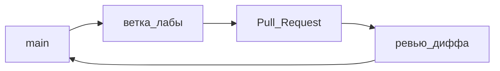

# S01E03 · Git / GitHub

## Пост

S01E03 · Git · commit, ветка, PR

Код без истории — это черновик. Git фиксирует *что* изменилось, GitHub — *как это обсудить*, не потеряв файлы в мессенджере.

Минимум, который нужен до FastAPI:

- Репозиторий. Один проект — один repo.
- Commit — снимок с понятным сообщением («добавлена таблица tickets», не «fix»).
- Ветка. `main` бережём. Лаба живёт в `s01-e03` или `feature/tickets-api`.
- `.gitignore`: туда сразу `.env`, `venv/`, `__pycache__/`, `node_modules/`, секреты k8s. Иначе секреты уедут в историю навсегда.
- Pull Request — место ревью. Смотрите дифф, не кнопку Merge.

Зачем это в живом сервисе. В CopyParse секреты не должны попадать в git (`secret.yaml` собирается из example). Один закоммиченный пароль БД = ротация у всех.

Граница. Теги, rebase-гимнастика и монорепо-тулинг подождут. В сезон 1 хватит ветки и PR.

Следующий выпуск: системный анализ — контракт API до первой строчки FastAPI.

## Лаба

30 минут.

1. Создайте пустой репозиторий учебного сервиса «Заявки» на GitHub (private нормально).
2. Локально: `git init`, файл `.gitignore` по списку выше, README на три строки: что за сервис.
3. Первый commit в `main`.
4. Ветка `s01-layers`, второй commit (хоть схема из E01 текстом).
5. Push и Pull Request в `main`. Merge можно после того, как одногруппник или я глянем дифф.

В группу: ссылка на PR.

Проверка: в PR нет `.env` и папок виртуального окружения.

## Ссылки

- Pro Git, главы 2–3 (снимки и ветки), по-русски — https://git-scm.com/book/ru/v2
- GitHub Flow: короткие ветки и PR — https://docs.github.com/ru/get-started/using-github/github-flow
- Шаблоны `.gitignore` — https://github.com/github/gitignore
- Картинка веток из книги Pro Git (CC) — https://git-scm.com/book/en/v2/book/03-git-branching/images/branch-and-history.png

## Схема

