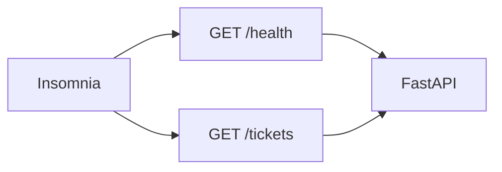

# S01E06 · Insomnia: коллекция до UI

## Пост

S01E06 · Insomnia · API проверяем до React

UI ещё нет — и это хорошо. Если ручка жива только «когда открыта страница», вы не отличите баг фронта от бага сервера.

Insomnia (или аналог) нужна как **клиент контракта**:

- Коллекция — набор запросов, который живёт рядом с кодом, а не в голове.
- Environment — `base_url` для local (`http://127.0.0.1:8000`). Позже добавите minikube, не плодя копии запросов.
- Заголовки. Пока без JWT; привыкайте видеть `Content-Type: application/json`. Authorization появится в E11.

Зачем это в живом сервисе. Шлюз CopyParse отдаёт JSON; отладка «пост не ушёл» начинается с запроса к API, не с кликов в UI.

Граница. Не превращайте Insomnia в CI. Сначала руками, коллекцию — в git. Прогоны в Jenkins — сезон 2.

Следующий выпуск: PostgreSQL — факты заявок переживут перезапуск uvicorn.

## Лаба

30 минут.

1. Установите Insomnia: https://insomnia.rest/download
2. Создайте коллекцию «Заявки», env `local` с `base_url`.
3. Запросы: `GET {{ base_url }}/health` и `GET {{ base_url }}/tickets`. Сохраните успешные ответы.
4. Экспорт коллекции (JSON) в репозиторий, например `insomnia/tickets.json`. Commit в ветке.

В группу: скрин двух зелёных запросов + путь к файлу коллекции в PR.

Проверка: одногруппник может импортировать JSON и попасть в ваши ручки, сменив только `base_url`.

## Ссылки

- CopyParse (регистрация, учебный контур): https://www.copyparse.ru/sign-up?utm_source=tg&utm_campaign=s01e06
- Скачать Insomnia — https://insomnia.rest/download
- Документация: коллекции и окружения — https://docs.insomnia.rest/insomnia/environments
- Импорт/экспорт — https://docs.insomnia.rest/insomnia/import-export-data
- OpenAPI из FastAPI можно импортировать в клиент — с `/openapi.json` вашего сервера

## Схема

