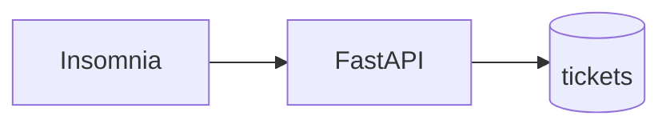

# S01E07 · PostgreSQL: таблица и SELECT

## Пост

S01E07 · PostgreSQL · таблица, PK, SELECT

Пока заявки живут в списке Python, перезапуск сервера стирает учебный стенд. База — это факты: строка либо есть, либо её нет.

Минимум:

- Таблица `tickets`: столбцы с типами, не «одна JSON-простыня на всё».
- Первичный ключ (`id`). Без него вы не скажете PATCH/DELETE «вот эта заявка».
- `SELECT` — чтение. Сначала без JOIN.
- Подключение с API. Один пул / одно соединение на запрос в учебном коде допустимо; соединение в глобальном цикле без закрытия — нет.

Зачем это в живом сервисе. CopyParse хранит посты и статусы в PostgreSQL: конвейер переживает рестарт бота.

Граница. Не настраивайте репликацию, партиции и Kafka «чтобы было как в банке». Одна база, одна таблица, три строки.

Следующий выпуск: JOIN и индекс — когда таблиц станет две.

## Лаба

40 минут.

1. Поднимите Postgres (локально или контейнер). Создайте БД `tickets`.
2. SQL:

```sql
CREATE TABLE tickets (
  id         bigint GENERATED ALWAYS AS IDENTITY PRIMARY KEY,
  title      text NOT NULL,
  status     text NOT NULL,
  created_at timestamptz NOT NULL DEFAULT now()
);
```

3. Вставьте 3 заявки. `SELECT id, title, status FROM tickets;`
4. Подключите FastAPI к БД: `GET /tickets` читает таблицу, не список в памяти.

В группу: скрин SELECT из клиента (psql, DBeaver, DataGrip) и зелёный `GET /tickets` в Insomnia после рестарта uvicorn.

Проверка: после рестарта API список тот же.

## Ссылки

- CopyParse (регистрация, учебный контур): https://www.copyparse.ru/sign-up?utm_source=tg&utm_campaign=s01e07
- Учебник PostgreSQL: старт — https://www.postgresql.org/docs/current/tutorial-start.html
- Русское издание Postgres Pro, создание таблиц — https://postgrespro.ru/docs/postgresql/current/ddl-basics
- `IDENTITY` / сериалы — https://postgrespro.ru/docs/postgresql/current/sql-createtable
- Docker Official Image postgres (если ставите контейнером) — https://hub.docker.com/_/postgres

## Схема


