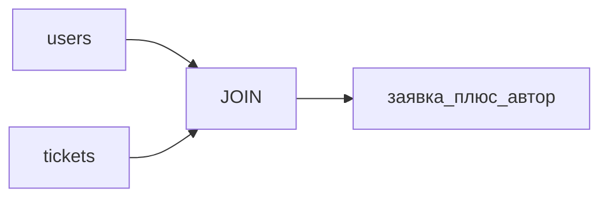

# S01E08 · SQL: JOIN и индекс

## Пост

S01E08 · SQL · JOIN и зачем индекс

Одна таблица врёт, как только появляется «чей это». Автор заявки — не строка, повторённая в каждом title, а другая сущность.

JOIN склеивает факты по ключу: `tickets.author_id = users.id`. Это не «цикл в Python по двум спискам», это работа СУБД.

Индекс — структура, которая ускоряет поиск по условию (`WHERE status = ...`, `WHERE author_id = ...`). Цена: INSERT/UPDATE становятся чуть дороже, место на диске тоже. Индекс «на всякий случай по всем колонкам» — лишняя фича.

`EXPLAIN` (и `EXPLAIN ANALYZE`) показывает, пошла ли база seq scan по всей таблице или index scan. На трёх строках разницы не видно — и это нормально. Смотрите план, привыкайте к словам.

Зачем это в живом сервисе. В аналитике и в ядре CopyParse без JOIN и индексов под реальные выборки вы не отладите «почему тормозит список».

Граница. Не учите оконные функции и CTE в этом выпуске, если JOIN ещё не уверенный. Партиции и шардинг — не сюда.

Следующий выпуск: регулярные выражения — валидация на входе, не парсинг всего HTML.

## Лаба

40 минут.

1. Таблица `users (id, name)`. 2–3 пользователя. В `tickets` добавьте `author_id` (FK).
2. Запрос: все заявки с именем автора — `INNER JOIN`.
3. Индекс: `CREATE INDEX tickets_author_id_idx ON tickets (author_id);`
4. `EXPLAIN SELECT ... JOIN ... WHERE tickets.author_id = 1;`

В группу: текст JOIN-запроса и скрин `EXPLAIN` (не обязательно ANALYZE).

Проверка: без JOIN в Python. Имена авторов приходят из SQL.

## Ссылки

- JOIN в учебнике Postgres Pro — https://postgrespro.ru/docs/postgresql/current/tutorial-join
- Виды JOIN (картинки-схемы в статье) — https://postgrespro.ru/docs/postgresql/current/queries-table-expressions
- Индексы — https://postgrespro.ru/docs/postgresql/current/indexes-intro
- Как читать EXPLAIN — https://postgrespro.ru/docs/postgresql/current/using-explain
- Explain Postgres visually (eng) — https://explain.dalibo.com/

## Схема

