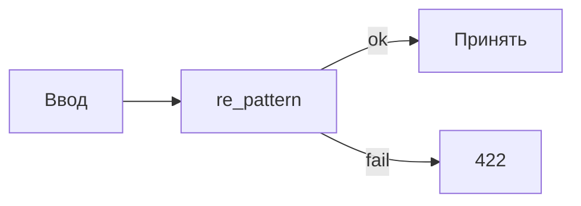

# S01E09 · Регулярные выражения

## Пост

S01E09 · Regex · валидация и где уже вредно

Регулярное выражение — это формальный язык для поиска по строке, не «искусственный интеллект» и не парсер HTML.

Где уместно в сервисе заявок:

- Грубый формат: код заявки `TCK-\d+`, e-mail «есть @ и точка», slug из латиницы.
- Вырезать кусок из лога: номер запроса, статус.
- Серверная проверка плюс та же идея на клиенте — но источником правды остаётся API.

Где вредно:

- Разбор HTML/XML regex’ом («достать все ссылки из страницы») — ломается на вложенности. Для этого парсер.
- «Умная» валидация ФИО, адресов, телефона всех стран одним выражением — ложные отказы.
- Секреты и SQL: regex не заменяет параметризованные запросы.

В Python — модуль `re`. Отлаживать удобно на regex101: видны группы и расхождения Python vs JS.

Зачем это в живом сервисе. В пайплайне контента (чистка текста, URL, лимиты) без дисциплины regex легко сломать валидные данные.

Граница. Не пишите комбайн на 80 групп. Если выражение нельзя прочитать вслух — упростите или откажитесь.

Следующий выпуск: React — список заявок из того API, которое вы уже проверили Insomnia.

## Лаба

30 минут.

1. На https://regex101.com/ (Flavor: Python) напишите выражение для кода заявки: `TCK-` и цифры. Прогоните 5 положительных и 3 отрицательных примера.
2. В FastAPI: поле `code` (или валидация `title`) через `pattern` в Pydantic либо `re` в хендлере. Невалидное тело → 422, не 500.
3. Insomnia: один запрос, который должен упасть, один — пройти.

В группу: ссылка на сохранённый regex101 (или скрин тестов) + скрин 422.

Проверка: вы не парсите HTML. Есть хотя бы один сознательно отвергнутый ввод.

## Ссылки

- CopyParse (регистрация, учебный контур): https://www.copyparse.ru/sign-up?utm_source=tg&utm_campaign=s01e09
- `re` в Python — https://docs.python.org/3/library/re.html
- HOWTO по regex в документации Python — https://docs.python.org/3/howto/regex.html
- Песочница regex101 — https://regex101.com/
- MDN: обзор регулярных выражений (идея языка, осторожно: диалект JS) — https://developer.mozilla.org/ru/docs/Web/JavaScript/Guide/Regular_expressions
- Почему HTML regex’ом нельзя (классика, eng) — https://stackoverflow.com/questions/1732348/regex-match-open-tags-except-xhtml-self-contained-tags

## Схема

