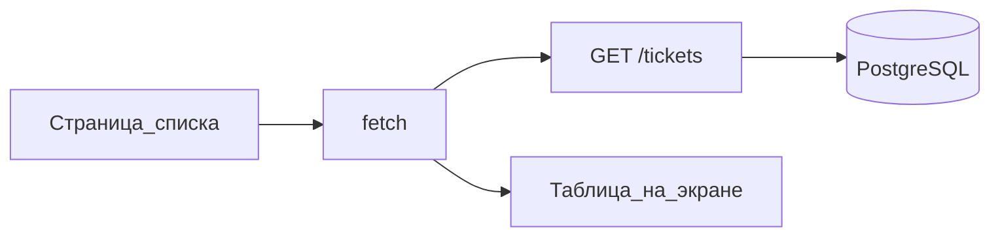

# S01E10 · React: страница списка и вызов API

## Пост

S01E10 · React · список и fetch

UI — последний слой в этой десятке, не первый. Вы уже знаете контракт (`GET /tickets`) и видели JSON в Insomnia. Страница только рисует то, что API уже умеет.

Минимум Vite + React:

- Страница «Список заявок»: запрос к API при загрузке, вывод `title` и `status`.
- Один `baseURL` (лучше переменная `VITE_API_URL`), не размазанные по компонентам localhost.
- Ошибка сети — текст на странице, не пустой экран.
- Пока без дизайн-системы, без Redux, без авторизации (JWT — E11).

CORS. Если UI на `:5173`, а API на `:8000`, браузер заблокирует запрос, пока FastAPI не отдаст CORS. Это не баг React. Либо прокси Vite на `/api`, либо настройки CORS на бэке — выберите одно и зафиксируйте в README.

Зачем это в живом сервисе. UI CopyParse ходит в `/api` так же: один клиент, не «каждый экран сам знает хост core».

Граница. Не верстайте админку и не тащите компонентную библиотеку «как на проде». Список из API важнее кнопок.

Следующий выпуск (E11): JWT — логин без самодельной криптографии.

## Лаба

40 минут.

1. `npm create vite@latest` → React. Страница списка.
2. `fetch` (или тонкая обёртка) на `GET /tickets`. Отобразите 3 поля.
3. README: как запустить UI и API, какая переменная URL, как обойден CORS.
4. Скрин: Insomnia показывает те же заявки, что и страница.

В группу: скрин UI + ссылка на PR.

Проверка: остановка API даёт видимую ошибку в UI. Нет захардкоженного списка «на время».

## Ссылки

- React: Think in React / списки — https://react.dev/learn/rendering-lists
- Эффекты и загрузка данных — https://react.dev/learn/synchronizing-with-effects
- Vite, старт — https://vite.dev/guide/
- Env-переменные Vite (`VITE_*`) — https://vite.dev/guide/env-and-mode.html
- CORS в FastAPI — https://fastapi.tiangolo.com/tutorial/cors/
- Fetch API — https://developer.mozilla.org/ru/docs/Web/API/Fetch_API/Using_Fetch

## Схема

