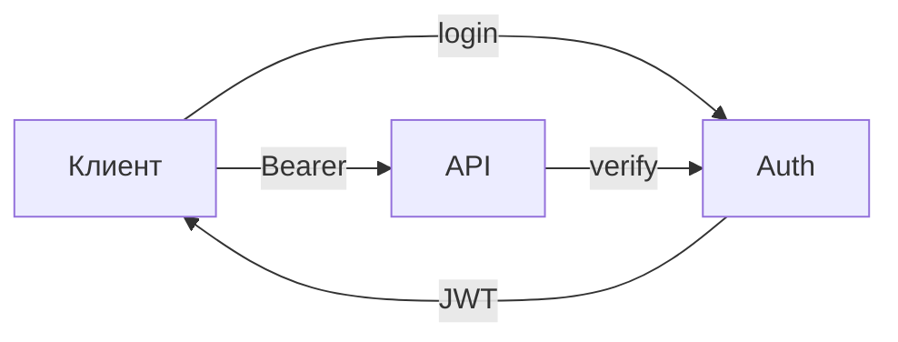

# S01E11 · JWT: логин без самоделки криптографии

## Пост

S01E11 · JWT · логин без самоделки

Вы уже умеете отдавать список заявок. Теперь вопрос: кто имеет право создавать и менять? Ответ — токен, а не «секретный URL».

Минимум, который нужен:

1. `POST /auth/login` → access + refresh (или хотя бы access с коротким TTL).
2. Защищённые роуты читают `Authorization: Bearer …`, не cookie «на всё приложение» в первый день.
3. Пароль только через bcrypt (или аналог). Сами AES/HMAC «на коленке» не пишем.
4. Ошибки: 401 без утечки «такого пользователя нет / неверный пароль» в разные тексты, если не хотите enumeration.

Зачем это в живом сервисе. У CopyParse auth отдельный сервис, gateway проверяет JWT и прокидывает `X-User-*` во внутренние сервисы. Браузер не ходит в Postgres за ролью.

Граница. Не тащите OAuth всех провайдеров и RBAC на 12 ролей в учебный CRUD. Один пользователь + guest/user хватит до E19.

Следующий выпуск: Docker — образ API.

## Лаба

40 минут.

1. Эндпоинт логина: проверка пароля, выдача JWT (библиотека, не самописная крипта).
2. Один защищённый роут `POST /tickets` — без токена 401.
3. В Insomnia: окружение с `token`, заголовок Authorization.
4. Скрин: 401 без токена и 201 с токеном.

В группу: коллекция Insomnia + скрин.

Проверка: токен с чужим секретом не принимается. Пароль в БД не plaintext.

## Ссылки

- CopyParse (регистрация, учебный контур): https://www.copyparse.ru/sign-up?utm_source=tg&utm_campaign=s01e11
- JWT introduction (auth0) — https://auth0.com/docs/secure/tokens/json-web-tokens
- PyJWT — https://pyjwt.readthedocs.io/
- FastAPI Security OAuth2PasswordBearer — https://fastapi.tiangolo.com/tutorial/security/oauth2-jwt/
- bcrypt — https://github.com/pyca/bcrypt/

## Схема

