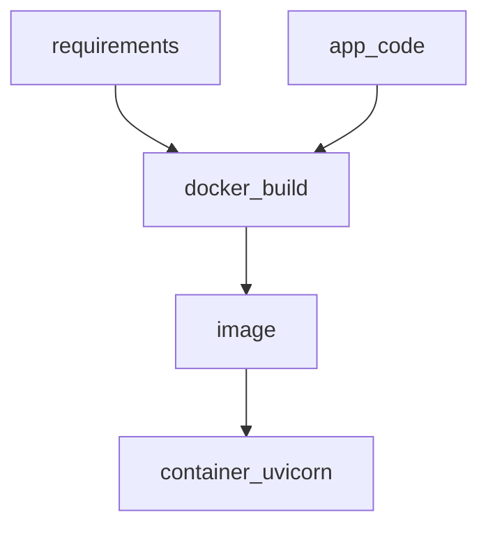

# S01E12 · Docker: образ API, что не класть в слой

## Пост

S01E12 · Docker · образ API

«У меня работает» заканчивается, когда коллега клонирует репо. Образ фиксирует runtime: Python, зависимости, команду старта.

Правила слоёв:

1. Сначала копируем `requirements.txt` / lock — кэш pip переживает правки кода.
2. `.dockerignore`: `.env`, `__pycache__`, `.git`, venv, секреты.
3. Не класть секреты в ENV образа на сборке. Секреты — runtime.
4. Один процесс = один контейнер (12-factor). Не «API + Postgres в одном Dockerfile».

Зачем это в живом сервисе. Каждый сервис CopyParse собирается своим Dockerfile (`auth/Dockerfile`, `core/Dockerfile`, …) из корня контекста монорепо.

Граница. Multi-stage и distroless — позже. Сейчас: тонкий понятный образ, который стартует `uvicorn`.

Следующий выпуск: Compose — API + Postgres + UI.

## Лаба

40 минут.

1. Dockerfile для вашего FastAPI.
2. `docker build` и `docker run -p …`. Health или `/docs` открывается.
3. Убедитесь, что `.env` не попал в образ.
4. README: команды build/run.

В группу: скрин `docker images` + открытый `/docs`.

Проверка: без смонтированного кода контейнер всё равно стартует (код внутри образа).

## Ссылки

- CopyParse (регистрация, учебный контур): https://www.copyparse.ru/sign-up?utm_source=tg&utm_campaign=s01e12
- Best practices Dockerfile — https://docs.docker.com/build/building/best-practices/
- .dockerignore — https://docs.docker.com/build/building/context/#dockerignore-files
- Официальный образ python — https://hub.docker.com/_/python
- CopyParse: любой `*/Dockerfile` в корне репозитория

## Схема

