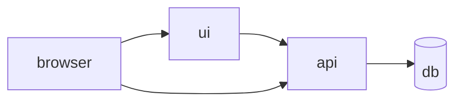

# S01E13 · Compose: API + Postgres + UI на одной сети

## Пост

S01E13 · Compose · API + Postgres + UI

Три контейнера на одной user-defined сети видят друг друга по имени сервиса: `api`, `db`, `ui`. Хост-порты — только то, что нужно браузеру.

Что зафиксировать в `docker-compose.yml`:

1. `services`, `networks`, `volumes` для данных Postgres.
2. `depends_on` — порядок старта, не readiness. Для готовности БД — healthcheck.
3. `DATABASE_URL=postgresql://…@db:5432/…` — хост `db`, не localhost.
4. UI знает публичный URL API (через gateway или прокси), не внутренний DNS браузера.

Зачем это в живом сервисе. Корень CopyParse — `docker-compose.yaml`: десятки сервисов, но идея та же — имена, сети, лимиты памяти.

Граница. Не поднимайте MinIO, Ollama и все боты «чтобы было как в проде». Учебный срез: API + DB + UI.

Следующий выпуск: healthcheck — «висит, но не живо».

## Лаба

45 минут.

1. Compose: `api`, `db`, `ui` (или api+db, если UI пока Vite на хосте — тогда два сервиса + README).
2. Миграция/CREATE TABLE при старте или init SQL volume.
3. С хоста: создать заявку через UI или Insomnia на проброшенный порт.
4. `docker compose ps` — все healthy/up.

В группу: фрагмент compose + скрин ps.

Проверка: после `compose down -v` и `up` данные чистые — вы понимаете, где живут данные.

## Ссылки

- CopyParse (регистрация, учебный контур): https://www.copyparse.ru/sign-up?utm_source=tg&utm_campaign=s01e13
- Compose overview — https://docs.docker.com/compose/
- Networking in Compose — https://docs.docker.com/compose/networking/
- Healthcheck — https://docs.docker.com/compose/compose-file/05-services/#healthcheck
- CopyParse: docker-compose.yaml в корне

## Схема

