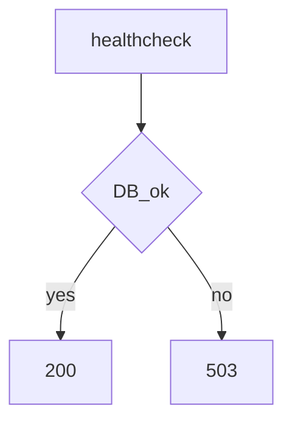

# S01E14 · Healthcheck и почему «висит, но не живо»

## Пост

S01E14 · Healthcheck · висит, но не живо

Процесс слушает порт — ещё не значит, что сервис готов. БД может не принять соединения, миграции не прогнаны, зависимость 503.

Два уровня:

1. Liveness — процесс жив (часто `/health` без тяжёлых проверок).
2. Readiness — можно ли слать трафик (проверка пула БД, критичных зависимостей).

В Compose `healthcheck` + `depends_on: condition: service_healthy` спасает от гонок старта.

Зачем это в живом сервисе. Gateway и боты CopyParse отдают `/health`; оркестрация и Checks в UI смотрят, кто реально отвечает.

Граница. Не делайте `/health`, который долбит внешний Instagram. Health должен быть дешёвым.

Следующий выпуск: env и секреты.

## Лаба

30 минут.

1. Эндпоинт `/health`: 200 если БД отвечает простым `SELECT 1`, иначе 503.
2. В Compose healthcheck на api и db.
3. Ломаете БД (стоп контейнера) — api становится unhealthy.
4. Скрин `compose ps` до/после.

В группу: два скрина ps.

Проверка: curl `/health` документирован в README.

## Ссылки

- CopyParse (регистрация, учебный контур): https://www.copyparse.ru/sign-up?utm_source=tg&utm_campaign=s01e14
- Kubernetes probes (идея readiness) — https://kubernetes.io/docs/concepts/workloads/pods/pod-lifecycle/#container-probes
- FastAPI: простой роут `/health` без магии
- CopyParse: эндпоинты `/health` у сервисов

## Схема

