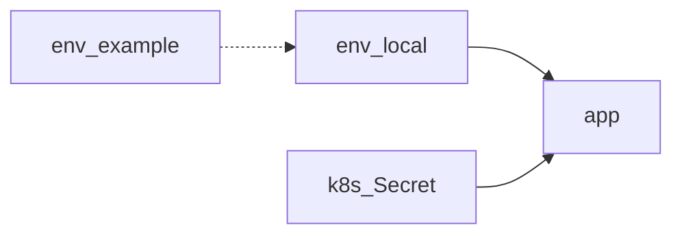

# S01E15 · Env и секреты: что сломает minikube, если захардкодить

## Пост

S01E15 · Env · секреты

Захардкоженный пароль БД в коде «для скорости» сломает перенос в Minikube и любой чужой стенд. Конфиг — из окружения.

Практика:

1. `.env.example` без секретов; `.env` в `.gitignore`.
2. JWT secret, DB password, API keys — только env / Secret.
3. Разные значения local / compose / minikube, один и тот же ключ имени.
4. Не логировать секреты. Не коммитить `secret.yaml` с живыми значениями.

Зачем это в живом сервисе. `config.md` и `.env.example` CopyParse перечисляют переменные; в k8s те же смыслы уезжают в Secret/ConfigMap.

Граница. Vault и sealed-secrets — сезон 2. Сейчас дисциплина файлов и env.

Следующий выпуск: Minikube — Deployment и Service.

## Лаба

30 минут.

1. Вынесите `DATABASE_URL` и `JWT_SECRET` в env; уберите дефолты «password123» из кода (или оставьте только для dev с явным предупреждением).
2. Обновите `.env.example`.
3. Compose: `env_file` или `environment`.
4. Скрин: приложение стартует с другим секретом, старый токен 401.

В группу: `.env.example` (без секретов) + скрин.

Проверка: поиск по репо не находит реальный пароль в `.py`.

## Ссылки

- CopyParse (регистрация, учебный контур): https://www.copyparse.ru/sign-up?utm_source=tg&utm_campaign=s01e15
- 12factor config — https://12factor.net/ru/config/
- Docker Compose env — https://docs.docker.com/compose/environment-variables/set-environment-variables/
- CopyParse: config.md, .env.example

## Схема

