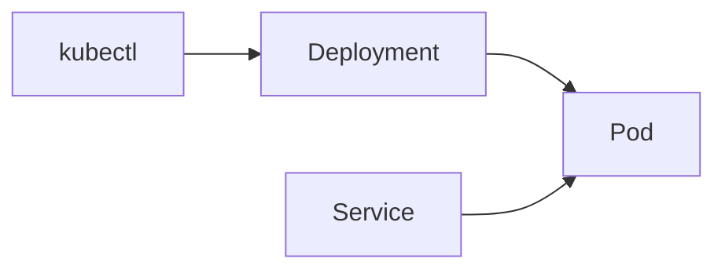

# S01E16 · Minikube: первый Deployment и Service

## Пост

S01E16 · Minikube · Deployment и Service

Compose научил вас именам сервисов. Kubernetes говорит Pod / Deployment / Service. Minikube — учебный кластер на вашей машине.

Минимум манифестов:

1. Deployment: образ, replicas=1, порты контейнера.
2. Service: ClusterIP, чтобы другие поды ходили на api по DNS.
3. Сборка образа в docker Minikube (`minikube docker-env`) — иначе ImagePull ошибки на локальном теге.

Зачем это в живом сервисе. Каталог `k8s/` CopyParse — тот же перенос Compose → манифесты, только сервисов больше.

Граница. Не тащите Helm chart и service mesh в первый Deployment.

Следующий выпуск: Ingress — браузер находит UI и `/api`.

## Лаба

45 минут.

1. Поднимите Minikube. Соберите образ API в его Docker.
2. Apply Deployment + Service.
3. `kubectl get pods,svc` — Running.
4. `kubectl port-forward` или curl через service — `/health` 200.

В группу: скрин get pods + describe (если были ошибки — их тоже).

Проверка: удаление пода — Deployment поднимает новый.

## Ссылки

- CopyParse (регистрация, учебный контур): https://www.copyparse.ru/sign-up?utm_source=tg&utm_campaign=s01e16
- Minikube start — https://minikube.sigs.k8s.io/docs/start/
- Deployments — https://kubernetes.io/docs/concepts/workloads/controllers/deployment/
- CopyParse: k8s/README.md

## Схема

