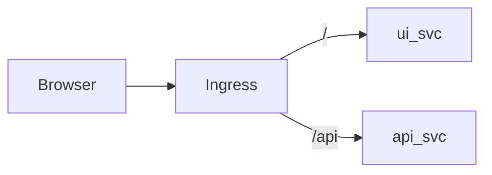

# S01E17 · Ingress: как браузер находит UI и `/api`

## Пост

S01E17 · Ingress · UI и /api

Браузеру нужен один вход: хост → UI на `/`, API на `/api`. Ingress (или аналог ui-edge/nginx) делает path-based routing.

Идея:

1. Ingress addon в Minikube.
2. Правила: `/api` → Service api, `/` → Service ui.
3. UI собран с `baseURL=/api`, без хардкода NodePort.

Зачем это в живом сервисе. `deploy/ui-edge` на проде CopyParse: Host copyparse.ru → UI и `/api` → gateway.

Граница. TLS и несколько доменов — после того, как HTTP path routing стабилен.

Следующий выпуск: Secret в k8s.

## Лаба

40 минут.

1. Включите ingress addon.
2. Ingress-манифест с двумя paths.
3. Добавьте запись в hosts (или minikube tunnel — как в README вашего среза).
4. С браузера: открыть UI и дернуть API через тот же хост.

В группу: YAML Ingress + скрин браузера.

Проверка: прямой port-forward больше не единственный способ открыть UI.

## Ссылки

- CopyParse (регистрация, учебный контур): https://www.copyparse.ru/sign-up?utm_source=tg&utm_campaign=s01e17
- Ingress — https://kubernetes.io/docs/concepts/services-networking/ingress/
- Minikube ingress — https://minikube.sigs.k8s.io/docs/handbook/addons/ingress-dns/
- CopyParse: deploy/ui-edge/README.md

## Схема

