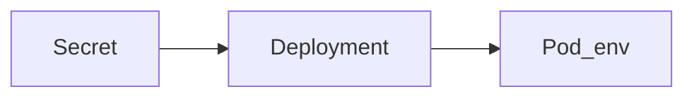

# S01E18 · Secret в k8s и почему compose-привычки там врут

## Пост

S01E18 · Secret · compose-привычки врут

В Compose вы монтировали `.env`. В Kubernetes секрет — объект `Secret`, подключается как envFrom или volume. Базовый64 в YAML — это не шифрование, только encoding.

Что запомнить:

1. Не коммитить Secret с продовыми значениями.
2. Deployment ссылается на Secret по имени; ротация = новый Secret + rollout.
3. `kubectl create secret generic` из литералов / файла — удобный старт.
4. Права RBAC: не все ServiceAccount должны читать все Secret.

Зачем это в живом сервисе. Те же JWT/DB URL, что в `.env`, в кластере живут иначе — отсюда боль переноса.

Граница. Sealed Secrets / external secrets operator — после сезона 1.

Следующий выпуск: склейка среза на Minikube.

## Лаба

35 минут.

1. Вынесите DB password и JWT в Secret.
2. Deployment читает их как env.
3. Смените секрет → rollout restart → старые JWT невалидны.
4. Убедитесь, что в git нет живого Secret.

В группу: манифест Secret с placeholder-значениями + скрин pods Running.

Проверка: `kubectl describe pod` не показывает plaintext password в событиях (только имена ключей).

## Ссылки

- CopyParse (регистрация, учебный контур): https://www.copyparse.ru/sign-up?utm_source=tg&utm_campaign=s01e18
- Secrets — https://kubernetes.io/docs/concepts/configuration/secret/
- Good practices — https://kubernetes.io/docs/concepts/configuration/secret/#good-practices
- CopyParse: k8s/ и предупреждения в INSTALLATION.md

## Схема

